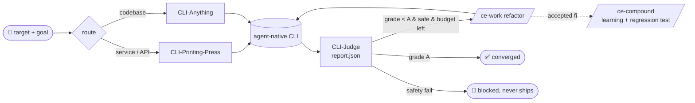
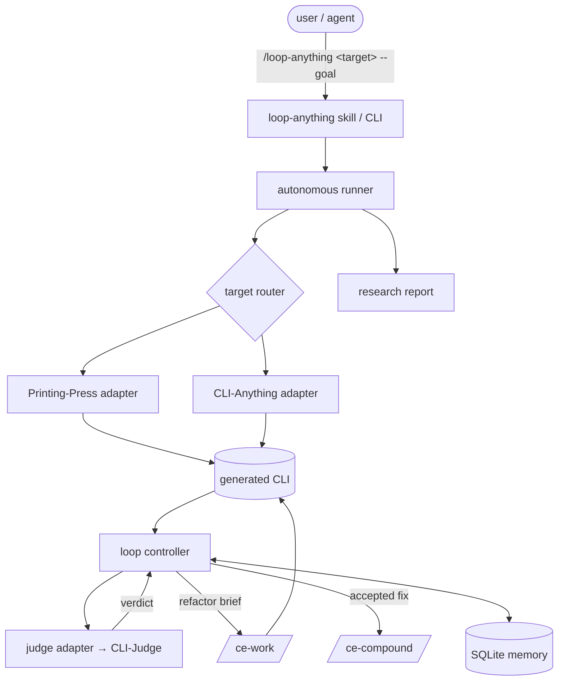

<div align="center">

# ♻️ loop-engineering-anything

### **Stop generating tools. Start engineering loops.**

**Today's software is generated once and frozen. Tomorrow's software improves itself.**

Point it at any **API** or **codebase**. It builds an agent-native CLI, grades it against
reality, and refactors until the grade stops climbing — then tells you what it learned.

<br/>

[](https://github.com/wjlgatech/loop-engineering-anything/actions/workflows/ci.yml)
[](https://wjlgatech.github.io/loop-engineering-anything/)
[](https://github.com/wjlgatech/loop-engineering-anything/actions/workflows/ci.yml)
[](https://www.python.org/)
[](docs/plans/)
[](#-license)
[](#-roadmap)

</div>

> **The "I'm going to the beach" workflow:** give it a target and a goal, walk away,
> and come back to a measurably better tool **plus a report on how it got there** — every
> iteration recorded, every regression rolled back, every unsafe change blocked.

---

## 🎯 10+ things you can put in a loop — [loop-anything-hub](https://wjlgatech.github.io/loop-engineering-anything/)

Point the loop at a domain and it turns *"generate once, hope it's good"* into
*"improve until an independent referee says it's good."* The
**[loop-anything-hub](https://wjlgatech.github.io/loop-engineering-anything/)** is a
live catalog of these loops, auto-published from `demos/` on every push — each card
headlines the **loop outcome** (grade trajectory + convergence + report), which a
plain CLI gallery can't.

| Domain | What "improving itself" looks like |
| --- | --- |
| 🔀 **PR lifecycle** | a loop that drives a PR green — tests, review comments, conflicts — until it merges |
| ⚖️ **Legal** | clause/contract tooling refined against a rubric of real redlines |
| 🧪 **Clinical trials** | eligibility/protocol tooling graded against real trial criteria |
| 🧬 **Biotech** | assay/pipeline CLIs improved against captured lab data |
| 📈 **Quant** | a strategy/backtest tool refined against held-out market data |
| 💼 **VC** | deal-screening tooling graded against a real diligence rubric |
| 🏛️ **Software architecture** | architecture-review CLIs climbing a quality rubric |
| 🎓 **Education** | tutoring/grading tools refined against answer keys + rubrics |
| ⚡ **Smart grid** | load/forecast tooling graded against real telemetry |
| 📦 **Supply chain** | routing/inventory CLIs improved against real logistics data |

> **← Your application here.** Each row is a loop waiting to be built. Add one in a
> single PR — see [`CONTRIBUTING-demos.md`](CONTRIBUTING-demos.md). Domains beyond the
> engine's current reach ship as **[loop recipes](docs/recipes/)** (the map, not fake
> demos); starter cards are badged `illustrative` until a live run is recorded.

```bash
loop-anything demo list                      # registered demos + recipes
loop-anything showcase --out showcase.html   # the self-contained gallery

# Turn a real catalog CLI into a verified before/after proof (refine-only):
loop-anything demo proof <id> --catalog cli-anything --name <entry> \
    --sha <full-40-char-commit-sha> --install-kind pip_git_subdir --dry-run
```

> **Proofs validate the refine loop, not the generate frontier.** `demo proof` adopts
> an *already-generated* catalog CLI as the baseline ("before"), runs the loop
> (judge → `/ce-work` → re-judge → `/ce-compound`), and records a `live_verified` card
> with the before/after grade, the per-dimension diff, iterations, and the regression
> tests it compounded.

---

## 🧠 Why a loop?

Building agent-native tooling today is a **one-shot act**: generate a CLI, eyeball it, stop.
Nothing closes the gap between *"it exists"* and *"it's actually good."*

- 🔁 **Compounding, not one-shot** — each iteration makes the tool measurably better, and the
  fix is captured as a regression test so a solved problem never comes back.
- 🌍 **Grounded in reality, not vibes** — quality comes from an independent referee grading the
  tool against real captured payloads, never from the model admiring its own code.
- 🛡️ **Degradation-proof** — a multi-signal convergence policy (plateau + regression rollback +
  budget) stops the recursive "flying turd" effect where agents slowly make things worse.
- 😴 **Autonomous by design** — kick it off, go to sleep, read the research report in the morning.
- 🔒 **Safety is a hard gate** — an unsafe tool can never ship, no matter how high it otherwise scores.

> It treats the generated tool as a **Heuristic System** — code, rules, detectors, tests — and
> runs an agentic "nutrition pipeline" that evolves it continuously. Fast code-based heuristics
> execute (System 1); the slow LLM agent reflects and refines (System 2).

---

## 🔭 The Loop



`loop-engineering-anything` is **not another CLI generator.** It is the **controller, memory, and
convergence policy** that wire four existing tools into a closed feedback loop:

| Stage | Tool | Role in the loop |
| --- | --- | --- |
| 🏗️ **route + generate** | [CLI-Printing-Press](https://github.com/mvanhorn/cli-printing-press) · [CLI-Anything](https://github.com/HKUDS/CLI-Anything) | build the agent-native CLI (service lane / codebase lane) |
| ⚖️ **judge** | [CLI-Judge](https://github.com/wjlgatech/cli-judge) | grade it against reality — 5 dimensions, A–F, `report.json` |
| 🔧 **refactor** | [`/ce-work`](https://github.com/EveryInc/compound-engineering-plugin) | fix the lowest-scoring dimensions |
| 📚 **compound** | [`/ce-compound`](https://github.com/EveryInc/compound-engineering-plugin) | record the learning + a regression test |

> These are installable **dependencies, wrapped behind adapters — never forked.** The orchestrator
> stays thin; the upstreams evolve on their own.

---

## 💢 Pain point → ♻️ Fix

| Today's pain point | What loop-engineering-anything does |
| --- | --- |
| 🪦 Generated CLIs are frozen the moment they're built | Keeps refactoring until the grade converges |
| 🤷 "Looks fine to me" is the only quality bar | Grades against **real payloads** via an independent referee |
| 📉 Agents recursively degrade what they touch | Plateau detection + **regression rollback** + hard budget |
| 💸 Overnight runs balloon in cost | Iteration/token budget enforced by the convergence policy |
| ☠️ Unsafe code slips through on a high score | Safety failure is a **terminal state** — capped, blocked, never shipped |
| 🧠 The same bug gets re-fixed forever | Every accepted fix is compounded into a regression test |

---

## ✨ What you can do

<table>
<tr>
<td width="33%" valign="top">

### 🌐 Make any API agent-native
Hand it a URL, HAR capture, or OpenAPI spec. It routes to the service lane and keeps improving the CLI against real responses.

</td>
<td width="33%" valign="top">

### 🧩 Make any codebase agent-native
Hand it a local repo. It routes to the codebase lane and grinds the generated CLI up the grade scale.

</td>
<td width="33%" valign="top">

### 😴 Run it overnight
One command, unattended. Wake up to a converged tool, a full grade trajectory, and a research report.

</td>
</tr>
</table>

---

## ⚙️ How it works

|  |  |
| --- | --- |
| **🔁 Multi-signal convergence** | Stops at the first of: target grade reached, plateau (no gain over N), iteration/token budget, or a safety block. No single "until Grade A" naïveté. |
| **🛡️ Unbypassable safety gate** | A safety-failing verdict is a terminal `BLOCKED_SAFETY` state — the change is rolled back and the tool can never ship. |
| **↩️ Regression rollback** | A refactor that doesn't raise the grade is reverted to the prior git checkpoint; the better verdict is kept. |
| **📚 Compound-on-accept** | `/ce-compound` fires **only** on a kept improvement — never on a transient gain that's later rolled back. |
| **🗄️ Local-first memory** | Every run/iteration/grade/learning lands in SQLite, enabling cross-run queries (trend, plateau, recurring failures). |
| **🔌 Protocol-driven core** | The controller depends only on `Judge`/`Refiner`/`Compounder`/`Checkpoint` protocols — so loop dynamics are proven against recorded verdicts, no live tool required. |

---

## 🧭 Where this differs from a generic agent loop

The popular "agent loop" anatomy (state → reason → act → observe → reflect →
terminate) describes one agent improving its own answer. This is an **outer**
loop that improves a *generated tool* and is opinionated about three things on
purpose — they are design choices, not missing features:

- **Outer-loop sovereignty** — we referee the refiner's **output**, never its
  inner tokens. The inner agent loop is a swappable vendor; we are the meta-loop
  it plugs into.
- **Single referee of record** — quality comes **only** from the independent
  CLI-Judge verdict, never from the maker's self-report. That single authority is
  the maker≠checker moat.
- **Gated human confirm** — a converged result is a *claim* until a human
  confirms; the gate is on by default and its verdict is recorded for audit but
  never auto-ships.

Full rationale, with the failure mode each choice accepts: [`docs/solutions/outer-loop-non-gaps.md`](docs/solutions/outer-loop-non-gaps.md).

## 🏛️ Architecture



---

## 🗂️ Project structure

```
loop-engineering-anything/
├── src/loopeng/
│   ├── cli.py                 # loop-anything entrypoint  (run / preflight / status / report / demo proof)
│   ├── config.py              # budgets, convergence knobs, dependency table
│   ├── preflight.py           # per-mechanism dependency detection (+ refine-only gate)
│   ├── adopt.py               # catalog tool adopter — venv-isolated, env-pruned, full-SHA pin
│   ├── proof.py               # ProofPack builder + store-backed compounder
│   ├── router.py              # target → lane classification
│   ├── adapters/
│   │   ├── base.py            # Verdict / GenerateResult + Judge/Refiner/Compounder/Checkpoint protocols
│   │   ├── safety.py          # shell=False exec, metachar rejection, workspace jail
│   │   ├── printing_press.py  # service lane factory shell
│   │   ├── cli_anything.py    # codebase lane factory shell
│   │   └── judge.py           # CLI-Judge wrapper + strict report.json parsing
│   ├── memory/                # SQLite store + trend/plateau/recurring queries
│   ├── loop/                  # controller state machine, convergence, brief, compound, GitCheckpoint
│   └── autonomous/            # research report + autonomous runner
├── skills/loop-anything/      # the /loop-anything agent skill
├── tests/                     # 286 tests — loop dynamics validated against recorded verdicts
└── docs/plans/                # the implementation plan
```

---

## 🚀 Quick start

```bash
git clone https://github.com/wjlgatech/loop-engineering-anything
cd loop-engineering-anything
python -m venv .venv && source .venv/bin/activate
pip install -e ".[dev]"

loop-anything preflight        # check the four dependencies
pytest -q                      # 286 passing
```

**Preflight tells you exactly what's wired:**

```text
[MISSING] CLI-Printing-Press (service/API lane) -- not on PATH (looked for: printing-press, cli-printing-press)
[MISSING] CLI-Anything (codebase lane) -- not on PATH (looked for: cli-anything, cli-hub)
[MISSING] CLI-Judge (referee) -- not on PATH (looked for: cli-judge)
[ok ]     compound-engineering plugin (/ce-work, /ce-compound) -- plugin found
```

**Drive a target** (auto-routes by lane; gates on preflight):

```bash
loop-anything run https://api.example.com --goal "make this agent-native and keep improving it"
loop-anything run ./my-repo            --goal "raise correctness and safety to Grade A"
loop-anything status                   # recorded runs
loop-anything report <run_id> --json   # the research report
```

---

## 🛡️ Safety

CLI-Judge's safety gate caps a tool's grade at **C** on any safety failure. The loop treats this
as a **terminal `BLOCKED_SAFETY` state**: the offending change is rolled back, the run halts, and
the tool is **never shipped (R3)** — regardless of how high it scored elsewhere. Autonomous runs
apply code only inside a workspace boundary, read credentials from the environment (never logged),
and checkpoint every iteration so any regression reverts cleanly.

---

## 🧭 Roadmap

Built from an 8-unit plan (`docs/plans/`). Loop dynamics are already validated against recorded
verdicts — so the hardest part (does the loop converge without degrading?) is proven before any
live run.

- [x] **U1** — Scaffold, `loop-anything` CLI, `/loop-anything` skill, dependency preflight
- [x] **U2** — SQLite memory layer (trend / plateau / recurring-failure queries)
- [x] **U3** — Target router (service vs. codebase lane)
- [x] **U6** — Loop controller core: state machine, convergence policy, **safety hard-gate**, regression rollback
- [x] **U4** — Factory adapter shells (Printing-Press / CLI-Anything)
- [x] **U5** — Judge adapter shell (strict `report.json` safety derivation)
- [x] **U8** — Autonomous runner shell (preflight + credential + workspace guards)
- [x] **U7** — History Compression Engine (grade-neutral-or-better System-2 pass)
- [x] **P0 #1 mechanism** — headless `/ce-work` + `/ce-compound` via `claude -p`
- [x] **P0 #2 mechanism** — grade-variance probe + noise-aware acceptance band
- [x] **Judge live-binding** — `CLIJudge` pinned to the real `report.json` (`safety_blocker`,
  `D1..D5` dims, `--out`) and **verified against an installed `cli-judge`**
- [x] **Real loop run** — `LoopController` driven by the live `cli-judge` to a correct terminal state
- [ ] **Factory live-binding** — CLI-Anything generation is an agentic `claude -p "/cli-anything …"` skill; CLI-Printing-Press needs a Go toolchain
- [ ] **Full agentic e2e** — real generate (`/cli-anything`) + real refine (`/ce-work`) on a live target

> **Both feasibility gates are resolved.** **P0 #2 is empirical:** the live CLI-Judge is
> **deterministic** (variance probe spread `0.0`), so grades are a safe control signal. **P0 #1**
> is mechanical: `/ce-work` + `/ce-compound` run headlessly via `claude -p`. The loop has been run
> end-to-end against the **real referee**; the remaining frontier is the agentic generate/refine
> steps and the Go-based service lane — see the [runbook](docs/e2e-runbook.md).

---

## 🧰 The four tools it drives

| Tool | What it brings |
| --- | --- |
| [**CLI-Printing-Press**](https://github.com/mvanhorn/cli-printing-press) | URL/HAR/OpenAPI → a CLI with a local SQLite mirror and domain archetypes |
| [**CLI-Anything**](https://github.com/HKUDS/CLI-Anything) | local software → an agent-native Click CLI with a `SKILL.md` |
| [**CLI-Judge**](https://github.com/wjlgatech/cli-judge) | reality-grounded referee — 5 dimensions / 100 pts, hard safety gate |
| [**compound-engineering**](https://github.com/EveryInc/compound-engineering-plugin) | the brain — `/ce-work` refactors, `/ce-compound` captures learnings |

---

## 📈 Star history

<div align="center">

[](https://star-history.com/#wjlgatech/loop-engineering-anything&Date)

</div>

---

## 🤝 Contributing

PRs welcome. The repo enforces a simple bar: **CI must be green** (pytest on Python 3.11–3.13) and
behavior changes carry a `CHANGELOG.md` entry plus synced docs. See [`AGENTS.md`](AGENTS.md) for
architecture boundaries — chiefly *wrap-don't-fork*, the *protocol-only controller*, and the
*unbypassable safety gate*.

---

## 📄 License

MIT — free to use, modify, and distribute.

---

<div align="center">

### ♻️ Make any software improve itself.

**A self-improving loop for the age of AI agents · grounded in reality · safe by construction**

<sub>Built by driving <a href="https://github.com/mvanhorn/cli-printing-press">CLI-Printing-Press</a> · <a href="https://github.com/HKUDS/CLI-Anything">CLI-Anything</a> · <a href="https://github.com/wjlgatech/cli-judge">CLI-Judge</a> · <a href="https://github.com/EveryInc/compound-engineering-plugin">compound-engineering</a> around a closed loop.</sub>

**Thanks for visiting ✨**

</div>
