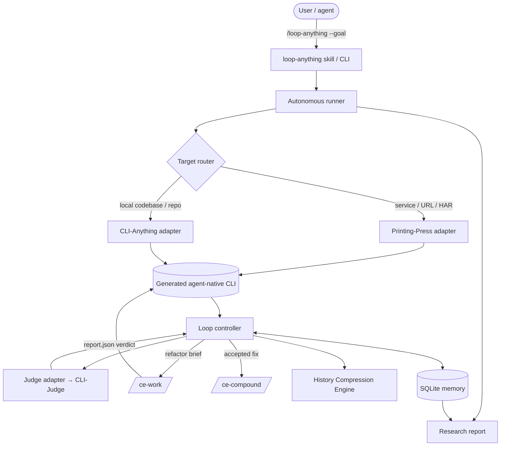
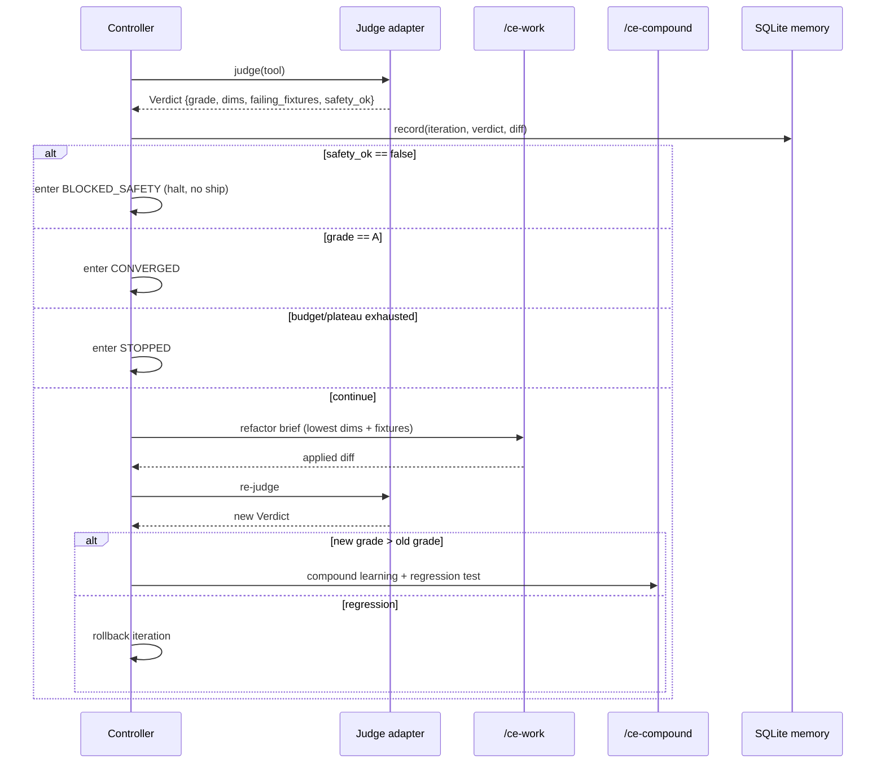
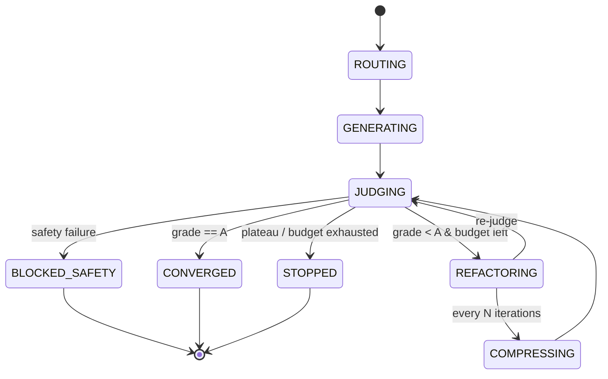

# feat: loop-engineering-anything — self-improving loop orchestrator

**Target repo:** this repository (greenfield; `loop-engineering-anything/` becomes the project root). All paths below are repo-relative. The repo is not yet initialized with git — `git init` is part of U1.

---

## Summary

`loop-engineering-anything` is a **loop orchestrator**: it turns any target — a public service/API or a local codebase — into a self-improving, agent-native CLI by driving four existing tools around a closed feedback loop. The thing we build is **not another CLI generator**; it is the controller, memory, and convergence policy that wire the existing factories and referee together so a target keeps improving on its own.

The loop is: **route** the target to the right factory → **generate** an agent-native CLI → **judge** it with CLI-Judge → **refactor** the lowest-scoring dimensions via `/ce-work` → **re-judge** → repeat until Grade A, a safety block, or budget exhaustion → **compound** the learnings and emit a research report. The MVP supports both target lanes from day one, runs fully autonomously ("going to the beach"), and is proven against one public-API reference loop.

---

## Problem Frame

Building agent-native tooling today is a one-shot act: you generate a CLI, eyeball it, and stop. There is no mechanism that (a) verifies the result against reality, (b) feeds failures back into improvement automatically, or (c) prevents quality from degrading as an agent iterates recursively (the "flying turd" effect). The four tools in this ecosystem each solve one slice — generation (CLI-Anything, CLI-Printing-Press), verification (CLI-Judge), and refinement/memory (compound-engineering) — but nothing closes the loop between them.

`loop-engineering-anything` closes that loop. It treats the generated tool as a **Heuristic System** (code, rules, detectors, tests) and runs an agentic "nutrition pipeline" that evolves it continuously, grounded in CLI-Judge's reality-based grades rather than code-pattern inspection. The System 1 / System 2 split is explicit: the generated tool's fast code-based heuristics handle execution; the slow LLM agent (`/ce-work`, `/ce-compound`) handles reflection and refinement.

---

## Requirements

Traced from `loop-engineering-anything-idea.md`.

| ID | Requirement |
|---|---|
| R1 | Route any target (service/API URL/HAR/OpenAPI, or local codebase/repo) to the correct factory — Printing-Press or CLI-Anything — and support **both lanes from day one**. |
| R2 | Independently grade the generated tool by invoking CLI-Judge and parsing `report.json` (5 dimensions, A–F, 100 pts). |
| R3 | Honor CLI-Judge's **safety hard-gate**: any safety failure caps the grade at C and blocks shipping; the loop must stop and flag, never auto-ship an unsafe tool. |
| R4 | Run a closed refinement loop: translate failing dimensions/fixtures into a `/ce-work` refactor brief, apply, re-judge, repeat until Grade A or a stop condition. |
| R5 | Enforce a convergence policy that prevents recursive degradation: max iterations, token budget, plateau detection, and rollback on regression. |
| R6 | Maintain local-first memory (SQLite) of runs, iterations, grades, diffs, and learnings; support history queries across runs. |
| R7 | After each accepted fix, invoke `/ce-compound` to document the learning and add a regression test so a fixed failure never recurs. |
| R8 | Periodically run a **History Compression** pass that refactors redundant rules/heuristics into clean module boundaries (System 2), guarding against "big ball of mud" growth. |
| R9 | Support an overnight **autonomous run**: target + high-level goal → unattended loop → morning research report on grade trajectory and architectural improvements. |
| R10 | Expose the orchestrator agent-natively via a `/loop-anything` Claude Code skill and a `loop-anything` CLI. |
| R11 | Prove the system end-to-end with one reference loop against a public API. |
| R12 | Preserve the System 1 / System 2 split: fast code heuristics execute; the LLM agent reflects and refines. |

**Success criteria:** a single command (`/loop-anything <target> --goal "..."`) drives a target from first generation to a converged grade (or a clearly-reported stop), unattended, with every iteration recorded and a final research report produced — demonstrated on one real public API.

---

## Key Technical Decisions

- **KTD1 — Wrap, don't fork.** The four tools are installable dependencies invoked behind adapters; `loop-engineering-anything` stays thin. _Rationale:_ avoids carrying upstream maintenance, lets each tool evolve independently, and keeps the novel surface (the loop) small. _Rejected:_ vendoring/forking all four into a monorepo — large maintenance burden, immediate staleness.
- **KTD2 — Adapter boundary isolates each tool's CLI surface.** Adapters normalize tool-specific output into internal contracts (`GenerateResult`, `Verdict`); upstream command/flag changes are absorbed in one file each. _Rationale:_ the tools' exact invocation surfaces are the most likely thing to drift, so they are the right thing to isolate (see Risks, Open Questions).
- **KTD3 — Python controller.** Matches CLI-Anything and CLI-Judge (both Python); Printing-Press (Go) is invoked as a subprocess CLI like any other. _Rationale:_ one runtime for the orchestrator, native interop with the two Python tools and the `report.json` schema.
- **KTD4 — CLI-Judge `report.json` is the single source of truth for quality.** The controller never inspects code patterns to decide quality — only the referee's reality-grounded verdict. _Rationale:_ this is the anti-"flying turd" reality-grounding principle; lets the loop trust an independent signal.
- **KTD5 — Safety is a hard interlock, not a heuristic.** A safety failure (grade capped at C) is a terminal controller state (`BLOCKED_SAFETY`) that halts the loop and forbids shipping. _Rationale:_ R3 is non-negotiable; encoding it as a state (not a soft check) makes it unbypassable.
- **KTD6 — Multi-signal convergence policy.** Stop conditions combine grade target (A), plateau detection (no improvement over N iterations), regression rollback (revert an iteration that lowers the grade), and a hard token/iteration budget. _Rationale:_ a single "until Grade A" condition cannot defend against oscillation or degradation.
- **KTD7 — SQLite memory mirrors the Printing-Press pattern.** Local-first run history enables "transcendent" cross-run queries (trends, plateaus, recurring failures) that a stateless run cannot answer. _Rationale:_ reuses a proven pattern from the ecosystem; R6.
- **KTD8 — Refinement rides `/ce-work`, compounding rides `/ce-compound`.** The loop does not implement bespoke codegen or learning capture; it delegates to the compound-engineering brain. _Rationale:_ keeps the orchestrator thin (KTD1) and inherits the plan→work→compound lifecycle.

---

## High-Level Technical Design

Directional — prose is authoritative where it disagrees.

### Component architecture



### One iteration (sequence)



### Loop controller states



---

## Output Structure

```
loop-engineering-anything/
├── pyproject.toml
├── README.md
├── CHANGELOG.md
├── skills/loop-anything/SKILL.md          # /loop-anything agent skill (U1)
├── src/loopeng/
│   ├── cli.py                             # loop-anything entrypoint (U1)
│   ├── config.py                          # config + budgets (U1)
│   ├── preflight.py                       # dependency detection (U1)
│   ├── router.py                          # target lane classification (U3)
│   ├── adapters/
│   │   ├── base.py                        # GenerateResult / Verdict contracts (U4, U5)
│   │   ├── printing_press.py              # service/API lane (U4)
│   │   ├── cli_anything.py                # codebase lane (U4)
│   │   └── judge.py                       # cli-judge wrapper + report.json parse (U5)
│   ├── memory/
│   │   ├── schema.sql                     # runs/iterations/grades/learnings (U2)
│   │   └── store.py                       # query + write API (U2)
│   ├── loop/
│   │   ├── controller.py                  # state machine (U6)
│   │   ├── convergence.py                 # policy + plateau guard (U6)
│   │   ├── refactor_brief.py              # report.json → ce-work brief (U6)
│   │   └── compound.py                    # /ce-compound hook (U6)
│   ├── compression.py                     # History Compression Engine (U7)
│   └── autonomous/
│       ├── runner.py                      # going-to-the-beach entrypoint (U8)
│       └── report.py                      # morning research report (U8)
└── tests/
    ├── test_preflight.py  test_router.py  test_adapters_factory.py
    ├── test_adapter_judge.py  test_memory_store.py
    ├── test_loop_controller.py  test_convergence.py  test_compression.py
    ├── test_autonomous_runner.py
    └── e2e/test_reference_loop.py
```

The per-unit `**Files:**` sections are authoritative; the tree is a scope declaration the implementer may adjust.

---

## Implementation Units

Grouped into four phases (see Phased Delivery). Dependencies cite U-IDs.

### U1. Project scaffold, skill, and dependency preflight

- **Goal:** Stand up the Python package, the `/loop-anything` skill + `loop-anything` CLI entrypoint, config/budget plumbing, and a preflight that detects whether the four tools are installed and usable.
- **Requirements:** R10; supports all.
- **Dependencies:** none.
- **Files:** `pyproject.toml`, `README.md`, `CHANGELOG.md`, `skills/loop-anything/SKILL.md`, `src/loopeng/cli.py`, `src/loopeng/config.py`, `src/loopeng/preflight.py`, `tests/test_preflight.py`.
- **Approach:** `git init`. Click-based `loop-anything` CLI with subcommands (`run`, `status`, `report`). `config.py` holds budgets (max iterations, token budget, compression interval N) and tool paths. `preflight.py` detects all four dependencies — `printing-press`, `cli-anything`/`cli-hub`, `cli-judge`, and the compound-engineering plugin (`/ce-work`, `/ce-compound`) — returning a structured availability report; the CLI refuses to start a run if a tool required for the chosen lane (or the refinement engine) is missing, with an actionable message. `SKILL.md` follows the agent-discoverable convention so an agent can invoke the loop.
- **Patterns to follow:** CLI-Anything's `SKILL.md` agent-discovery convention; Click + `--json` output mode used across the ecosystem.
- **Test scenarios:**
  - All four tools present → preflight reports all-available, exit 0.
  - Printing-Press missing + service target requested → run refuses with a message naming the missing tool and lane (error path).
  - CLI-Anything missing + codebase target requested → same, scoped to the codebase lane.
  - `--json` preflight output is valid JSON with one entry per tool (happy path).
- **Verification:** `loop-anything --help` lists subcommands; `loop-anything preflight --json` returns each tool's status; missing-tool runs fail fast with a clear message.

### U2. SQLite memory layer

- **Goal:** Local-first store of runs, iterations, grades-per-dimension, applied diffs, and learnings, with a query API for cross-run history.
- **Requirements:** R6; enables R5, R8, R9.
- **Dependencies:** U1.
- **Files:** `src/loopeng/memory/schema.sql`, `src/loopeng/memory/store.py`, `tests/test_memory_store.py`.
- **Approach:** Tables: `runs` (target, lane, goal, started, status, final_grade), `iterations` (run_id, n, grade, per-dim JSON, safety_ok, token_cost, diff_ref), `learnings` (run_id, iteration_id, summary, regression_test_ref). Cursor/incremental writes per iteration. Query helpers for trend (`grade over iterations`), plateau (`no improvement in last N`), and recurring failures (`fixtures failing across runs`). Mirror the Printing-Press SQLite + FTS pattern for the transcendent queries.
- **Patterns to follow:** CLI-Printing-Press local SQLite mirror + incremental sync; its `stale`/`trends`-style queries over persisted history.
- **Test scenarios:**
  - Record a run with 3 iterations → `get_run` returns ordered iterations with grades (happy path).
  - Plateau query returns true when the last N iterations show no grade gain; false otherwise (edge: exactly N, fewer than N).
  - Recurring-failure query joins fixtures across two runs and surfaces the shared failing fixture (integration).
  - Concurrent writes from two iterations of the same run do not corrupt ordering (edge: concurrency).
- **Verification:** schema applies cleanly to a fresh DB; trend/plateau/recurring queries return correct results against seeded fixtures.

### U3. Target router

- **Goal:** Classify a target and select the lane — Printing-Press (service/API: URL, HAR, OpenAPI) or CLI-Anything (local codebase/repo).
- **Requirements:** R1.
- **Dependencies:** U1.
- **Files:** `src/loopeng/router.py`, `tests/test_router.py`.
- **Approach:** Classify by target shape: existing local directory or git URL ending in a repo → codebase lane; `http(s)` URL, `.har` file, or OpenAPI/`.json|.yaml` spec → service lane. Ambiguous inputs (e.g., a GitHub URL that is also "a website") resolve via an explicit `--lane` override and otherwise default by precedence (local path > spec file > URL). Return a `LaneDecision {lane, factory, normalized_target, reason}`.
- **Patterns to follow:** Printing-Press's three input types (OpenAPI / HAR / URL) define the service-lane signals.
- **Test scenarios:**
  - Local dir path → codebase lane (happy path).
  - `https://api.example.com` → service lane.
  - `.har` file and OpenAPI `.yaml` → service lane (two cases).
  - GitHub repo URL → codebase lane; same URL with `--lane service` → service lane (override).
  - Nonexistent path / unrecognized input → actionable error naming accepted target types (error path).
- **Verification:** every accepted target type maps to the documented lane; `--lane` override wins; unknown input fails with guidance.

### U4. Factory adapters (Printing-Press + CLI-Anything)

- **Goal:** Wrap each generator behind one normalized `generate(target, goal) -> GenerateResult` contract.
- **Requirements:** R1.
- **Dependencies:** U1, U3.
- **Files:** `src/loopeng/adapters/base.py`, `src/loopeng/adapters/printing_press.py`, `src/loopeng/adapters/cli_anything.py`, `tests/test_adapters_factory.py`.
- **Approach:** `base.py` defines `GenerateResult {tool_path, lane, manifest, logs, ok}`. `printing_press.py` invokes the Printing-Press generate flow (URL/HAR/OpenAPI in) and locates the emitted Cobra CLI + SQLite-backed tool; `cli_anything.py` invokes the CLI-Anything 7-phase build (dir/repo in) and locates the emitted `cli-anything-<software>` package + `SKILL.md`. Both capture logs, surface a normalized success/failure, and tolerate the long generate wall-time (Printing-Press ~30–40 min) with progress streaming and a timeout. **Exact subcommands/flags are verified at build against installed versions (deferred to implementation per the planning/execution split); adapters isolate them.**
- **Patterns to follow:** Printing-Press `/printing-press <app>` + typed exit codes; CLI-Anything `/cli-anything <path>` + `cli-hub`.
- **Test scenarios:**
  - Printing-Press generate (mocked subprocess) returns a `GenerateResult` pointing at the built tool (happy path).
  - CLI-Anything generate (mocked) returns a `GenerateResult` with the package path + SKILL.md present.
  - Factory exits non-zero / emits a typed error exit code → adapter returns `ok=false` with captured logs, no exception leak (error path).
  - Generate exceeds timeout → adapter aborts and reports a timeout result, not a hang (edge).
  - Integration: router decision → correct adapter dispatched (verifies U3↔U4 seam).
- **Verification:** each adapter, against a recorded/mocked tool invocation, produces a well-formed `GenerateResult`; failures and timeouts are normalized, never raw stack traces.

### U5. Judge adapter

- **Goal:** Invoke CLI-Judge against a generated tool and parse `report.json` into a structured `Verdict`.
- **Requirements:** R2, R3.
- **Dependencies:** U1, U4.
- **Files:** `src/loopeng/adapters/judge.py`, `tests/test_adapter_judge.py`.
- **Approach:** Run `cli-judge run --adapter <tool_adapter> --suite full`, then parse `report.json` into `Verdict {grade, score, dims{correctness, non_interactive, cross_platform, safety, efficiency}, failing_fixtures[], safety_ok}`. `safety_ok` is derived strictly: if the safety dimension failed or the grade is capped at C by the safety gate, `safety_ok=false`. Surface the lowest-scoring dimensions ranked, since the refactor brief (U6) targets them. The per-target CLI-Judge adapter (`invoke(call)->Result`) is generated/wired here or flagged as a manual prerequisite (Open Questions).
- **Patterns to follow:** CLI-Judge `report.json` schema and the 5-dimension / 100-pt rubric; the single-line verdict format.
- **Test scenarios:**
  - A Grade-A `report.json` fixture → `Verdict` with `grade=A`, `safety_ok=true`, empty failing list (happy path).
  - A safety-failure fixture (grade capped at C) → `safety_ok=false` regardless of other dimension scores (**critical** — enforces R3).
  - A mixed fixture → failing dimensions ranked lowest-first for the brief (happy path).
  - Malformed/absent `report.json` → adapter returns an error verdict, not a crash (error path).
  - Covers R3. Safety-cap detection asserted independently of total score.
- **Verification:** known `report.json` fixtures map to correct `Verdict`s; the safety cap is detected from both an explicit safety failure and a C-cap; parse failures degrade gracefully.

### U6. Loop controller

- **Goal:** The closed-loop state machine — generate → judge → refactor → re-judge — with convergence policy, the safety hard-gate, regression rollback, and `/ce-work` + `/ce-compound` integration.
- **Requirements:** R3, R4, R5, R7, R12.
- **Dependencies:** U2, U4, U5.
- **Files:** `src/loopeng/loop/controller.py`, `src/loopeng/loop/convergence.py`, `src/loopeng/loop/refactor_brief.py`, `src/loopeng/loop/compound.py`, `tests/test_loop_controller.py`, `tests/test_convergence.py`.
- **Approach:** Implement the state machine from the High-Level Technical Design above (ROUTING→GENERATING→JUDGING→{CONVERGED|BLOCKED_SAFETY|REFACTORING|STOPPED}, with periodic COMPRESSING). `convergence.py` decides next state from grade target (A), plateau (no gain over N), and budget (max iterations + token budget); `refactor_brief.py` turns the ranked failing dimensions + fixtures into a focused `/ce-work` brief; on a successful re-judge with a higher grade, `compound.py` fires `/ce-compound` to record the learning and add a regression test; on a regression, the controller rolls back the iteration (git checkpoint per iteration). `BLOCKED_SAFETY` is terminal and forbids any ship action. Every transition is recorded via the U2 store. **The controller never inspects code to judge quality — only the `Verdict` (KTD4).**
- **Execution note:** Implement the safety-gate and regression-rollback paths test-first — they are the highest-risk behaviors and must be provably unbypassable.
- **Patterns to follow:** compound-engineering `/ce-work` (refactor) and `/ce-compound` (learning + regression test) invocation conventions.
- **Test scenarios:**
  - Grade < A then A after one refactor → terminates in CONVERGED; one `/ce-compound` call fired (happy path).
  - Safety failure at any iteration → immediate BLOCKED_SAFETY, no further refactor, no ship (**critical**, covers R3).
  - Plateau: N iterations with no gain → STOPPED with reason=plateau (edge, covers R5).
  - Budget: token/iteration budget hit mid-loop → STOPPED with reason=budget (edge, covers R5).
  - Regression: a refactor lowers the grade → iteration rolled back, prior state restored, loop continues or stops (error path, covers R5).
  - Refactor brief contains the lowest-scoring dimensions + their failing fixtures, not the whole report (happy path).
  - Integration: controller drives judge adapter (U5) + memory (U2) across 3 iterations and the recorded trajectory matches transitions.
- **Verification:** each stop reason (converged, safety, plateau, budget, regression) is reachable and correctly recorded; safety block cannot be exited into a ship; rollback restores the prior tool state.

### U7. History Compression Engine

- **Goal:** A periodic System-2 pass that refactors redundant rules/heuristics in the evolving tool into clean module boundaries, guarding against "big ball of mud" growth.
- **Requirements:** R8, R12.
- **Dependencies:** U6.
- **Files:** `src/loopeng/compression.py`, `tests/test_compression.py`.
- **Approach:** Triggered from the controller's COMPRESSING state every N iterations. Uses memory (U2) to find redundant/overlapping learnings and rules, drafts a consolidation brief, and runs it through `/ce-work` as a refactor-only change — then **re-judges** to confirm the compression did not lower the grade (compression must be grade-neutral or better, else rolled back). This is reflection (System 2), distinct from per-iteration fixes.
- **Execution note:** Characterize the pre-compression grade first; treat a post-compression grade drop as a failed compression (rollback).
- **Patterns to follow:** the regression-rollback discipline from U6; `/ce-work` refactor briefs.
- **Test scenarios:**
  - Compression that holds the grade → accepted, modules consolidated (happy path).
  - Compression that lowers the grade → rolled back, no change shipped (error path, covers R8 safety of the pass).
  - Trigger cadence: fires only every N iterations, not every iteration (edge).
  - Integration: compression reads redundant learnings from U2 and produces a consolidation brief referencing them.
- **Verification:** compression runs on cadence, is grade-neutral-or-better by construction, and rolls back otherwise.

### U8. Autonomous runner, research report, and reference loop

- **Goal:** The "going to the beach" entrypoint — target + goal → unattended run to convergence/stop → morning research report — proven end-to-end against one public API.
- **Requirements:** R9, R11; exercises R1–R8, R12.
- **Dependencies:** U6, U7.
- **Files:** `src/loopeng/autonomous/runner.py`, `src/loopeng/autonomous/report.py`, `tests/test_autonomous_runner.py`, `tests/e2e/test_reference_loop.py`.
- **Approach:** `runner.py` wires preflight → router → factory → controller into one unattended call with global budget + safety enforcement and per-iteration git checkpoints (so an overnight run is recoverable and never auto-ships unsafe). `report.py` reads the U2 history and emits a research report: grade trajectory, dimensions improved, learnings compounded, compressions applied, final status, and recommended next steps. `tests/e2e/test_reference_loop.py` runs the full loop against one public API target (e.g. Linear or Stripe via Printing-Press) — gated/marked so it runs deliberately, not on every CI run, given the ~30–40 min generate time and credential needs.
- **Patterns to follow:** Printing-Press generated-CLI `--json`/typed-exit conventions for the report's machine-readable mode.
- **Test scenarios:**
  - Unattended run reaching CONVERGED → report lists the grade trajectory and compounded learnings (happy path).
  - Unattended run hitting BLOCKED_SAFETY → report flags the safety block prominently and records no ship (**critical**, covers R3/R9).
  - Budget-exhausted run → report states the stop reason and the best grade reached (edge).
  - Report renders both human (Markdown) and `--json` forms (happy path).
  - `e2e` reference loop against a public API produces a non-trivial grade trajectory and a final report (integration, covers R11).
- **Verification:** an unattended run produces a coherent report for every terminal state; the reference loop demonstrably moves a real public-API tool's grade across iterations and ends with a report — the end-to-end proof.

---

## Scope Boundaries

**In scope:** the orchestration layer (router, adapters, judge integration, loop controller, convergence policy, SQLite memory, compounding hook, History Compression, autonomous runner + report, `/loop-anything` skill), both target lanes, and one public-API reference loop.

### Deferred to Follow-Up Work
- Additional lanes/targets beyond the first reference (a catalog of validated targets).
- A web dashboard / hosted "CLI-Hub"-style browsing of looped tools.
- Parallel multi-target looping (the MVP loops one target at a time).
- Auto-generating per-target CLI-Judge adapters/fixtures (MVP wires or flags them manually — see Open Questions).
- Domain-archetype-driven "compound insight" command generation beyond what Printing-Press already emits.

### Outside this product's identity
- Building yet another CLI generator (we orchestrate the existing two; KTD1).
- Training or fine-tuning models — the substrate is Heuristic Systems (code/rules/tests), not neural weights.
- Judging quality by code-pattern inspection — quality comes only from CLI-Judge's reality-grounded verdict (KTD4).

---

## Risks & Dependencies

**Prerequisites:** CLI-Anything, CLI-Printing-Press, and CLI-Judge installed and on PATH; the compound-engineering plugin available for `/ce-work` and `/ce-compound`; credentials for the reference public API; a CLI-Judge adapter for the built tool.

| Risk | Mitigation |
|---|---|
| Tool interface drift (4 independent upstreams) | Adapter isolation (KTD2), version pinning, preflight checks (U1). |
| Loop non-convergence / oscillation | Plateau detection + regression rollback + hard budget (U6, R5). |
| Unattended autonomous run does unsafe refactors | Safety hard-gate terminal state (KTD5), per-iteration git checkpoints, never auto-ship/merge (U6, U8). |
| Overnight cost blowup | Token + iteration budget enforced in convergence policy; per-iteration cost logged to memory (U2, U6). |
| Printing-Press generate latency (~30–40 min) | Long-run progress streaming + timeouts in the adapter; e2e test gated, not per-CI (U4, U8). |
| CLI-Judge fixture coverage gaps on a novel target | Per-target adapter/fixtures may be needed; flagged as a prerequisite/open question. |

---

## Open Questions

- **Name:** the idea doc uses both `loop-engineering-anything` and `closeloop-anything`. This plan uses `loop-engineering-anything`; confirm before scaffolding (U1).
- **CLI-Judge adapter ownership:** does U5 auto-generate the per-target `invoke(call)->Result` adapter, or is it a manual prerequisite per target? Defaulting to manual for the MVP reference loop; revisit if it blocks autonomy (R9).
- **Reference target choice:** Linear vs. Stripe (or another public API) for U8 — pick the one with the cleanest free-tier credentials and richest CLI-Judge fixtures.
- **`/ce-work` invocation surface from a long-running controller:** confirm how the autonomous runner drives `/ce-work` unattended (skill invocation vs. headless) — execution-time detail to verify at build.

---

## Phased Delivery

- **Phase A — Foundations:** U1 (scaffold + skill + preflight), U2 (memory). Establishes the package and persistence.
- **Phase B — Single-pass pipeline:** U3 (router), U4 (factory adapters), U5 (judge adapter). End state: generate-then-judge once, no loop yet.
- **Phase C — Closed loop:** U6 (controller + convergence + safety + compounding), U7 (compression). End state: a converging, self-improving loop.
- **Phase D — Autonomy & proof:** U8 (autonomous runner + report + reference loop). End state: the "going to the beach" demo on a real API.

---

## Success Metrics

- One command drives a public-API target from first generation to a converged grade (or a clearly-reported stop), unattended.
- Every iteration is recorded; the final research report shows a non-flat grade trajectory.
- Safety failures provably halt the loop and never ship (asserted by tests, not just observed).
- The History Compression pass is grade-neutral-or-better on every run.

---

## Alternatives Considered

- **Monorepo that vendors all four tools.** Rejected (KTD1): immediate staleness and a large maintenance surface for code we don't own; the adapter approach gets the same capability with far less weight.
- **Bespoke codegen + judging inside the orchestrator** instead of delegating to the existing factories and CLI-Judge. Rejected: re-implements the ecosystem's strongest parts and abandons the independent reality-grounded referee (KTD4) that makes the loop trustworthy.
- **Single "until Grade A" stop condition.** Rejected (KTD6/R5): cannot defend against oscillation, plateaus, or recursive degradation; the multi-signal policy is the whole point of "loop engineering" over "vibe coding."

---

## Sources & Research

- CLI-Anything (HKUDS) — 7-phase Python/Click generator; `/cli-anything <path>`, `cli-hub`, JSON output, `SKILL.md`. (codebase lane)
- CLI-Printing-Press (mvanhorn) — Go/Cobra + MCP generator; URL/HAR/OpenAPI input, 5-phase ~30–40 min, Domain Archetypes, local SQLite mirror + transcendent commands, typed exit codes. (service lane + SQLite pattern)
- CLI-Judge (wjlgatech) — reality-grounded benchmark; 5 dimensions/100 pts, A–F, **safety gate caps at C**, `report.json`, `cli-judge run --adapter <x> --suite full`. (referee)
- compound-engineering-plugin (EveryInc) — `/ce-plan`, `/ce-work`, `/ce-compound`. (brain + memory)
- Origin: `loop-engineering-anything-idea.md`.

Local research: N/A — greenfield, non-git, empty directory; no existing codebase, learnings, or strategy doc to mine. External tool shapes grounded via repo recon.
