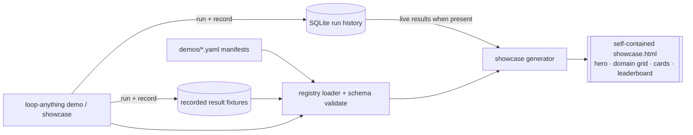
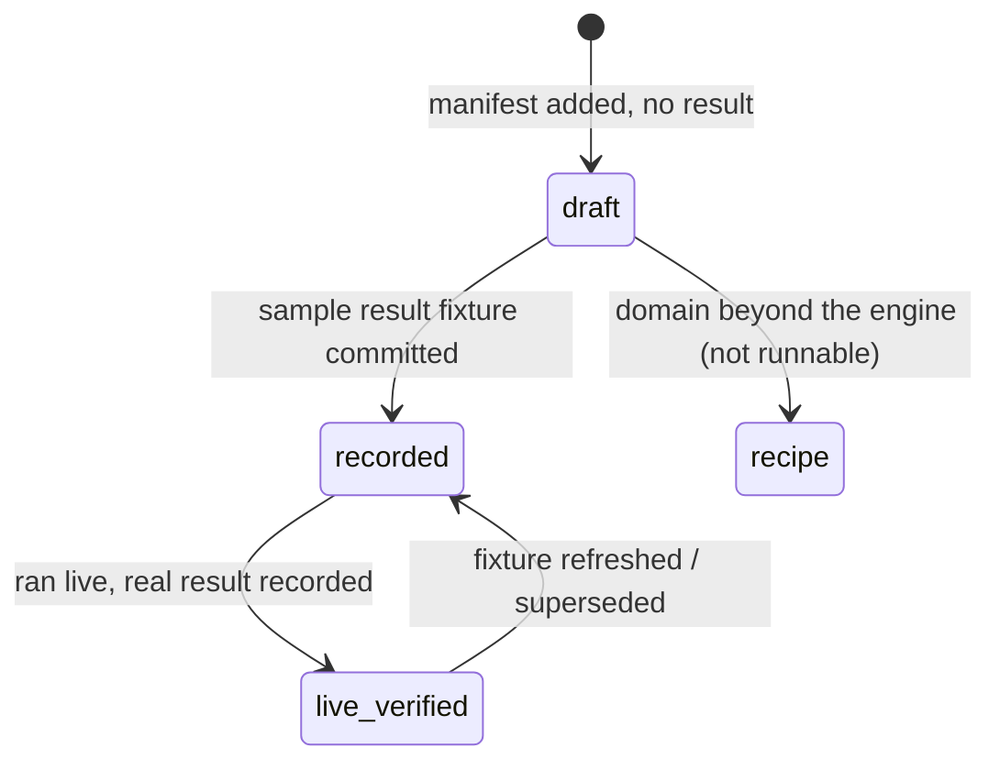

# feat: community demos + showcase catalog for loop-engineering-anything

**Target repo:** this repository (`loop-engineering-anything`). All paths are repo-relative.

---

## Summary

Add a **community demos + showcase layer** so anyone can publish a loop and browse what others have built. It has four parts: a **demo manifest/registry** (one file per demo, schema-validated), **10 starter demos** drawn from the domains in the *Infinite Improvement Loop* article — each reframed as a concrete agent-native target our engine actually loops — a **self-contained HTML showcase catalog** modeled on [printingpress.dev](https://printingpress.dev) and [clianything.cc](https://clianything.cc), and a **contribution path** (schema + guide + CI validation + attribution) for community submissions.

Unlike those two reference catalogs — which deliberately surface *no* quality metric — ours headlines the thing that makes loop-engineering-anything different: each demo card shows the **grade trajectory, final grade, convergence status, and research report**. The loop's outcome *is* the showcase.

Demos ship with **recorded sample results** so the catalog is populated and viewable immediately, decoupled from live-run availability (the external tools and `claude -p` quota are not always present); a live run refreshes the recorded result. Article domains our engine cannot execute today (live trading, drug-discovery simulation, grid dispatch) are documented as **aspirational loop recipes**, clearly separated from runnable demos.

---

## Problem Frame

loop-engineering-anything has a working engine (route → generate → judge → refactor → compound) but nothing to *show* for it and no on-ramp for others to participate. The two reference catalogs prove the pattern: a gallery of contributed, agent-native tools with low-friction gitops contribution is what turns a generator into a community. We need the equivalent — but our gallery's unique hook is the **loop outcome** (did the tool actually converge, and how?), which neither reference site surfaces because neither has a referee.

The article supplies ready-made domain inspiration (VC, education, legal, software architecture, PR lifecycle, biotech, quant, smart grid, supply chain, clinical trials). We use those domains as the seed set, mapping each to a concrete target our engine can genuinely loop, and reserve the domains beyond the engine's reach as recipes rather than pretending they run.

---

## Requirements

| ID | Requirement |
|---|---|
| R1 | Define a demo **manifest** format and a **registry** (one file per demo under `demos/`), loadable and schema-validated. |
| R2 | CLI commands to **list / show / validate / run / record** demos. |
| R3 | Generate a **self-contained static HTML showcase catalog** from the registry + run history: hero, domain grid, per-demo cards, search/filter, contributor leaderboard. |
| R4 | Each demo card surfaces the **loop outcome** — grade trajectory, final grade, convergence status, report link (the differentiator vs. generic CLI catalogs). |
| R5 | Ship **10 starter demos** from the article's domains, each reframed as a concrete agent-native target, with **recorded sample results** so the catalog is viewable without a live run. |
| R6 | Document **aspirational loop recipes** for domains beyond the current engine, clearly separated from runnable demos and cross-linked from the catalog. |
| R7 | A **community contribution path**: manifest JSON Schema, a contributor guide, CI validation, a PR template, and per-demo contributor attribution. |
| R8 | A demo can be **(re)run live** when the tools are available, recording real results back into the registry. |

**Success criteria:** a contributor adds one manifest file via PR, CI validates it, `loop-anything showcase` regenerates a single HTML gallery that lists every demo with its grade trajectory and report, and the article's 10 domains are represented (as runnable demos or recipes). The gallery is real and non-empty even when no live tools are installed.

---

## Key Technical Decisions

- **KTD1 — Manifests are static per-demo files validated by JSON Schema.** A demo is one YAML file under `demos/`; contributing is a PR that adds a file; CI validates it. _Rationale:_ lowest contribution friction, gitops-native, mirrors the contributor model of both reference catalogs. _Rejected:_ a database or web submission form — infrastructure the project doesn't have and contributors can't diff-review.
- **KTD2 — Demos ship with result fixtures that carry explicit provenance.** A fixture records a grade trajectory + report and a `source` of either `illustrative` (hand-authored, never run) or `live_verified` (snapshotted from a real run via `demo record --from <run_id>`). The catalog renders both but **visibly distinguishes them** — an `illustrative` card carries a "not a verified run" badge. _Rationale:_ the external tools and headless `claude -p` quota are intermittently unavailable, so the gallery must populate without live runs — but the product's whole credibility is honest grading, so an unearned-looking `A` must never masquerade as engine output. Provenance + the badge make the distinction unfakeable at a glance. _Resolves doc-review:_ the fabrication risk the recorded-fixture approach otherwise creates.
- **KTD3 — The showcase is a single self-contained HTML file** (inline CSS/JS, zero dependencies), generated from the registry. _Rationale:_ matches the repo's zero-dep ethos and both reference sites; trivially hostable on GitHub Pages. _Rejected:_ a docs-site framework — new toolchain, no payoff at this scale.
- **KTD4 — Cards headline the loop outcome.** Grade trajectory, final grade, convergence status, and report link are the primary card content. _Rationale:_ this is the product's unique value; the reference catalogs surface no quality metric precisely because they have no referee, and ours does (CLI-Judge).
- **KTD5 — Domains map to executable targets or become recipes, never fake demos.** Each article domain is either reframed as a real agent-native target the engine loops (mostly public-API service-lane targets) or documented as an aspirational recipe. _Rationale:_ keeps the gallery truthful to what the engine does today.
- **KTD6 — Reuse the existing memory store + report renderer** as the catalog's data source. _Rationale:_ run history and the research report already exist; the generator reads them rather than inventing a new data layer.
- **KTD7 — Community-contributed content is rendered with context-aware encoding, not blanket HTML-escaping.** Manifest and result-fixture strings are untrusted input that flows into multiple contexts: HTML text nodes, HTML attributes, and inline-JS string literals (the search index). Each context gets its correct encoding (HTML-text vs HTML-attribute vs JS-string/JSON-in-`<script>`). URL-valued fields (the report link, any contributor URL) are validated against a scheme allow-list (`https:` or repo-relative only) before going in an `href` — `javascript:`/`data:` URLs are rejected. `result_ref` is constrained to the `<id>.json` slug under `demos/results/` (no free path, no `..`). _Rationale:_ blanket HTML entity-encoding is the wrong encoding for attribute and JS contexts and lets `</script>` breakout, event-handler injection, and `javascript:` links survive; the gallery has inline JS (KTD3), so this is a real surface. _Resolves doc-review:_ the security findings that the single `<script>`-in-title test under-covers the threat.
- **KTD8 — Declare the manifest dependencies explicitly.** Manifests are YAML validated by JSON Schema, so `pyyaml` and `jsonschema` become declared runtime dependencies in `pyproject.toml` (and CI installs them). _Rationale:_ YAML is the right format for hand-authored, diff-reviewable community manifests; `jsonschema` is the right validator for field-named errors. Neither is currently a guaranteed dependency (only `click` is; `jsonschema` is present only incidentally via CLI-Judge), so leaving it to "decide at build" would crash `demo validate` on a clean CI runner. _Rejected:_ JSON manifests + structural validation to stay zero-dep — saves two small deps at the cost of contributor ergonomics, and YAML is worth it for the community surface.

---

## High-Level Technical Design

Directional; prose is authoritative where it disagrees.

### Data flow: registry + run history → catalog



### Demo result lifecycle (what a card's status badge reflects)



---

## Output Structure

```
loop-engineering-anything/
├── demos/
│   ├── SCHEMA.json                      # manifest JSON Schema (U1)
│   ├── vc-angel.yaml                     # 10 starter manifests (U4)
│   ├── legal-compliance.yaml
│   ├── pr-lifecycle.yaml
│   ├── clinical-trials.yaml
│   ├── ... (6 more)
│   └── results/                          # result fixtures (U4)
│       ├── <demo-id>.json                # trajectory + report metadata + source (illustrative|live_verified)
│       └── <demo-id>.report.md           # persisted report artifact the card links to (U2 record)
├── src/loopeng/
│   ├── demos/
│   │   ├── manifest.py                   # manifest dataclass + load/validate (U1)
│   │   └── registry.py                   # discover + index demos (U1)
│   └── showcase/
│       └── generate.py                   # registry + run history -> HTML, inline CSS/JS, escaping (U3)
├── docs/recipes/                          # aspirational loop recipes (U5)
│   ├── README.md                         # runnable demos vs recipes
│   └── <domain>.md
├── CONTRIBUTING-demos.md                  # how to submit a demo (U6)
├── .github/
│   ├── workflows/demos.yml               # CI: validate every manifest (U6)
│   └── PULL_REQUEST_TEMPLATE/demo.md      # demo submission template (U6)
└── tests/
    ├── test_demo_manifest.py             # U1
    ├── test_demo_cli.py                  # U2
    ├── test_showcase_generate.py         # U3
    └── test_starter_demos.py             # U4
```

Per-unit `**Files:**` are authoritative; the tree is a scope declaration.

---

## Implementation Units

Grouped into four phases (see Phased Delivery).

### U1. Demo manifest schema + registry

- **Goal:** Define the manifest format and a registry that discovers, loads, and validates every demo file.
- **Requirements:** R1.
- **Dependencies:** none.
- **Files:** `demos/SCHEMA.json`, `pyproject.toml` (declare `pyyaml`, `jsonschema`), `src/loopeng/demos/manifest.py`, `src/loopeng/demos/registry.py`, `tests/test_demo_manifest.py`.
- **Approach:** A manifest carries: `id` (kebab slug), `title`, `domain`, `target`, `lane` (`service`/`codebase`), `goal`, `exit_criteria` (target grade + budget), `contributor` (optional GitHub handle), `required_env` (optional list of env-var names for credentialed targets — *not* a bare boolean), and an optional `result_ref` (the `<id>.json` slug under `demos/results/`; no free path). **Two orthogonal axes replace a single conflated `status`** (doc-review fix): `kind` (`demo` | `recipe`) for runnability, and the result's `source` (`none` | `illustrative` | `live_verified`) lives in the fixture, not the manifest — so a domain can ship a runnable narrow demo *and* a broader recipe without contradiction. **Target validation** is part of the schema/loader: service-lane targets must be `https:` URLs whose host is not a private/link-local range (no SSRF); codebase-lane targets must be a repo-relative path with no `..` (no traversal); `required_env` names and committed fixtures are scanned to reject embedded credential-like strings (no secrets in git). `manifest.py` loads YAML (`pyyaml`) into a dataclass and validates against `SCHEMA.json` (`jsonschema`) — both declared deps per KTD8. `registry.py` globs `demos/*.yaml`, rejects duplicate ids, and indexes by domain. Lane values reuse `config.Lane`.
- **Patterns to follow:** dataclass contracts in `src/loopeng/adapters/base.py`; `Lane` in `src/loopeng/config.py`.
- **Test scenarios:**
  - A valid manifest loads into a dataclass with all fields (happy path).
  - A manifest missing a required field (`goal`) fails validation with a field-named error (error path).
  - Two manifests with the same `id` → registry raises a duplicate-id error (edge).
  - `kind: recipe` manifests are loaded but flagged non-runnable (happy path).
  - A service-lane target of `http://169.254.169.254/...` or a private-IP host is rejected (**security** — SSRF guard).
  - A codebase-lane target containing `..` is rejected (**security** — path traversal).
  - A manifest or fixture containing a credential-like string is rejected by validation (**security** — no secrets in git).
  - Registry indexes 3 manifests across 2 domains and returns them grouped by domain (integration).
- **Verification:** every file in `demos/` loads and validates; duplicate ids and missing fields are caught with actionable messages.

### U2. `loop-anything demo` CLI commands

- **Goal:** Expose the registry through the CLI: list, show, validate, run, record.
- **Requirements:** R2, R8.
- **Dependencies:** U1.
- **Files:** `src/loopeng/cli.py` (add a `demo` command group), `tests/test_demo_cli.py`.
- **Approach:** `demo list [--domain X] [--json]`, `demo show <id>`, `demo validate` (validate all manifests + fixtures; exit 1 on any failure — the CI entrypoint), `demo record <id> --from <run_id>` (snapshot an existing run-history entry into a `live_verified` fixture **and persist the rendered report** to `demos/results/<id>.report.md` via `render_report`, so the card has a real artifact to link — doc-review fix), and `demo run <id>`. **`demo run` is a gated stub in this plan** (doc-review fix): `run_loop` requires concrete `Judge`/`Refiner`/`Compounder` bindings that depend on the still-deferred per-target adapters, exactly like the existing `run` command which already raises a not-yet-wired `ClickException`. `demo run` resolves + validates the manifest, gates on preflight + `required_env`, then emits the same honest not-yet-wired message until the adapters land. Live result population this cycle therefore flows through `demo record` against a real run-history entry, not `demo run`. `record` reuses `autonomous.runner`/`report` and the memory store; no new loop logic.
- **Patterns to follow:** existing Click commands and the preflight/credential gates in `src/loopeng/cli.py` and `src/loopeng/autonomous/runner.py`.
- **Test scenarios:**
  - `demo list --json` returns one entry per manifest with domain + kind + result source (happy path).
  - `demo validate` exits 0 on a clean registry, 1 when a manifest or fixture is malformed (error path; this is the CI contract).
  - `demo show <unknown-id>` → actionable not-found error (error path).
  - `demo run <id>` on a `recipe`-kind demo refuses as non-runnable (edge).
  - `demo run <id>` on a `demo`-kind target emits the not-yet-wired message (no live adapters) (edge — the honest stub contract).
  - `demo record <id> --from <run_id>` writes a `live_verified` fixture matching the run's trajectory AND persists `demos/results/<id>.report.md` (integration, mocked store).
- **Verification:** each subcommand behaves per scenario; `demo validate` is usable as the CI gate.

### U3. Showcase catalog generator

- **Goal:** Generate a single self-contained HTML gallery from the registry + run history.
- **Requirements:** R3, R4, R7 (leaderboard/attribution), R8 (live results when present).
- **Dependencies:** U1.
- **Files:** `src/loopeng/showcase/generate.py` (rendering + escaping live here — no separate `template.py`; single consumer, per doc-review simplification), `src/loopeng/cli.py` (add `showcase`), `tests/test_showcase_generate.py`.
- **Approach:** `generate.py` reads the registry, joins each demo to its result (live run-history entry if present, else the fixture), and renders one self-contained HTML file (inline CSS/JS, no external assets). Layout mirrors the reference catalogs — hero, domain grid (filter by domain), per-demo cards, client-side search, contributor leaderboard — but each card headlines the **loop outcome**. `loop-anything showcase [--out showcase.html]` writes the file. Encoding follows KTD7 (context-aware; URL allow-list; slug-only `result_ref`).

  **Hero content brief:** headline names the differentiator ("Tools that grade themselves better" / equivalent); subhead = one line on the generate→judge→refactor loop; primary CTA "Browse demos" (scrolls to grid), secondary "Add your own" (links `CONTRIBUTING-demos.md`). Not a generic gradient-SaaS hero.

  **Card-state table** (the implementer renders by these, not by inventing copy):

  | kind / result.source | trajectory slot | grade badge | convergence badge | report link | provenance badge |
  |---|---|---|---|---|---|
  | demo / `live_verified` | full e.g. `C → B → A` | final letter | `converged`/`stopped`/`blocked_safety` | to `<id>.report.md` | "verified run" |
  | demo / `illustrative` | full trajectory | final letter | as recorded | to report if present | **"illustrative — not a verified run"** |
  | demo / `none` (draft) | "— not yet run —" | greyed `?` | hidden | hidden | "draft" |
  | recipe / any | hidden | hidden | hidden | to `docs/recipes/<domain>.md` | "recipe — not runnable yet" |

  **Recipes lane:** a separate, visually distinct section below the runnable grid; recipe cards headline the goal + a one-line "why not runnable yet" + a link to the recipe doc (no grade elements).

  **Search/filter:** client-side, searches `title`/`domain`/`target`/`contributor`; domain-grid filter and search **compose (AND)**; zero-results shows "No demos match — clear filter"; the recipes lane is included in search/filter.

  **Leaderboard:** rank contributors by demo count, alphabetical tiebreak, top 10; when no demos carry a `contributor`, show "Be the first — see CONTRIBUTING-demos.md" instead of an empty list.

  **Empty/degraded states:** an empty registry renders the hero + "No demos yet — see CONTRIBUTING-demos.md" (not a blank page); a manifest whose `result_ref` is missing renders as `draft` with a logged warning, never a crash.

  **Accessibility:** the card grid is wrapped in an `aria-live` region so filter/search changes are announced; the search input sits in a `role="search"` landmark; grade-trajectory spans carry an `aria-label`; filter chips are real buttons with `aria-pressed`. Responsive: cards go single-column below a narrow breakpoint; the trajectory string wraps rather than truncating.
- **Execution note:** Add the escaping/encoding tests first — they are the security-bearing behavior.
- **Patterns to follow:** the self-contained-HTML, zero-dep approach used elsewhere in the ecosystem; `autonomous/report.py` for the per-run fields to surface.
- **Test scenarios:**
  - Covers R4. A `live_verified` demo renders `C → B → A`, an `A` badge, and a "verified run" provenance badge linking to its report (happy path).
  - An `illustrative` fixture renders the **"illustrative — not a verified run"** badge, never an unqualified verified one (happy path; the honesty guarantee).
  - A `<script>`-bearing title is escaped in HTML-text context (no executable tag) (**security**).
  - A `result_ref`/report URL of `javascript:alert(1)` is rejected — the rendered `href` is safe or omitted (**security** — URL allow-list).
  - A title containing `</script>` does not break out of the inline-JS search index (**security** — JS-context encoding).
  - A `contributor` of `` is escaped in the leaderboard (**security** — leaderboard path).
  - A `draft` demo (no result) renders "— not yet run —", greyed badge, no crash (edge).
  - A `recipe`-kind demo renders in the recipes lane linking its recipe doc, not as a runnable card (happy path).
  - An empty registry renders the hero + "No demos yet" copy, not a blank page (edge).
  - Domain filter and search compose (AND); zero-results renders the clear-filter copy (integration).
  - The card grid carries an `aria-live` region and trajectory spans carry `aria-label` (a11y).
  - The output is a single file with no external asset references (edge — self-contained invariant).
- **Verification:** `loop-anything showcase` produces one self-contained HTML file rendering every demo with its outcome; community text cannot inject script.

### U4. Ten starter demos + recorded results

- **Goal:** Seed the registry with the article's 10 domains as concrete demos/recipes, each with a recorded sample result so the catalog is immediately real.
- **Requirements:** R5, R6.
- **Dependencies:** U1, U3.
- **Files:** `demos/*.yaml` (10 demo manifests + the `kind: recipe` manifests for U5's recipe domains — recipe manifests are owned **here**, their prose docs by U5), `demos/results/*.json` (+ `*.report.md`) illustrative fixtures, `tests/test_starter_demos.py`.
- **Approach:** Map each domain to a concrete, mostly key-free target (named, not "a public X API" — doc-review fix):

  | Demo id | Article domain | Concrete target (lane) | Credentials |
  |---|---|---|---|
  | `pr-lifecycle` | Interactive spec / PR lifecycle | GitHub REST API (service) | `GITHUB_TOKEN` (rate limits) |
  | `legal-compliance` | Legal & compliance | SEC EDGAR submissions API (service) | none |
  | `clinical-trials` | Clinical trials & health | ClinicalTrials.gov API v2 (service) | none |
  | `biotech-discovery` | Biotech & drug discovery | PubChem PUG REST API (service) | none |
  | `quant-macro` | Quant asset management | Frankfurter FX API (service) | none |
  | `vc-angel` | VC & angel investing | SEC EDGAR company-facts API (service) | none |
  | `software-arch` | Complex software architecture | a small local microservice repo (codebase) | none |
  | `edu-curriculum` | Education & curriculum | a local learning-tool repo (codebase) | none |
  | `smart-grid` | Smart-grid energy | Open-Meteo forecast API (service) | none |
  | `supply-chain` | Supply chain & logistics | OpenSky Network API (service) | none |

  **Provenance is honest about the current state:** because no live agentic run is possible yet (per-target adapters deferred; tools/quota intermittent), all 10 ship with `source: illustrative` fixtures and the "illustrative — not a verified run" badge (KTD2). When the adapters land and a real run is recorded via `demo record`, a card flips to `live_verified`. The **first target to verify live** should be a no-credential, well-fixtured API (ClinicalTrials.gov or SEC EDGAR) — depth-first, to prove one real card before scaling. Domains whose *full* article loop exceeds the engine (overnight portfolio optimization, drug simulation) keep the runnable narrow demo and add a `kind: recipe` manifest + doc (U5).
- **Patterns to follow:** the manifest schema from U1; result fixture shape from `autonomous/report.py`'s `build_report` output.
- **Test scenarios:**
  - All 10 manifests + their fixtures pass `demo validate` (happy path; covers R5).
  - Every starter fixture is `source: illustrative` — no starter card claims a `live_verified` run it didn't have (the honesty guarantee).
  - Every starter demo declares a domain present in the article set, and every credentialed target declares its `required_env` (integration).
  - The showcase renders all 10 without error and the recipe cross-links resolve (integration, covers R6).
- **Verification:** the catalog generated from only the starter set is non-empty, shows 10 domains, and every runnable demo card has a trajectory.

### U5. Aspirational loop recipes

- **Goal:** Document the article's domains whose full loop exceeds the current engine as recipes, separated from runnable demos.
- **Requirements:** R6.
- **Dependencies:** U1.
- **Files:** `docs/recipes/README.md`, `docs/recipes/<domain>.md` (per recipe).
- **Approach:** `README.md` states the runnable-demo-vs-recipe distinction. Each recipe adapts the article's domain loop (the agent personas, the iterate-until exit criteria) to loop-engineering-anything's paradigm — what the loop *would* be, what target/judge/exit-criteria it needs, and why it isn't runnable yet (no referee fixtures for that domain, requires live execution we don't sandbox, etc.). Each recipe domain also has a `kind: recipe` manifest (U4) so it appears in the catalog's recipes lane.
- **Patterns to follow:** `docs/e2e-runbook.md` tone (honest about what's blocked and why).
- **Test scenarios:** `Test expectation: none -- documentation. Validated indirectly: U4 asserts recipe manifests load and the showcase renders them in the recipes lane.`
- **Verification:** every recipe doc has a matching `kind: recipe` manifest and is reachable from the catalog.

### U6. Community contribution path

- **Goal:** Make submitting a demo a low-friction, validated PR.
- **Requirements:** R7.
- **Dependencies:** U1, U2.
- **Files:** `CONTRIBUTING-demos.md`, `.github/workflows/demos.yml`, `.github/PULL_REQUEST_TEMPLATE/demo.md`, README cross-link.
- **Approach:** `CONTRIBUTING-demos.md` walks through copying a manifest, the required fields, the **credential convention** (name env vars in `required_env`; never put secret values in a manifest or fixture), recording a result, and regenerating the showcase. `demos.yml` **installs the package with its declared deps** (`pip install -e ".[dev]"` now pulls `pyyaml`+`jsonschema` per KTD8 — do not rely on incidental presence) and runs `loop-anything demo validate` on every PR touching `demos/`, so a malformed/duplicate manifest, a bad target (SSRF/traversal), or an embedded credential-like string fails the check. The PR template prompts for target, lane, goal, exit criteria, `required_env` (if any), `contributor`, and whether the attached result is `illustrative` or `live_verified`. Contributor attribution flows from `contributor` into the leaderboard (U3).
- **Patterns to follow:** the existing `.github/workflows/ci.yml`; `AGENTS.md` doc-sync conventions.
- **Test scenarios:**
  - A PR adding a malformed manifest fails `demo validate` in CI (error path; the core guarantee — validated against a fixture bad manifest in `tests/test_demo_cli.py`).
  - A manifest with a private-IP/`javascript:` target or an embedded credential-like string fails `demo validate` (**security** — the CI gate enforces the U1 rules).
  - A well-formed contributed manifest validates and appears in the regenerated catalog with its contributor credited (integration).
- **Verification:** CI rejects bad manifests; a clean contribution lands in the catalog with attribution.

---

## Scope Boundaries

**In scope:** the manifest/registry, demo CLI commands, the HTML showcase generator, 10 starter demos with recorded results, aspirational recipe docs, and the contribution path.

### Deferred to Follow-Up Work
- Hosting the catalog (GitHub Pages workflow) — the generator emits the file; publishing is a follow-up.
- A contributor leaderboard backed by anything beyond manifest attribution (e.g., GitHub stats).
- Automatic nightly live-refresh of all demo results (depends on tools + quota being reliably present).
- Per-demo CLI-Judge adapters for novel targets (each runnable demo needs one to run live; recorded fixtures stand in until then).

### Outside this product's identity
- A general-purpose agentic-loop runtime for domains the engine can't execute (live trading, drug-discovery simulation, grid dispatch). These are recipes, not demos — the engine loops agent-native CLI generation, not arbitrary domain simulations.
- Re-hosting or forking the reference catalogs; we model their UX, we don't mirror their content.

---

## Risks & Dependencies

**Prerequisites:** the existing engine (registry/runner/judge/report) on `main`; `pyyaml`+`jsonschema` added as declared deps (KTD8); for *live* demo runs, the external tools + the still-deferred per-target adapters + credentials for credentialed targets (per `docs/e2e-runbook.md`).

| Risk | Mitigation |
|---|---|
| Live demo runs blocked (tools/quota/adapters absent) | `illustrative` fixtures (KTD2) populate the catalog; `demo run` is an honest stub until adapters land (U2). |
| Fixtures fabricated / overclaim a run that didn't happen | Explicit `source` provenance + "illustrative" badge (KTD2); `live_verified` only via `demo record --from` a real run (U2); validated in U4 tests. |
| Stored XSS via community text/URLs/JS context | Context-aware encoding + URL scheme allow-list + slug-only `result_ref` (KTD7); multiple U3 security tests, not just `<script>` in title. |
| SSRF / path traversal via community `target` | Target validation in the schema/loader (U1) enforced by the CI gate (U6). |
| Secrets committed in manifests/fixtures | `required_env` names only + credential-string scan in `demo validate` (U1/U6). |
| Undeclared deps crash CI | `pyyaml`/`jsonschema` declared and installed in `demos.yml` (KTD8, U6). |
| Manifest schema drift as contributions grow | JSON Schema + `demo validate` CI gate (U1/U6). |
| Article domains overclaim what the engine does | KTD5 — concrete real targets or `kind: recipe`; no fabricated demos. |

---

## Phased Delivery

- **Phase A — Framework:** U1 (manifest + registry), U2 (demo CLI). End state: demos are loadable, validatable, runnable/recordable.
- **Phase B — Showcase:** U3 (HTML generator). End state: a registry renders to a self-contained gallery with loop outcomes.
- **Phase C — Content:** U4 (10 starter demos + results), U5 (recipes). End state: the article's domains are represented and the catalog is real.
- **Phase D — Community:** U6 (contribution path + CI). End state: outside contributors can submit validated demos.

---

## Success Metrics

- One `loop-anything showcase` run produces a single self-contained HTML file listing every demo with its grade trajectory and report.
- The catalog renders all 10 article domains (runnable demos + recipes) with zero live tools installed.
- A malformed contributed manifest is rejected by CI; a clean one appears in the catalog with attribution.
- No manifest-derived string can inject executable script into the catalog.

---

## Alternatives Considered

- **Database/web-app catalog** instead of static HTML + gitops manifests. Rejected (KTD1/KTD3): infrastructure the project lacks, kills diff-reviewable contribution, and over-builds for the scale.
- **Require live runs to populate the gallery.** Rejected (KTD2): the tools and `claude -p` quota are intermittently unavailable, which would leave the catalog empty or tempt fabricated results; recorded fixtures keep it real and refreshable.
- **Implement the article's full domain loops** (trading, drug sim, grid dispatch) as runnable demos. Rejected (KTD5): beyond the engine's current generate→judge→refactor scope; surfaced as recipes so the article's vision is honored without fake demos.

---

## Sources & Research

- [printingpress.dev](https://printingpress.dev) — catalog UX studied: hero + value prop, 19-category grid, featured "Library" exemplars, per-entry cards (name/tagline/example command/sample output/data sources), contributor leaderboard, search; **no quality metric surfaced**.
- [clianything.cc](https://clianything.cc) — CLI-Hub UX: hero, capability-matrix filters, category grid, per-entry cards with status badges (preview/live) + GIF previews + contributor attribution.
- *The Infinite Improvement Loop* (A. Gulli, 2026-06-13) — the **external article** (not in the repo) that supplies the 10 starter domains; the "I'm going to the beach" framing aligns with the autonomous runner. Note: the plan's `origin:` frontmatter points at `loop-engineering-anything-idea.md` (the engine's idea doc); the *community/showcase layer itself is new scope* this plan introduces, validated by the user's confirmed forks rather than by that idea doc.
- Internal: `src/loopeng/autonomous/report.py` (result fields), `src/loopeng/memory/store.py` (run history), `src/loopeng/config.py` (`Lane`), `docs/e2e-runbook.md` (live-run prerequisites).
