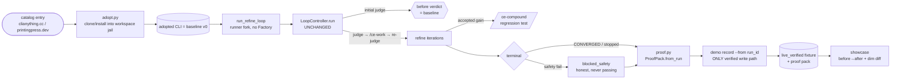

# feat: Catalog-to-proof pipeline — verified before/after loop proofs from real catalog CLIs

## Summary

The showcase (`loop-anything-hub`) ships **illustrative** demos with hand-authored grade trajectories — none have been run live. This plan replaces that gap with a **reproducible proof pipeline**: adopt an already-generated agent-native CLI from the real catalogs ([clianything.cc](https://clianything.cc/), [printingpress.dev](https://printingpress.dev/)) as the **baseline ("before")**, run the genuine refine loop (judge → `/ce-work` → re-judge → `/ce-compound`) on it, emit a standardized **proof pack** (before/after `report.json`, per-dimension score diff, iterations, wall-clock, token cost, compounded regression tests), and record a `live_verified` card via the existing `demo record` path. The 3–5 ROI-ranked catalog targets are the **first outputs** of this pipeline, not bespoke hand-crafted demos.

This proves the project's *actual* novel contribution — the convergence loop — rather than the generators it wraps, and it does so honestly: the machinery is built and unit-tested against scripted verdicts now; the live before→after runs are gated on the `claude -p` quota window (opens **2026-07-01**) and per-target toolchains.

---

## Problem Frame

`loop-engineering-anything` claims "make any software improve itself." The README's loop diagram, the convergence policy, and 74 tests all validate **loop dynamics against recorded verdicts** — but the showcase has **zero verified runs**. Every fixture in `demos/results/*.json` carries `"source": "illustrative"` with a representative, hand-authored trajectory (e.g., `["C","B","A"]`). The recent "honesty pass" (commit `0c90d7d`) explicitly badges these as not-a-verified-run precisely because faking verified status is the failure mode to avoid.

The user's request: stop illustrating, start proving. Source real working CLIs from the two catalogs, pick the highest-ROI 3–5, apply the loop, and show a before/after comparison that demonstrates value.

### Eval of the request, and the 10X reframe

The literal request — "run the loop on 3–5 catalog tools and show before/after" — is correct but under-leverages three facts research surfaced:

1. **Catalog CLIs are already-generated tools.** That makes them *baselines*, not generation targets. Running refine-only (judge → ce-work → re-judge → compound) on a published CLI sidesteps the unproven from-scratch **generate** frontier (Go toolchain for Printing-Press; untested agentic `/cli-anything`) and exercises the loop's real value. "Before/after" becomes **catalog-v0 → loop-converged** — a cleaner, fairer, more honest comparison than "no tool → tool."
2. **A one-off run proves nothing reusable.** The 10X is a **re-runnable pipeline** (`loop-anything demo proof <id>`) that adopts any catalog entry, runs the loop, emits a standardized proof pack, and flips an `illustrative` card to `live_verified` *in place* — committed, diff-reviewable, CI-gated. The 3–5 targets seed a pipeline that lets the project continuously prove itself and lets contributors add proofs in one PR. This is compounding leverage, not a demo dump.
3. **The proof must be rigorous and unfakeable.** A "C→A" letter is not proof. A proof pack carries before/after `report.json`, per-dimension deltas, iteration count, convergence terminal state (CONVERGED / plateau / budget / `BLOCKED_SAFETY`), wall-clock, token cost, and the regression tests `/ce-compound` added. Provenance stays unfakeable: `live_verified` is writable *only* via `demo record --from <run_id>` against a real store run.

The honest cost of the 10X: a real before→after requires the `claude -p` refine quota (blocked until **2026-07-01**, ~2 weeks out) and per-target CLI-Judge adapters (none exist today). So the plan **builds and tests everything now**, runs **baseline judging** as soon as adapters exist (no quota needed), and gates the **full refine+after** behind the quota window — marking anything not-yet-run honestly.

---

## Requirements

| ID | Requirement | Source |
|---|---|---|
| R1 | Adopt an already-generated catalog CLI into a workspace-jailed directory, pinned by version/commit, from an allowlisted catalog source, without logging credentials. | 10X reframe #1; AGENTS.md safety |
| R2 | Run the loop **refine-only** on an adopted tool: the controller's initial judge of the tool-as-is is the recorded "before" baseline; no Factory/generate step. | Controller `run()` native behavior |
| R3 | Emit a standardized **proof pack**: before/after `report.json` refs, per-dimension score diff, iteration count, convergence terminal state, wall-clock, token cost, compounded regression-test refs. | 10X reframe #3 |
| R4 | A card flips to `live_verified` **only** via `demo record --from <run_id>` against a real store run — never by hand-editing a fixture. | Provenance honesty (KTD2, honesty pass) |
| R5 | Quality comes only from CLI-Judge's parsed `Verdict`/`report.json`; the pipeline never inspects code patterns to assess quality. | AGENTS.md KTD4 |
| R6 | A `safety_ok=False` verdict yields a terminal `BLOCKED_SAFETY` proof recorded honestly as `convergence_status: blocked_safety` — never promoted to a passing proof. | AGENTS.md KTD5/R3 |
| R7 | Select the 3–5 targets by an explicit ROI rubric across both catalogs; the user approves the shortlist before per-target adapters are built. | User-confirmed scope |
| R8 | Existing `illustrative` fixtures continue to validate after the result-schema extension (additive optional fields only); the `demos.yml` CI gate stays green. | Backward-compat |
| R9 | Live before→after runs are gated (skip, never fail) when prerequisites are absent (quota, toolchain, daemon, adapter); a green default suite must not imply a live run occurred. | `docs/e2e-runbook.md` discipline |
| R10 | The showcase headlines real before→after + dimension diff on `live_verified` cards. | 10X reframe #2 |

**Success criteria:** (a) `loop-anything demo proof <id>` runs end-to-end against scripted verdicts in the default suite; (b) at least one catalog target reaches a recorded `live_verified` proof pack with a genuine before→after (or an honest non-improving terminal state) once quota opens; (c) the showcase renders that proof; (d) zero fabricated verified status; (e) a contributor can add a new proof target in one PR **once they have authored its CLI-Judge adapter and captured payloads** — the mechanical path is one PR; the adapter+fixtures are the real work (a scaffold to lower that friction is deferred follow-up).

---

## Key Technical Decisions

**KTD1 — Refine-only via a runner fork, not a controller change.** `LoopController.run(run_id, tool_path, goal)` already judges `tool_path` as-is before any refactor (`src/loopeng/loop/controller.py:81`); that verdict is the baseline. The Factory is invoked only by `autonomous/runner.run_loop` and `cli._run_generator`, never by the controller. So we add a refine-only runner entrypoint that reuses the controller untouched and skips the generate block. *Rejected:* adding a `skip_generate` flag to the `Factory` protocol — the controller already excludes Factory, so the flag would be dead weight and blur the protocol boundary.

**KTD2 — `demo record --from <run_id>` is the sole promoter to `live_verified`.** The proof command orchestrates adopt → refine-loop → proof-pack, then calls the existing record path. We do not add a second write path to verified status. This preserves the unfakeable-provenance primitive the honesty pass established (`demos/README.md`, plan-002 KTD2). **Note:** `demo_record_cmd` today emits a fixed payload (`demo_id, source, grade_trajectory, final_grade, convergence_status, report_ref, engine_version`) and does **not** carry proof-pack fields — so "reuse record" means **extend `demo_record_cmd`'s payload** (U4) to include the proof-pack fields from `ProofPack.from_run`. It remains the *sole* write path; we extend it rather than bypass it.

**KTD3 — Extend the result schema additively (optional fields only).** New proof-pack fields (`before_grade`, `after_grade`, `dim_diff`, `iterations`, `elapsed_seconds`, `token_cost`, `before_report_ref`, `after_report_ref`, `regression_tests`) are optional; `source` keeps its `illustrative | live_verified` enum unchanged. Existing illustrative fixtures still validate; `demo validate` (the `demos.yml` gate) stays green. *Rejected:* a third `source` value like `baseline_only` — a judged-but-unrefined tool is not a proof and should not get a card; it stays `illustrative` until a real refine run completes.

**KTD4 — Catalog adoption is a new, safety-jailed module — never a fork of the generators.** `src/loopeng/adopt.py` installs a published CLI (CLI-Anything: `pip install git+…#subdirectory=<name>/agent-harness`; Printing-Press: prebuilt binary / npx, with Go build flagged as toolchain-gated) into a `within_workspace` directory using `run_tool` (args list, `shell=False`), from an allowlisted host set, pinned by ref. This honors wrap-don't-fork (KTD1 in AGENTS.md): we *adopt* a tool as a target, we never copy its generation logic.

**KTD5 — Grade against captured payloads, with fixture provenance discipline.** Each target's CLI-Judge adapter (`demos/adapters/<id>.py`, the path `cli.py:305` already anticipates) exercises the adopted tool against committed captured-payload fixtures, so grading is deterministic and needs no live credentials/network (P0 #2: judge variance spread 0.0). **But a frozen fixture set chosen by the same author who wants improvement to show is not automatically a fair referee signal** (adversarial finding). To keep the before/after meaningful rather than an artifact of fixture choice, fixtures must: (a) be sampled from a **documented external source** — the tool's own README/examples, upstream issues, or a recorded real session — **never hand-authored to fail**; (b) be **frozen before the baseline judge runs**, with the capture method recorded in the proof pack; (c) prefer the adopted tool's **own declared example/test surface** where it exists. Fixtures must pass `_scan_for_secrets` (see KTD7 on its limits). The proof pack records adapter authoring effort so the loop's contribution is not silently inflated by adapter craftsmanship.

**KTD6 — De-risk P0 #1 before building breadth.** P0 #2 (grade stability) is empirically closed; P0 #1 (does headless `/ce-work` actually raise the grade on a real tool — and *substantively*, not cosmetically?) is the open gate and the single most load-bearing assumption. Rather than build the full pipeline + 3–5 bespoke adapters before testing it, the sequencing runs the **cheapest possible first-light experiment first**: U6a points the pipeline at an **in-repo `services/example-*` target** (zero external-code/credential surface, author-controlled headroom) the moment quota opens, with a **pre-registered substantive-vs-cosmetic pass bar**. Only a positive (non-cosmetic) signal unlocks the multi-target catalog buildout (U6b/U7). Units U1–U4 + one adapter are buildable now; live runs are gated on the `claude -p` quota (2026-07-01) and per-target toolchains.

**KTD7 — Adoption must isolate the install, not just jail the files.** `pip install git+…` and `npx` run arbitrary `setup.py`/build/postinstall code **at install time, before any workspace-jail check applies**, with the full inherited environment — so `within_workspace` alone is a false sense of safety (security finding, high confidence). The adopter therefore: (a) installs into a **dedicated throwaway venv / `--target` dir** inside the workspace, never the parent env; (b) spawns every adoption subprocess with an **explicit pruned `env=`** that omits ambient credentials (`ANTHROPIC_API_KEY`, `GITHUB_TOKEN`, anything matching secret-name patterns), passing only the target's manifest-declared `required_env` plus minimal `PATH`/`HOME`/`TMPDIR`; (c) **pins by full 40-char commit SHA** (tags/branches rejected — they are mutable and a force-push past the host allowlist would install different code); (d) records the resolved SHA in the proof pack. Catalog-entry adoption also requires **human review of the pinned source** as a `CONTRIBUTING-demos.md` checklist item — the host allowlist gates *where* code comes from, not *what* it does.

---

## High-Level Technical Design

The proof pipeline is a thin orchestration over existing parts. The novel surface is the **adopter** (U1) and the **proof-pack emitter** (U3); everything else is reuse.



**Proof-pack anatomy** (assembled by `proof.py` from the SQLite store run + `autonomous.report.build_report`). Three fields have **no existing source** in the codebase and require the wiring named below — they are not free reads (see U3):

| Field | Source | Wiring status |
|---|---|---|
| `before_grade` / `after_grade` | `store.grade_trajectory(run_id)[0]` / `[-1]` | ✅ exists |
| `dim_diff` (per-dimension D1..D5 delta) | `store.iterations(run_id)[0].dims` vs `[-1].dims` | ✅ exists |
| `iterations` | `LoopOutcome.iterations` | ✅ exists |
| `convergence_status` | `run.status` (converged / stopped / blocked_safety) | ✅ exists |
| `elapsed_seconds` | `perf_counter()` in `run_refine_loop`, persisted via **new** `store.record_finished(run_id, iso)` after `controller.run` returns (controller stays unchanged — KTD1) | 🔧 U3 adds column + method |
| `regression_tests` | `learnings.regression_test_ref` — **but no Compounder writes to the store today** (only `compression.py` does, on the every-5 cadence). U3 adds a store-backed Compounder wrapper in `run_refine_loop` that calls `store.record_learning` on each accepted fix | 🔧 U3 wires learning→store |
| `token_cost` | `iterations.token_cost` — **always `None` today**; no token count is captured anywhere and the Refiner/Compounder protocols return no usage. U3 parses `claude -p --output-format json` usage in `ClaudeCodeRefiner`/`Compounder` and threads it through. **Best-effort: if no count is available, the field is omitted/null — never a placeholder** | 🔧 U3 captures or honestly omits |
| `before_report_ref` / `after_report_ref` | committed `report.json` snapshots (new optional schema fields; the existing `report_ref` pattern only accepts `.report.md`, so these are distinct fields accepting `.json`) | 🔧 U3 adds fields |

---

## Output Structure

Existing dirs (e.g. `src/loopeng/adapters/`, `src/loopeng/preflight.py`) are reused, not recreated; only new/modified paths are listed.

```
src/loopeng/
├── adopt.py                      # NEW (U1) — catalog tool adoption, venv-isolated + env-pruned
├── proof.py                      # NEW (U3) — ProofPack builder + store-backed Compounder wrapper
├── preflight.py                  # +missing_for_refine() helper (U2)
├── adapters/safety.py            # +env= pruning on run_tool (U1, KTD7); else reused
├── adapters/compound_engineering.py # +parse claude -p --output-format json usage (U3 token_cost)
├── autonomous/runner.py          # +run_refine_loop (U2)
├── memory/{schema.sql,store.py}  # +finished column, record_finished(), record_learning wiring (U3)
├── demos/result.py               # +optional proof fields (U3)
├── cli.py                        # +`demo proof` command, +extend demo_record payload (U4)
└── showcase/generate.py          # +verified-card proof rendering (U4)
demos/
├── RESULT_SCHEMA.json            # extended additively (U3)
├── adapters/                     # NEW dir (U5)
│   ├── <id>.py                   # per-target CLI-Judge adapters
│   └── fixtures/<id>/*.json      # captured payloads (provenance-recorded, secret-scanned)
├── <id>.yaml                     # shortlist manifests (U5)
└── results/<id>.json             # illustrative → live_verified via record (U6b/U7)
tests/
├── test_adopt.py                 # NEW (U1)
├── test_proof.py                 # NEW (U3)
├── test_autonomous_runner.py     # +run_refine_loop (U2)
├── test_memory_store.py          # +finished column, record_learning (U3)
├── test_demo_manifest.py         # back-compat: illustrative fixtures still validate (U3)
├── test_demo_cli.py              # +`demo proof` (U4)
├── test_showcase_generate.py     # +proof-pack rendering (U4)
└── e2e/test_reference_loop.py    # +gated live proof (U6/U7)
docs/
├── e2e-runbook.md                # +proof run steps (U6/U8)
└── solutions/                    # NEW — seed P0/provenance/refine-only learnings (U8)
```

---

## Implementation Units

### Phase A — Pipeline machinery (buildable now, no quota)

### U1. Catalog tool adopter

**Goal:** A safe `adopt(spec, workspace) -> AdoptResult` that installs a published catalog CLI into a workspace-jailed directory and returns its `tool_path` + metadata.
**Requirements:** R1; KTD7.
**Dependencies:** none.
**Files:** `src/loopeng/adopt.py` (new), `src/loopeng/adapters/safety.py` (reuse `validate_target`/`within_workspace`; **add an `env=` parameter to `run_tool`** so callers can pass a pruned environment), `tests/test_adopt.py` (new).
**Approach:** `AdoptSpec(catalog, name, sha, install_kind)` dataclass — `sha` is a **required full 40-char hex commit SHA** (tags/branches rejected at validation). `install_kind ∈ {pip_git_subdir (CLI-Anything), pp_binary (Printing-Press prebuilt)}`. Allowlist catalog hosts (`github.com/HKUDS/CLI-Anything`, `github.com/mvanhorn/printing-press-library` + their release hosts). **Install isolation (KTD7):** `pip_git_subdir` installs into a dedicated `<workspace>/.venv` (or `pip install --target <workspace>/.pkg`), never the parent env; every adoption subprocess is spawned with an **explicit pruned `env=`** that strips ambient credentials (drop keys matching `_SECRET_NAME_PATTERNS`; keep manifest `required_env` + `PATH`/`HOME`/`TMPDIR`). All subprocess via `run_tool` (args list, `shell=False`); all writes `within_workspace`. `pp_binary` verifies a pinned SHA-256 checksum before execution where available. Go-build path is flagged toolchain-gated, not attempted unless Go is detected. Returns `AdoptResult(ok, tool_path, resolved_sha, logs)` with creds never logged. No changes to the `Factory` protocol.
**Patterns to follow:** subprocess style in `src/loopeng/adapters/printing_press.py`; `run_tool`/`ProcResult` in `adapters/safety.py`.
**Test scenarios:**
- Happy: `pip_git_subdir` spec installs into `<workspace>/.venv` (not the parent env) and returns a `tool_path` inside the workspace (mocked `run_tool`); asserts the install subprocess `args` reference the venv/target path.
- Edge (KTD7): `AdoptSpec` with a tag/branch ref (not a 40-char SHA) is rejected at validation before any subprocess.
- Edge (KTD7): the `env=` passed to the install subprocess omits `ANTHROPIC_API_KEY`/`GITHUB_TOKEN`/secret-pattern keys and includes only allowed vars.
- Happy: `pp_binary` spec resolves a prebuilt binary into the workspace and verifies its checksum (mocked).
- Edge: name containing `..` / shell metachars (`;`, `|`, `` ` ``, `$(`) is rejected before any subprocess call.
- Edge: non-allowlisted catalog host → `AdoptResult(ok=False)`, no subprocess spawned.
- Error: install command non-zero exit → `AdoptResult(ok=False)` with captured stderr, never raises.
- Edge: a path that would escape the workspace is refused (`within_workspace` false).
- Security: credential-like env values never appear in returned logs/strings.

### U2. Refine-only loop entrypoint (runner fork)

**Goal:** `run_refine_loop(tool_path, goal, *, judge, refiner, compounder, store, checkpoint, budget, lane) -> RunResult` that skips generation and drives `LoopController.run` over an already-present tool.
**Requirements:** R2, R6.
**Dependencies:** U1 (provides `tool_path`).
**Files:** `src/loopeng/autonomous/runner.py` (add function; extract shared setup from `run_loop`), `src/loopeng/preflight.py` (**add `missing_for_refine(lane)`** — see Approach), `tests/test_autonomous_runner.py` (extend).
**Approach:** Validate `tool_path` is `within_workspace`. **Preflight:** `missing_for_lane` always pulls in a lane factory (`required_keys` includes every dep where `not dep.lanes or lane in dep.lanes`), so a refine-only run needs a **new `missing_for_refine(lane)`** that requires only `cli-judge` + `compound-engineering` (no factory). Then credential-names check; `_ensure_git_repo` + `GitCheckpoint`; `store.create_run(...)`; `LoopController(...).run(run_id, tool_path, goal)`. The controller's first verdict (iteration baseline) is the "before". Controller code is untouched (KTD1).
**Patterns to follow:** `run_loop` in the same file; tests drop `FakeFactory` and add a "tool already present in workspace" fixture, mirroring `tests/test_autonomous_runner.py`.
**Test scenarios:**
- Happy: scripted judge `before(C) → after(A)` produces a run whose `grade_trajectory[0]` is the baseline and `[-1]` the final.
- Edge: `tool_path` outside the workspace → refused before any loop work.
- Error: preflight missing `cli-judge` or `/ce-work` → `RuntimeError` (matches `run_loop` gate).
- Integration: safety-failing baseline verdict → terminal `BLOCKED_SAFETY`, recorded as `blocked_safety`, no compound fired (Covers R6).
- Edge: no-improvement trajectory → `stopped`, `before == after`, recorded honestly.
- Edge: already-Grade-A baseline → `converged` at iteration 0 (honest "nothing to prove").

### U3. Proof-pack model + result-schema extension + memory metrics

**Goal:** A `ProofPack.from_run(store, run_id)` builder plus the additive schema/store changes and the **three wirings** the proof-pack anatomy table flags as not-yet-sourced.
**Requirements:** R3, R5, R8.
**Dependencies:** U2 (produces the store run it reads).
**Files:** `demos/RESULT_SCHEMA.json` (extend, optional fields incl. `before_report_ref`/`after_report_ref` patterns accepting `.json`), `src/loopeng/demos/result.py` (new optional fields, keep `verified == source == "live_verified"`), `src/loopeng/memory/schema.sql` + `src/loopeng/memory/store.py` (add `finished` column + **`record_finished(run_id, iso)`** method), `src/loopeng/adapters/compound_engineering.py` (parse `claude -p --output-format json` usage for token_cost), `src/loopeng/proof.py` (new — `ProofPack` + a **store-backed Compounder wrapper**), `tests/test_proof.py` (new), `tests/test_memory_store.py` (extend), `tests/test_demo_manifest.py` (back-compat assertion).
**Approach:** `proof.py` reuses `autonomous.report.build_report` for the "after" report and `MemoryStore` queries for before/after dims, diff, trajectory. `dim_diff` is a per-`D1..D5` `{before, after, delta}` map computed purely from parsed verdicts (KTD3 — never from code inspection). **The three not-yet-sourced fields each get an explicit wiring:**
- **`elapsed_seconds`** — the runner measures `perf_counter()` around `controller.run` and persists it via the **new `store.record_finished`** after the call returns (controller stays unchanged — `finish_run` is called *inside* `_finish`, so the runner cannot piggyback on it). If the column is absent, `elapsed_seconds` is omitted, never a placeholder.
- **`regression_tests`** — no Compounder writes to the store today (only `compression.py` does, on the every-5 cadence). `run_refine_loop` injects a **store-backed Compounder wrapper** that calls `store.record_learning(...)` on each accepted fix, so `learnings(run_id)` is populated for normal `max_iterations` runs.
- **`token_cost`** — parse `claude -p --output-format json` usage in `ClaudeCodeRefiner`/`Compounder`, thread the count through the Refiner/Compounder return into `record_iteration(token_cost=...)`. If no count is available, the field is omitted/null — **never a fabricated rigor signal** (R3).
**Patterns to follow:** `autonomous/report.build_report`; `demo record` payload shape at `cli.py:239`.
**Test scenarios:**
- Regression: all 10 existing `illustrative` fixtures still validate against the extended schema (Covers R8).
- Happy: `ProofPack.from_run` computes correct per-dimension `delta` from a scripted before/after store run.
- Edge: `additionalProperties` stays `false`; an unknown field still fails, but every new optional field is accepted.
- Edge: `blocked_safety` run → proof pack records `convergence_status: blocked_safety` and no "passing" framing (Covers R6).
- Integration: store-backed Compounder wrapper populates `learnings(run_id)` on an accepted fix; `regression_tests` is non-empty after a scripted improving run.
- Integration: `elapsed_seconds` populated via `record_finished`; `token_cost` surfaced when the parsed usage is present, omitted/`null` when not (assert no placeholder value).
- Edge: `before_report_ref`/`after_report_ref` (`.json`) resolve to committed snapshot files and validate against the new patterns.

### U4. `demo proof` command + showcase enrichment

**Goal:** `loop-anything demo proof DEMO_ID [--workspace] [--ref] [--dry-run]` orchestrates adopt → refine-loop → proof-pack → `demo record`; the showcase renders proof-pack details on verified cards.
**Requirements:** R4, R6, R10.
**Dependencies:** U1, U2, U3.
**Files:** `src/loopeng/cli.py` (new `@demo_grp.command("proof")` with lazy imports; **extend `demo_record_cmd`'s payload** to carry the proof-pack fields — KTD2), `src/loopeng/showcase/generate.py` (render before→after + `dim_diff` in `_demo_card` for `result.verified`, reading the new `Result` fields), `tests/test_demo_cli.py` (extend), `tests/test_showcase_generate.py` (extend).
**Approach:** Mirror `demo_record_cmd`/`demo_run_cmd`. `--dry-run` prints the adopt + loop plan and writes nothing. The full path records `live_verified` **only** through the `demo record --from <run_id>` write path (KTD2) against the real run U2 produced — but that command's payload is **extended** to include the `ProofPack.from_run` fields (it emits none today), so "reuse record" means "extend record's payload," not "record is unchanged." Refuse to present a `blocked_safety` run as a passing proof. Showcase adds a compact "C → A (+2 grades), D3 +18pts, 4 iters, 38s" line to verified cards (fixture-sourced); illustrative/draft rendering unchanged.
**Patterns to follow:** `demo_record_cmd` (`cli.py:220`); `test_demo_record_writes_fixture_and_report` (`tests/test_demo_cli.py:106`); `_demo_card` in `showcase/generate.py:64`.
**Test scenarios:**
- Happy: `--dry-run` prints the adopt+loop plan, writes no fixture (CliRunner, tmp demos dir).
- Happy: full path with mocked adopter + scripted judge records a `live_verified` fixture **and** a proof pack; asserts `fixture["source"] == "live_verified"`.
- Integration: a `blocked_safety` run records honest status and the command exits indicating no passing proof (Covers R6).
- Error: missing tool / failed preflight → `ClickException`.
- Render: a `verified` card shows before→after + dim diff; an `illustrative` card is unchanged (Covers R10).

### Phase B — Target enablement (buildable now; shortlist user-approved)

### U5. ROI selection + shortlist manifests + per-target CLI-Judge adapters + captured payloads

**Goal:** Encode the ROI rubric with a **headroom pre-gate**, then build the manifest + CLI-Judge adapter + provenance-recorded payloads for the **single first-light target first**, and only after U6a confirms a non-cosmetic signal, the remaining user-approved targets.
**Requirements:** R5, R7, R8.
**Dependencies:** U3 (schema), U4 (the command that consumes these). Adapter authoring waits on shortlist approval; the **first adapter is built and smoke-run through the U2 runner (scripted verdicts, no quota) before the rest** so a contract mismatch surfaces once, not five times.
**Files:** `demos/adapters/<id>.py` (new dir + files), `demos/adapters/fixtures/<id>/*.json` (provenance-recorded captured payloads), `demos/<id>.yaml` (manifests), `demos/results/<id>.json` (illustrative placeholders until U6b/U7 records real runs), `tests/test_starter_demos.py` (extend), `CONTRIBUTING-demos.md` (adapter authoring + ROI rubric + fixture-provenance + human-review checklist).
**Approach:** ROI rubric scores each candidate on install friction (no heavy toolchain/creds), judgeability, improvement headroom, safety/credential risk, recency. **Headroom pre-gate (cheap, no quota — baseline judging runs as soon as an adapter exists):** before committing to a target, run the baseline judge once; **drop any candidate that grades A at baseline** and require a named sub-A weak dimension. This converts the "loop shows no gain" risk into a pre-commitment filter and guarantees the flagship card has room to climb. **Fixture provenance (KTD5):** payloads are sampled from the tool's own README/examples or recorded sessions, frozen before the baseline judge, never hand-authored to fail; prefer the tool's own declared example surface. Research shortlist (balanced; ≥1 pure-Python CLI-Anything target to avoid Go): **arxiv** (Printing-Press, thinnest, public), **cli-anything-wiremock** (Python/pip, v0.1.0, local, no creds), **cli-anything-ollama** (Python/pip, 9 cmds, local), **hackernews** (Printing-Press, public APIs + SQLite), **wikipedia** (Printing-Press, thin, public) — final set + first-light pick confirmed by the user. Manifests pass SSRF/host validation; fixtures pass `_scan_for_secrets` (whose pattern set is expanded in U1/U8 — see Risks).
**Patterns to follow:** existing `demos/*.yaml` manifest shape; `demos/SCHEMA.json` validation; the adapter path `cli.py:305` already references.
**Execution note:** Build the first-light adapter only; gate the remaining 2–4 on a positive U6a signal. Do not pre-build all candidates.
**Test scenarios:**
- Each manifest passes schema + security validation (`demo validate`).
- Each adapter is importable and conforms to the CLI-Judge adapter contract (smoke).
- Headroom pre-gate: a candidate whose baseline grades A is dropped; a kept candidate has a recorded sub-A baseline with a named weak dimension.
- Captured-payload fixtures contain no secrets (expanded `_scan_for_secrets`) and carry a provenance note.
- `demos/adapters/<id>.py` resolves at the path `cli.py:305` expects; lane routing correct per target.

### Phase C — Live proof execution (gated on quota 2026-07-01 + toolchains)

### U6a. P0 #1 first light on an in-repo target (cheapest possible experiment) — gated

**Goal:** Answer the single load-bearing question — *does headless `/ce-work` raise the grade on a real tool, substantively?* — with **zero external-code/credential surface**, before any catalog adapter buildout commits.
**Requirements:** R3, R6, R9; KTD6.
**Dependencies:** U1–U4 + one adapter (for a vendored target); external: `claude -p` quota (2026-07-01), installed `cli-judge`.
**Files:** `demos/adapters/example-microservice.py` (adapter for the in-repo `services/example-microservice`), `tests/e2e/test_reference_loop.py` (gated proof e2e), `docs/e2e-runbook.md`.
**Approach:** Point the pipeline at an **in-repo `services/example-*` target** with author-controlled, deliberately sub-A headroom (no allowlist, no third-party install, no toolchain/daemon friction, no fixture-bias concern since we wrote the tool). Run `loop-anything demo proof example-microservice`. **Pre-register the pass bar BEFORE running:** (a) the after-state must improve ≥N *held-out* fixtures the adapter did not target, and (b) a manual diff review classifies the `/ce-work` change as **substantive vs cosmetic** — a green delta that only touches the graded fixtures is recorded as a `shallow` outcome, not a win. This separates "does the loop work at all" from "does it work on tools we didn't write."
**Execution note:** Real-run unit — **do not fabricate**. A positive (non-cosmetic) signal here is the gate that unlocks U6b/U7; a shallow/negative signal is recorded honestly and pauses the catalog buildout for a brief-context fix (feed `/ce-work` the tool's README/structure).
**Test scenarios:**
- Gated skip: prereqs absent → e2e skips cleanly (green suite ≠ ran) (Covers R9).
- Live: improving run records `live_verified` + proof pack; the held-out-fixture and substantive-vs-cosmetic checks are recorded in the pack.
- Live: safety block → `blocked_safety`, never passing (Covers R6).

### U6b. First catalog proof (single external target) — gated

**Goal:** With P0 #1 de-risked, run the first **catalog** target end-to-end (the impressive "tools we didn't write" claim) through the full adopter path.
**Requirements:** R3, R6, R9.
**Dependencies:** U5, U6a (positive signal); external: quota, the target's toolchain/daemon.
**Files:** `tests/e2e/test_reference_loop.py` (extend), `docs/e2e-runbook.md`.
**Approach:** Pick the user-approved first-light catalog target (current lead: `arxiv` if its prebuilt binary installs without Go, else `cli-anything-wiremock`). Run `loop-anything demo proof <id>`; assert a real terminal state + proof pack + recorded `live_verified` fixture, applying the same held-out / substantive-vs-cosmetic bar from U6a.
**Execution note:** Gated; do not fabricate. Absent prereqs → skip, card stays `illustrative`.
**Test scenarios:**
- Gated skip when prereqs absent (Covers R9).
- Live: records `live_verified` + proof pack with before < after, or an honest `stopped`/no-gain/shallow terminal state.

### U7. Scale to the full 3–5 + regenerate showcase — gated

**Goal:** Run the remaining approved targets, record each `live_verified` via the extended `demo record`, regenerate the showcase, refresh README badges and scope-honesty copy.
**Requirements:** R4, R9, R10.
**Dependencies:** U6b (de-risked path).
**Files:** `demos/results/*.json` (flipped to `live_verified` via `demo record` — never hand-edited), regenerated showcase output, `README.md` (verified-count badge; showcase blurb + the scope-honesty caveat that these proofs validate the **refine loop**, not the generate frontier).
**Approach:** Repeat the U6b path per target. Each card flips only through the record write path (KTD2/R4). Targets that can't yet run stay honestly `illustrative`.
**Execution note:** Gated like U6b.
**Test scenarios:**
- Showcase renders proof-pack fields for `live_verified` cards (scripted fixture) (Covers R10).
- `demo validate` passes on the real recorded fixtures.
- Untouched targets remain `illustrative` and honest.

### U8. Docs, CHANGELOG, and compounded learnings

**Goal:** Sync human + agent docs; seed institutional learnings.
**Requirements:** global doc-sync policy; R4/R5/R6 discoverability.
**Dependencies:** U1–U7.
**Files:** `CHANGELOG.md` (`[Unreleased]` entries + any `Investigated / Rejected`), `README.md` + `AGENTS.md` (new `adopt.py`/`proof.py` modules, `demo proof` command, refine-only lane, KTD7 adopter-isolation boundary, **scope-honesty: proofs validate the refine loop, not the generate frontier**), `src/loopeng/demos/manifest.py` (**expand `_SECRET_PATTERNS`** — bearer/JWT, GCP service-account, HuggingFace `hf_`, high-entropy heuristic), `docs/e2e-runbook.md` (proof runbook), `docs/solutions/*.md` (NEW — decision-record form: P0-gate status, provenance-honesty primitive, refine-only-baseline reframe, adopter-isolation), `CONTRIBUTING-demos.md` (proof contribution flow + fixture-provenance + per-entry human-review checklist).
**Approach:** One CHANGELOG line per behavior change with the why. Seed `docs/solutions/` as short ADR-style decision records (distinct from the narrative `docs/plans/`) so the P0/provenance reasoning currently living only in plans/CHANGELOG gets a durable, queryable home; consider running `/ce-compound` after merge. Reconcile the README headline ("builds … and refactors") with the refine-only proof scope so the hub doesn't market a broader claim than the proofs demonstrate.
**Test expectation:** none — docs only.

---

## Scope Boundaries

**In scope:** the reproducible proof pipeline (adopt → refine-only loop → proof pack → `live_verified` record → showcase), the result-schema extension, an in-repo first-light P0 #1 experiment (U6a), per-target adapters for the approved 3–5, and the first live catalog proofs once quota opens.

**Non-goals (outside this product's identity):**
- The from-scratch **generate** frontier (CLI-Anything agentic generation, Printing-Press Go build). The pipeline adopts already-generated tools; generation stays the deferred frontier.
- Self-grading or code-pattern quality heuristics. CLI-Judge remains the only referee (R5).
- A web-app/database showcase. The catalog stays a git-committed, statically-generated gallery (plan-002 KTD1).

### Deferred to Follow-Up Work
- Live-API grading (vs captured payloads) for targets with free public APIs, once a network/credential policy is defined.
- Auto-discovery of catalog entries (scrape registries) to suggest ROI candidates; for now selection is research-informed + user-approved.
- An adapter scaffold/generator + capture-workflow tooling to make "add a proof in one PR" genuinely low-friction (see success criterion caveat).
- Replacing the bespoke `_scan_for_secrets` pattern list with a maintained scanner (gitleaks/detect-secrets) as a CI gate.

---

## Risks & Dependencies

| Risk | Likelihood | Impact | Mitigation |
|---|---|---|---|
| **`claude -p` refine quota** blocked until 2026-07-01 | Certain (until date) | Blocks before→after | Build/test now against scripted verdicts; gate live runs (U6/U7); the date is ~2 weeks out. |
| **P0 #1 unresolved:** headless `/ce-work` may not raise the grade on a real tool | Medium | A target may show no gain | U6a is the cheap in-repo experiment that answers it *before* breadth (KTD6); an honest `stopped`/no-gain result is valid (if less flashy) — never faked. |
| **Cosmetic refinement:** `/ce-work` has no tool context (only D1..D5 + fixture IDs), so it may patch the graded fixtures without real improvement | Medium | Green delta that proves nothing | Pre-registered substantive-vs-cosmetic bar + held-out fixtures + manual diff review in U6a/U6b; `shallow` recorded honestly; feed the brief tool README/structure if first-light underperforms. |
| **Fixture-choice bias:** the author picks payloads, writes the adapter, and wants improvement — the grade can be an artifact of fixture choice, not tool quality | Medium | Inflated/meaningless before→after | KTD5 fixture-provenance: sample from the tool's own examples, freeze before baseline, prefer the tool's declared surface, record provenance + adapter effort in the pack. |
| **Install-time code execution:** `pip`/`npx` run arbitrary build/postinstall code *before* the jail applies, with inherited env | High | Credential exfiltration / host compromise | KTD7: dedicated venv/`--target`, pruned `env=` stripping ambient creds, full-SHA pin, checksum on binaries, per-entry human review — `within_workspace` alone is insufficient. |
| **Supply chain:** a malicious PR merged to an allowlisted catalog repo passes the host check | Low–Med | Backdoored adopted tool persists across iterations | Full-40-char-SHA pin (not tags), human review of pinned source as a `CONTRIBUTING-demos.md` gate, resolved SHA recorded in the pack (U8). |
| **Committed payload fixtures leak secrets** the 5-pattern scanner misses | Med | Public secret in the repo/showcase | Expand `_SECRET_PATTERNS` (bearer/JWT, GCP, `hf_`, entropy heuristic) in U8; scan full fixture content, not just manifest values. |
| **No per-target CLI-Judge adapter** exists | Certain today | Can't grade | U5 builds adapters against captured payloads; `cli.py:305` already anticipates the path. |
| **Toolchain/daemon friction** (Go for Printing-Press; Java/WireMock; Ollama daemon+model) | Medium | Slows a target | ROI rubric prefers low-friction targets; per-target prereqs are execution-time `skipif` checks (R9). |
| **Schema change breaks the CI gate** | Low | Red `demos.yml` | Additive optional fields only; regression test asserts existing fixtures still validate (U3). |

**External dependencies:** installed `cli-judge`; `claude -p` quota (compound-engineering refine/compound); per-target toolchains/daemons; the two catalog source hosts (allowlisted).

---

## Alternatives Considered

- **Generate-from-scratch then refine** (the literal "before = no tool"). Rejected as the default: depends on the unproven generate frontier (Go toolchain, untested agentic `/cli-anything`) and yields a less honest before/after. Adopting the catalog tool as the baseline is both more feasible and a fairer proof. (User-confirmed.)
- **One-off verified demos, no reusable pipeline.** Rejected: faster to a first card but doesn't compound; the 10X is the re-runnable `demo proof` path and standardized proof pack. (User-confirmed.)
- **Require live runs to populate the gallery.** Rejected (re-confirming plan-002 KTD2): tools/quota are intermittently available, which would leave the catalog empty or tempt fabrication. The pipeline flips `illustrative → live_verified` in place; the surface is never empty.
- **A new `source` value for baseline-only judged tools.** Rejected: a judged-but-unrefined tool isn't a proof and shouldn't earn a card; it stays `illustrative` until a real refine run (KTD3).
- **In-repo target first vs. catalog target first.** Adopted: the *very first* live experiment (U6a) runs against a vendored `services/example-*` target — zero third-party-code surface, author-controlled headroom, no fixture-bias — to isolate "does the loop work at all" from "does it work on tools we didn't write" (U6b). The catalog framing has real credibility value, but it stacks the most external dependencies onto the riskiest unknown, so it goes second.
- **Grade against the tool's own declared examples vs. author-captured payloads.** Partially adopted (KTD5): prefer the adopted tool's own README/example/test surface as the fixture basis where it exists — it gives the same determinism with far less grader-introduced bias — falling back to author-captured payloads only when none are published, recording which was used.
- **On "fairer":** the reframe's *honesty/feasibility* claim (avoids the unproven generate frontier) is well-supported; the separate claim that catalog-v0 → converged is a *more meaningful referee signal* is only as strong as fixture provenance (KTD5) makes it — a low baseline grade must correspond to a defect a domain user would recognize, not a suite/purpose mismatch. Sanity-check one baseline grade against the tool's own README claims before treating the headroom as real.

---

## Sources & Research

- **Repo grounding:** `src/loopeng/loop/controller.py` (`run()` judges as-is first, line 81; Factory untouched), `src/loopeng/autonomous/runner.py` (`run_loop` factory block to fork), `src/loopeng/adapters/{base,judge,compound_engineering,safety}.py`, `src/loopeng/demos/result.py` + `demos/RESULT_SCHEMA.json` (`source` enum, `verified` derivation), `src/loopeng/showcase/generate.py` (`_demo_card` badging), `src/loopeng/memory/store.py` (trajectory/dims queries; `token_cost` always `None`; no `finished` column), `cli.py:220/239/305` (`demo record` payload + anticipated `demos/adapters/<id>.py`).
- **Catalog inventory + ROI ranking:** [clianything.cc](https://clianything.cc/) / [HKUDS/CLI-Anything](https://github.com/HKUDS/CLI-Anything) (pip-from-git subdir installs; wiremock v0.1.0, ollama 9 cmds); [printingpress.dev](https://printingpress.dev/) / [mvanhorn/printing-press-library](https://github.com/mvanhorn/printing-press-library) (arxiv thin/public, hackernews public+SQLite, wikipedia thin). Go toolchain friction on the Printing-Press lane; prebuilt binaries may avoid it (execution-time check).
- **Institutional learnings:** `CHANGELOG.md` (honesty pass `0c90d7d`; P0 #2 variance spread 0.0; rejected "require live runs"), `demos/README.md` (record-only verified write path; `claude -p` quota-blocked until 2026-07-01), `AGENTS.md` (wrap-don't-fork, protocol-only controller, unbypassable safety), `docs/e2e-runbook.md` (gated-skip discipline), `docs/plans/2026-06-15-00{1,2}-*` (prior KTDs). `docs/solutions/` does not exist — U8 seeds it.
- **External research load-bearing?** Yes — the catalog inventory directly shaped the U5 shortlist, the refine-only baseline reframe (KTD1), and the toolchain-friction risk.
