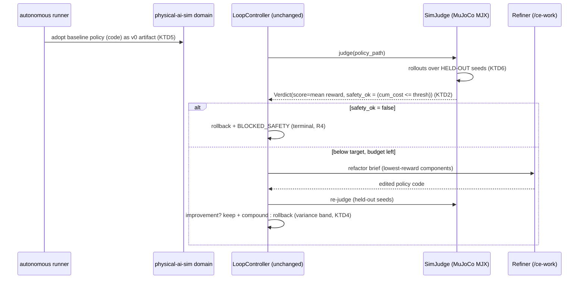

# feat: Loop Engine generalization + physical-AI-in-simulation domain

> **Plan-local U-IDs:** this plan continues the repo's shared U-space at **U9**
> (U1–U8 are the built software/web loop). U9–U17 are the new units here.

---

## Summary

`loop-engineering-anything` today is a *domain-specialized* Loop Engine: it makes
**software and APIs** agent-native and grade-converges them. The two "Loop Engineering"
posts (Osmani, Greyling) describe the *general* discipline — "replacing yourself as the
person who prompts the agent; you design the system that does it instead" — built from six
primitives (scheduling, worktrees, skills, connectors, **maker/checker sub-agents**, durable
state) over a Context → Harness → **Loop** progression.

This plan does two things. First, it **generalizes the loop core into a domain-agnostic
engine** — widening the existing `Factory`/`Judge`/`Refiner`/`Compounder`/`Checkpoint`
protocols and adding a **domain-plugin registry/SDK** — so a "target" can be *anything*, not
just code. Second, it **proves the generalization with a new physical-AI-in-simulation
domain**: a control policy (as code) is the artifact, a simulator is the referee, and a
physical-constraint violation reuses the existing **unbypassable `BLOCKED_SAFETY` gate**.
Along the way it closes the gap to the posts' full definition by adding the four primitives
the repo still lacks — **scheduler/heartbeat, MCP connectors, worktree parallelism, and a
formalized maker/checker contract**. The remaining mission rungs (companies, institutions,
communities, individuals) ship as a **horizon roadmap**, each expressed as a domain plugin,
not half-built code.

The load-bearing invariants are extended, never broken: **wrap-don't-fork**, **protocol-only
controller** (the controller is already domain-agnostic and stays untouched), and **safety is
unbypassable**.

---

## Problem Frame

The repo is one instance of Loop Engineering, hard-wired to a single target shape ("generate
a CLI and grade it to convergence"). Three things follow:

1. **The "anything" promise is unmet.** The mission is to loop-engineer *any* product or
   service across a trajectory — software → website → **physical AI** → companies →
   institutions → communities → individuals. The engine cannot currently express a target
   that isn't a codebase or an API.
2. **The loop is not yet a *loop* by the posts' definition.** It has the hardest parts
   (independent referee / maker-checker split, durable SQLite state, convergence, compounding,
   safety gate) but lacks the **heartbeat (scheduling)**, **connectors (acting in the world)**,
   and **worktree parallelism** that distinguish a continuous loop from a one-off session.
3. **Generality is unproven.** Claiming a domain-agnostic engine without a second domain is a
   vibe. **Precise claim (per doc-review):** the *actuator* in this proof is still "edit code via
   `/ce-work`" — what genuinely differs is the **referee and the safety signal**. So Phase B proves
   the spine drives a **non-code, reality-grounded referee (sim reward) with a real physical safety
   gate (CMDP cost)** — i.e. *pluggable reality-grounded judging*, the hard half of substrate-agnosticism
   — not yet a non-code *actuator*. Physical-AI-in-sim is the next rung in the stated trajectory and the
   cheapest way to prove that half without hardware; a non-code actuator (connectors driving an org
   process) is the follow-on rung (R13).

**In scope:** generalize the core; add the four primitives; build + prove the physical-AI-in-sim
domain; roadmap the rest.
**Not in scope:** building the org/individual domains; real-hardware sim-to-real transfer;
becoming an RL training framework or an MCP hub. (See Scope Boundaries.)

---

## Requirements

| ID | Requirement |
|---|---|
| **R1** | The loop core drives **any** registered domain via the widened protocols, with **no new states or branches in `loop/controller.py`** — every domain satisfies the controller's existing `(score, grade)` reads via a required projection (KTD1). The only additive core change is a persisted `score` column + score-aware plateau in `store`/`convergence`. |
| **R2** | Existing **software-service** and **software-codebase** behavior is preserved exactly — they become two registered domains; no regression in routing, generation, judging, or convergence. |
| **R3** | Convergence works on a **continuous score target** with noise/variance handling, not only the A–F letter ladder. |
| **R4** | A **physical-constraint violation** is expressed as `safety_ok=False` and reuses the terminal `BLOCKED_SAFETY` path — **no parallel safety mechanism** is added. |
| **R5** | The **physical-AI-in-sim** domain runs end-to-end against a real simulator referee and is recorded **honestly** (`live_verified` only via a real store run). |
| **R6** | **Referee integrity:** the final grade is computed on **held-out evaluation seeds the refining agent never sees**, and the referee definition is **immutable to the agent** (anti reward-hacking). |
| **R7** | A **scheduler** turns a one-off run into a recurring cadence ("going to the beach" → "always running"). |
| **R8** | A **connector layer** lets loops act on external systems behind an **install/credential isolation boundary**. |
| **R9** | **Worktree parallelism** runs multiple loops concurrently without file or git collisions. |
| **R10** | **Maker ≠ checker** is a formalized contract, with **human-confirm verification gates** for unattended runs ("'done' is a claim until confirmed"). |
| **R11** | New domains arrive as **adapters + a registration**, never as controller edits or forked upstream tools (wrap-don't-fork preserved). |
| **R12** | Simulator results are bounded to **"sim performance"**; sim-to-real risks are recorded and **never over-claimed** as physical correctness or zero-shot transfer. |
| **R13** | A **horizon roadmap** maps the org/institution/community/individual rungs, each as a domain plugin `(Target, Actuator, Referee, Safety profile)`. |

---

## Key Technical Decisions

**KTD1 — Generalize at the contract seam; keep the controller free of new states/branches.**
`loop/controller.py` imports only protocols + `Verdict`/`Budget`/`MemoryStore`; it never names a
real tool. Generalization = widen the `Verdict`/`RefactorBrief` *vocabulary* + add a
**domain-plugin registry** binding concrete adapters per domain. **Correction (doc-review):** an
earlier draft proposed making `Verdict.grade` optional — that is unsafe. The controller reads
`verdict.grade` directly (`_record` → `store.record_iteration`; `_finish` → `LoopOutcome.grade:
str`), `convergence.py` calls `grade_rank(verdict.grade)`, and `memory/schema.sql` declares
`grade TEXT NOT NULL` with **no score column**. So instead of nulling `grade`, **every domain
must project its native signal onto BOTH a primary `score` AND a coarse `grade` letter** (software
uses CLI-Judge's native letter; the sim domain projects mean reward → a letter band). `grade` stays
non-null, so the controller, `LoopOutcome`, and the NOT-NULL schema are genuinely untouched — **no
new controller states or branches** (R1, R11). The only additive core change is a **persisted
`score` column** + score-aware plateau (U9/U10), which the controller reaches only through the
unchanged `store`/`convergence` call sites. *Mirror plan-003's rejection of protocol-blurring flags:
express "no codegen" as a domain that supplies an adopt-as-baseline actuator, not a `skip_generate`
flag.*

**KTD2 — Physical safety is a CMDP cost channel mapped onto the existing gate.** Following safe-RL
practice (Safety-Gymnasium's `(obs, reward, cost, …)` API; CMDP), the simulator referee tracks a
**cost** signal separate from reward. Cumulative cost over a configured threshold → `safety_ok=False`
→ terminal `BLOCKED_SAFETY` (R4). Centralize the "constraint tripped" derivation in **one function**
in the sim-Judge adapter, exactly as `derive_safety_ok` centralizes it for CLI-Judge. *No path may
exit `BLOCKED_SAFETY` into accept/ship (AGENTS.md invariant).*

**KTD3 — Simulator = MuJoCo Playground (MJX) primary, ManiSkill3 fallback.** External research:
MuJoCo Playground is Apache-2.0, `pip install`, fully headless (`MUJOCO_GL=osmesa`), the most
deterministic and lightest of the field, actively maintained (Google DeepMind, RSS 2025). Determinism
requires `JAX_DEFAULT_MATMUL_PRECISION=highest`. ManiSkill3 (SAPIEN) is the fallback for contact-rich
manipulation. *Rejected:* Isaac Lab (10–20 GB + GPU, too heavy for an overnight loop), Genesis
(contact-accuracy claims unproven by independent benchmark), Brax standalone (retired → MJX), PyBullet
(throughput too low). See the simulator decision matrix in High-Level Technical Design below.

**KTD4 — Convergence operates on a persisted continuous score, with a measured variance band.** The
letter-grade ladder (`grade_rank(verdict.grade) >= grade_rank(target)`) is a CLI-Judge-ism. Generalize
`convergence.evaluate` so the target may be a **score threshold**, checked **after** the unbypassable safety
gate and **before** the letter path; when `target_score` is set, `is_improvement` decides keep/rollback on the
**score** delta, not the letter (so genuine sub-letter score gains/regressions are not masked — doc-review
finding). Because `is_plateaued`/`grade_trajectory` today rank **letter grades only**, a score-only domain would
never plateau correctly and has nowhere to persist its signal — so this unit **adds a persisted `score` column**
to `memory/schema.sql` and generalizes plateau/trend to read it. A stochastic simulator is the opposite of the
deterministic CLI-Judge (variance-probe spread 0.0) — so `Budget.min_score_gain` must be set from a **measured**
per-domain variance probe, and the sim referee averages over **multiple seeds** (R3, R6). *Reuse the existing
`judge-variance` probe precedent.*

**KTD5 — The physical-AI domain is refine-only (adopt-as-baseline), no codegen Factory.** A control policy
is *adopted* as the v0 artifact and the existing `Refiner` (`/ce-work`) edits the policy code in the loop —
mirroring the proposed `adopt.py` refine-only path (plan-003). The sim domain registers an actuator that
ingests a baseline policy rather than generating one. This keeps the controller's generate→judge→refactor
flow intact while supporting a domain with no generator.

**KTD6 — Referee integrity is the maker/checker formalization's teeth — enforced by a filesystem boundary,
not just a wiring assertion.** The refining agent gets the reward and a *development* seed subset; the **final
grade uses a disjoint held-out seed set the agent never sees**, and the referee/reward definition is immutable
to the agent. Doc-review (security/adversarial) flagged that `/ce-work` edits policy code *in the same worktree*
as `sim_judge.py`/`safety_profile.py`/seeds, so a startup assertion alone cannot stop a running maker from
tampering. The enforced boundary: **the Refiner's cwd/write surface is scoped to a policy-only subdirectory**,
and the **referee files + held-out seeds live outside that surface** — held-out seeds are generated at judge-time
from a secret PRG seed held only in the `SimJudge` environment, never written to a file the Refiner can read.
This is the anti-reward-hacking contract that makes maker ≠ checker real, not just two function calls (R6, R10).

**KTD7 — New loop primitives are injected, optional, cadence-driven collaborators — never new mandatory
controller states.** The scheduler, connectors, and parallelism wire in the way the History Compression
`compressor` already does (optional injected dependency, cadence-gated, rollback-guarded). The controller
flow does not grow new branches (R1, KTD7 preserves the System-1/System-2 split).

**KTD8 — Connectors inherit the install/credential isolation discipline (plan-003 KTD7).** External
endpoints and any `pip install`/`npx` for a connector run untrusted code *at install time, before the
workspace jail applies*. Mitigations carried forward: throwaway venv/`--target`, **explicitly pruned `env=`**
stripping ambient credentials, **full 40-char commit-SHA pinning** (tags/branches rejected), `run_tool` with
`shell=False` + args list (R8).

**KTD9 — Live runs skip-not-fail; honesty is unfakeable.** The simulator, the `claude -p` refine quota
(gated until **2026-07-01**), and connector endpoints are external dependencies. When absent, e2e **skips,
never fails** — a green default suite must not imply a live run occurred. A `live_verified` / converged card
is writable **only** via `demo record --from <run_id>` against a real store run; a constraint-violating run is
recorded honestly and never promoted to a passing proof (R5, R12).

---

## High-Level Technical Design

> Directional design to validate direction — the prose and per-unit fields are authoritative.

### Domain-plugin architecture (the generalization)

```mermaid
flowchart TD
    subgraph CORE["loop core — UNCHANGED (R1)"]
        Ctrl[LoopController\nstate machine + safety gate]
        Conv[convergence policy\nscore-based + variance band]
        Mem[(SQLite memory)]
        Ctrl --> Conv
        Ctrl <--> Mem
    end
    Ctrl -. depends only on .-> P{{Protocols\nFactory · Judge · Refiner ·\nCompounder · Checkpoint}}

    subgraph SDK["domain SDK + registry  (NEW — U9/U11)"]
        Reg[DomainRegistry\ntarget -> Domain]
    end
    Reg --> D1[software-service\nPrinting-Press + CLI-Judge]
    Reg --> D2[software-codebase\nCLI-Anything + CLI-Judge]
    Reg --> D3[physical-ai-sim  NEW\nadopt-policy + SimJudge]
    Reg -. roadmap .-> D4[org-process / individual\n(R13 — not built)]
    D1 -.implements.-> P
    D2 -.implements.-> P
    D3 -.implements.-> P
```

### Physical-AI-in-sim — one iteration (sequence)



### Simulator decision matrix (KTD3)

| Simulator | Install footprint | Headless | Determinism | License | Loop fit | Verdict |
|---|---|---|---|---|---|---|
| **MuJoCo Playground (MJX)** | `pip`, light | ✅ `osmesa`/`egl` | ✅ w/ `MATMUL_PRECISION=highest` | Apache-2.0 | high (light, deterministic) | **primary** |
| ManiSkill3 (SAPIEN) | `pip`, medium | ✅ | ✅ per-seed | Apache-2.0 | good for manipulation | **fallback** |
| Isaac Lab / Sim | 10–20 GB + RTX GPU | ✅ | rigid-body only, same GPU | BSD-3 | heavy; needs GPU node | rejected |
| Genesis | `pip` | ✅ | mixed | Apache-2.0 | contact accuracy unproven | rejected |
| PyBullet | `pip`, light | ✅ | ✅ | zlib | throughput too low | rejected |
| Brax (standalone) | `pip` | ✅ | ✅ | Apache-2.0 | retired → MJX | rejected |

The generalized loop **state machine is unchanged** from plan-001 (ROUTING → GENERATING/ADOPTING →
JUDGING → REFACTORING → {CONVERGED | BLOCKED_SAFETY | STOPPED}); only the convergence *predicate* (KTD4)
and the domain binding change.

---

## Output Structure

```
src/loopeng/
├── domains/                      # NEW — domain SDK + registry (U9, U11)
│   ├── base.py                   #   Domain protocol: classify · bind(Factory|adopt-baseline-actuator, Judge, safety, deps)
│   ├── registry.py               #   target -> Domain resolution (supersedes router lane heuristics)
│   ├── software.py               #   service + codebase domains (re-home existing behavior, R2)
│   └── physical_ai/              # NEW — the proof domain (U12, U13)
│       ├── sim_judge.py          #   MuJoCo MJX referee -> Verdict (reward score + CMDP cost -> safety_ok)
│       ├── policy_adopt.py       #   adopt-as-baseline actuator (refine-only, KTD5)
│       └── safety_profile.py     #   physical-constraint -> safety_ok derivation (one function, KTD2)
├── connectors/                   # NEW — MCP/connector actuator layer (U15)
│   ├── base.py                   #   Connector protocol + isolation boundary (KTD8)
│   └── reference_connector.py    #   one reference connector
├── scheduler/                    # NEW — heartbeat / cadence (U14)
│   └── heartbeat.py
└── (existing: loop/ adapters/ memory/ autonomous/ ... unchanged except contract widening)
demos/physical-ai-sim.yaml        # NEW — reference demo manifest (U13)
docs/roadmap/horizon-domains.md   # NEW — org/institution/community/individual rungs (R13)
```

The per-unit `**Files:**` lists are authoritative; this tree is the scope shape.

---

## Implementation Units

> Three phases: **A. Core generalization** (U9–U11) · **B. Physical-AI proof** (U12–U13) ·
> **C. Loop-Engineering primitives** (U14–U17). Units are dependency-ordered.

### U9. Widen the contracts + introduce the Domain protocol

**Goal:** Generalize the data shapes the controller passes around and define the `Domain` plugin
contract, without touching `loop/controller.py`.
**Requirements:** R1, R3, R11.
**Dependencies:** none.
**Files:** `src/loopeng/adapters/base.py` (widen), `src/loopeng/domains/base.py` (new),
`src/loopeng/memory/store.py` (add `score` to `record_iteration`/`Iteration`),
`src/loopeng/memory/schema.sql` (additive `score` column, nullable), `tests/test_contracts_generalization.py` (new),
`tests/test_domain_protocol.py` (new).
**Approach:**
- `Verdict`: **`score` is the primary signal**, but `grade` **stays required and non-null** — every domain
  **projects its native signal onto BOTH `score` and a coarse `grade` letter** (software: CLI-Judge's native
  letter; sim: mean reward → a letter band). This keeps the controller's `verdict.grade` reads, `LoopOutcome.grade:
  str`, and the `grade TEXT NOT NULL` schema genuinely untouched (KTD1). `dims` stays a free-form dict; `safety_ok`
  is the single cross-domain safety signal.
- Persist `score`: add a **nullable `score` column** to `schema.sql` (additive — back-compatible) and thread it
  through `record_iteration`/`Iteration` so U10 can plateau/trend on it.
- `Domain` protocol: `classify(target) -> bool`, `name`, and accessors that bind a `Factory` **or** an
  adopt-as-baseline actuator, a `Judge`, a `safety_profile`, and a `dependencies` set. No controller import.
- Keep all existing protocols (`Factory`/`Judge`/`Refiner`/`Compounder`/`Checkpoint`) byte-compatible.
**Patterns to follow:** existing `@runtime_checkable Protocol` + frozen dataclass style in `adapters/base.py`;
the existing additive-migration style in `memory/schema.sql`.
**Execution note:** Characterization-first — pin the current `Verdict`/protocol/store behavior with a test before
widening, so R2 (no software regression) is provable.
**Test scenarios:**
- Covers R1. A `LoopController` with fakes runs unchanged against a domain `Verdict` carrying a projected
  `grade="C"` + `score=0.82`; `_record` and `_finish` see a non-null grade exactly as today.
- An iteration recorded with a `score` round-trips from the store; a legacy row with `score=NULL` still reads.
- A `Verdict` with the old `(grade="B", score=…)` shape constructs and compares identically (back-compat).
- A class implementing the new `Domain` protocol passes `isinstance(..., Domain)` (`runtime_checkable`).
- A `Domain` that supplies an adopt-baseline actuator but no `Factory` is valid (KTD5 — "no codegen" is expressible).
- Edge: `safety_ok=False` with a high `score` still reads as unsafe (signal independence).

### U10. Score-based convergence + per-domain variance band

**Goal:** Generalize the convergence predicate so a domain can converge on a continuous **score target**,
with a measured noise band for stochastic referees.
**Requirements:** R3, R6.
**Dependencies:** U9.
**Files:** `src/loopeng/loop/convergence.py` (modify), `src/loopeng/config.py` (extend `Budget`),
`src/loopeng/memory/store.py` (plateau/trend read `score`; variance-probe helper), `tests/test_convergence.py` (extend),
`tests/test_score_convergence.py` (new).
**Approach:**
- `Budget` gains `target_score: float | None`. **Ordering is structural and explicit (security finding):** in
  `evaluate()`, the `safety_ok=False → BLOCKED_SAFETY` check stays **first and unbypassable**; then, when
  `target_score is not None`, the converged predicate is `score >= target_score` and the `grade_rank` letter
  branch is **skipped entirely**; when `None`, the existing letter path runs unchanged (preserves R2).
- `is_improvement`: when `target_score` is set, decide keep/rollback on the **score delta vs `min_score_gain`**,
  not the letter rank — so a real score gain/regression inside one letter band is not masked (doc-review finding).
- **Plateau/trend on score (was letter-only):** generalize `is_plateaued`/`grade_trajectory` to use the persisted
  `score` column (added in U9) when present, so a score-only domain plateaus correctly instead of ranking a
  constant `grade_rank(-1)`. The "flying turd" guard (plateau + rollback + budget) is otherwise untouched.
- Add a multi-seed variance probe (generalize `judge-variance`) that measures a referee's score spread and sets
  `min_score_gain`; document that a sim referee needs `min_score_gain > 0`.
**Patterns to follow:** existing `is_improvement` noise band; existing `judge-variance` probe; `store.is_plateaued`.
**Execution note:** Characterization-first on `convergence.py` **and** `store.is_plateaued` — both are load-bearing,
working code; the existing `test_convergence.py` must stay green (R2).
**Test scenarios:**
- Covers R3. With `target_score=0.9`, `Verdict(score=0.91)` → `CONVERGED`; `Verdict(score=0.89)` → `CONTINUE`.
- With `target_score=None`, letter-grade convergence behaves exactly as before (regression pin).
- Safety-first ordering: `safety_ok=False` → `BLOCKED_SAFETY` even when `score >= target_score` is large (structural).
- With `target_score` set, `is_improvement` accepts a within-letter score gain above `min_score_gain` and rolls back
  a within-letter score regression.
- Plateau fires on a flat **score** trajectory under a score target (not on a constant letter rank).
- `is_improvement` with a same-score delta below `min_score_gain` → not an improvement (variance band).
- Plateau, max-iteration, and token-cap stops still fire under a score target.
- Variance probe over N random seeds reports a larger spread than identical seeds, raising recommended `min_score_gain`.

### U11. Domain registry (supersede router lane heuristics) + re-home software domains

**Goal:** Replace `router.py`'s hard-coded service/codebase branching with a `DomainRegistry` that classifies a
target into a registered `Domain` and binds its adapters — and register the two existing software domains so
behavior is identical.
**Requirements:** R2, R11.
**Dependencies:** U9.
**Files:** `src/loopeng/domains/registry.py` (new), `src/loopeng/domains/software.py` (new),
`src/loopeng/router.py` (delegate to registry, keep public API), `src/loopeng/autonomous/runner.py` (resolve
domain via registry), `tests/test_router.py` (keep green), `tests/test_domain_registry.py` (new).
**Approach:**
- `DomainRegistry.resolve(target, forced=None) -> Domain` using each domain's `classify`, with the existing
  precedence (local path > spec file > URL) preserved for the software domains.
- `software.py` registers `software-service` (Printing-Press + CLI-Judge) and `software-codebase`
  (CLI-Anything + CLI-Judge) — wrapping the **existing** adapters; no new generation logic.
- `router.route()` stays as a thin compatibility shim delegating to the registry so existing callers/tests pass.
**Patterns to follow:** `router.LaneDecision` (carry a `reason` for auditability); `config.DEPENDENCIES` table.
**Execution note:** Characterization-first — the full existing `tests/test_router.py` must stay green through
the refactor (R2 proof).
**Test scenarios:**
- Covers R2. Every existing `test_router.py` case resolves to the same lane/factory via the registry.
- A git-repo URL → `software-codebase`; a plain `https://` URL → `software-service`; `.har`/OpenAPI → service.
- `forced` domain overrides classification.
- Unknown target with **no** matching domain → actionable `ValueError` listing registered domains.
- Registering a new domain makes its `classify`-matching targets resolve to it without touching `router.py`.

### U12. Physical-AI-in-sim domain: SimJudge referee + safety profile

**Goal:** Build the simulator referee — run a policy in MuJoCo Playground over held-out seeds and return a
`Verdict(score=mean reward, safety_ok = cumulative cost within threshold)`.
**Requirements:** R4, R5, R6, R12.
**Dependencies:** U9, U10.
**Files:** `src/loopeng/domains/physical_ai/sim_judge.py` (new),
`src/loopeng/domains/physical_ai/safety_profile.py` (new),
`src/loopeng/domains/physical_ai/__init__.py` (new),
`tests/test_sim_judge.py` (new, against **recorded** rollouts — no live sim in default suite).
**Approach:**
- `SimJudge.judge(policy_path) -> Verdict`: load the policy, run rollouts over a **held-out seed set**, average
  reward → `score`, **and project `score` → a coarse `grade` letter** so the controller's non-null `grade` read
  holds (KTD1); accumulate a **CMDP cost** channel (joint/velocity/torque/collision limits) →
  `safety_profile.derive_safety_ok(cost, threshold)` (one function, KTD2).
- **Held-out seeds are generated at judge-time from a secret PRG seed held only in the `SimJudge` environment**
  (KTD6) — never written to a file the Refiner can read — so the maker cannot overfit to or read the eval set.
- Headless + deterministic config (`MUJOCO_GL=osmesa`, `JAX_DEFAULT_MATMUL_PRECISION=highest`) read from env;
  the simulator is a **gated dependency** (skip-not-fail, KTD9).
- Bound all reporting to "sim performance" (R12); never emit a transfer/correctness claim.
**Patterns to follow:** `adapters/judge.py` strict `report.json` parsing + centralized `derive_safety_ok`;
the `judge-variance` probe.
**Execution note:** Test against recorded rollout fixtures; live sim runs live behind the e2e gate (U13).
**Test scenarios:**
- Covers R4. A recorded rollout with `cum_cost > threshold` → `Verdict.safety_ok=False` regardless of reward.
- Covers R6. Score is computed over the held-out seed set; dev seeds are not included in the final grade.
- Mean reward over seeds maps to `score`; per-seed variance is reported (feeds `min_score_gain`).
- Edge: a policy that errors / produces NaN reward → safe failure (not a silent pass), recorded honestly.
- Edge: empty/zero-length rollout → `ValueError`, never a fabricated score.
- Determinism: same policy + same seeds + precision flag → identical score across two judge calls.
- Safety derivation is centralized — a constraint trip in any single channel sets `safety_ok=False`.

### U13. Physical-AI domain registration, adopt-as-baseline actuator, reference demo + gated e2e

**Goal:** Register the physical-AI domain, ingest a baseline policy as v0 (refine-only), and prove the full
loop end-to-end against a real simulator — recorded honestly.
**Requirements:** R5, R11, R12, R13 (proof rung).
**Dependencies:** U11, U12.
**Files:** `src/loopeng/domains/physical_ai/policy_adopt.py` (new),
`src/loopeng/domains/physical_ai/__init__.py` (register), `demos/physical-ai-sim.yaml` (new),
`docs/e2e-runbook.md` (extend with the sim lane), `tests/e2e/test_physical_ai_loop.py` (new, **gated/skipped**),
`tests/test_policy_adopt.py` (new).
**Approach:**
- `policy_adopt` ingests an existing control-policy directory as the v0 artifact (KTD5) — no codegen Factory;
  the existing `Refiner` (`/ce-work`) edits the policy code each iteration.
- **Write boundary (security/adversarial finding):** the Refiner's cwd is scoped to a **policy-only
  subdirectory**; `sim_judge.py`, `safety_profile.py`, the cost-channel definition, and the secret seed source
  live **outside** that subdirectory so the maker cannot tamper with the referee or read held-out seeds (KTD6).
- Register `physical-ai-sim` in the registry: `classify` matches a sim-task spec / policy dir; binds
  `policy_adopt` + `SimJudge` + the physical `safety_profile` + the simulator dependency.
- e2e wires runner → registry → adopt → controller(SimJudge, Refiner, GitCheckpoint) on a real MuJoCo task;
  **skips** when the simulator or the `claude -p` quota (until 2026-07-01) is absent (KTD9). The skip guard catches
  `OSError`/`RuntimeError` too, not just `ImportError` — a missing `libosmesa` system lib fails at GL init, not
  import (notably on macOS runners). Results recorded via `demo record --from <run_id>`; nothing hand-badged.
**Patterns to follow:** the proposed `adopt.py` refine-only runner (plan-003 U2); the gated-skip e2e discipline
in `docs/e2e-runbook.md`; the honest `demo record` provenance path (plan-002/003 KTD2).
**Execution note:** De-risk **one** sim policy substantively before relying on breadth (sequencing discipline,
plan-003 KTD6). **Two distinct bars (doc-review, product-lens/adversarial):** *(1) plumbing verified* — a real run
reaches a correct terminal state (proves the engine drives the sim domain, the safety gate fires, results record
honestly); *(2) generality proven* — a real run shows **`score` rising across iterations** (proves the loop
actually improves a non-software artifact). Bar (1) alone is **not** the generality proof — record it as
"plumbing verified," and do not claim substrate-generality until bar (2) is observed. This separates the
unbypassable P0 #1 dependency (does `/ce-work` substantively improve?) from the plumbing.
**Test scenarios:**
- Covers R5. e2e drives a recorded/seeded sim target through `JUDGING → REFACTORING → re-judge` to a correct
  terminal state; the run lands in SQLite and is the **only** source of a `live_verified` card.
- `policy_adopt` ingests a baseline policy dir as v0 without invoking any Factory (refine-only).
- A safety-violating refactor rolls back and halts `BLOCKED_SAFETY`; the run is recorded honestly, never
  promoted to converged.
- e2e **skips** (not fails) when `MUJOCO_GL`/simulator import or the refine quota is unavailable.
- `demos/physical-ai-sim.yaml` validates against the demo `SCHEMA.json` and is badged `illustrative` until a
  real run records it.

### U14. Scheduler / heartbeat

**Goal:** Turn the one-off autonomous runner into a recurring cadence — the posts' #1 primitive.
**Requirements:** R7.
**Dependencies:** U11 (so any domain can be scheduled).
**Files:** `src/loopeng/scheduler/heartbeat.py` (new), `src/loopeng/scheduler/__init__.py` (new),
`src/loopeng/cli.py` (add `schedule` subcommand), `tests/test_scheduler.py` (new).
**Approach:**
- A cadence wrapper that re-invokes `run_loop` on registered targets on an interval, persisting last-run state
  in SQLite (durable state) so a wake-up resumes from the recorded checkpoint, not from scratch.
- Injected/optional, cadence-driven, rollback-guarded — wired like the History Compression `compressor`, **not**
  as a new controller state (KTD7). Scheduling mechanism is pluggable (in-repo interval loop now; platform cron
  later) — see Open Questions.
**Patterns to follow:** the optional-injected `compressor` wiring in `loop/controller.py`; `memory/store.py`
run persistence.
**Test scenarios:**
- Covers R7. The scheduler fires `run_loop` once per tick for due targets and records each run id.
- A target already run within its interval is **not** re-run (cadence honored).
- A wake-up after a recorded run resumes from the last checkpoint, not a fresh baseline.
- Edge: a failing run is recorded and does **not** abort the schedule for other targets.
- Edge: zero registered targets → no-op tick, no error.

### U15. Connector (MCP) layer with install/credential isolation

**Goal:** Give loops an actuator surface to act on external systems, behind the isolation boundary — the
prerequisite for the org/individual rungs.
**Requirements:** R8.
**Dependencies:** U9.
**Files:** `src/loopeng/connectors/base.py` (new), `src/loopeng/connectors/reference_connector.py` (new),
`src/loopeng/connectors/__init__.py` (new), `src/loopeng/adapters/safety.py` (**extend** `run_tool` with an
allowlist `env=` param, or add `run_tool_isolated`), `tests/test_connectors.py` (new).
**Approach:**
- **`run_tool` has no `env=` today (feasibility/security finding)** — it inherits the full parent environment,
  so the U15 credential-stripping assertion cannot pass as-is. Extend `run_tool` (or add `run_tool_isolated`) to
  build a **minimal allowlisted environment** (e.g. `PATH`, `HOME`, `MUJOCO_GL`, `JAX_*`) and drop everything
  else. This is net-new safety-surface work, not pure reuse.
- `Connector` protocol: declared capabilities + an `act(payload)` surface; payloads are **structured data,
  never shell-interpolated** (existing security finding).
- Isolation (KTD8): connector install uses a throwaway venv/`--target` **outside the repo worktree** (so a
  malicious post-install script cannot stage files a later Refiner picks up), the allowlisted `env=`,
  **full-SHA pinning**, and `run_tool` (`shell=False`, args list). Credentials read from the environment only,
  never logged. **Build-time code execution under a pinned SHA is an accepted residual risk** (recorded in Risks).
- One reference connector demonstrates the surface against a **concrete pinned external endpoint** (e.g. filing
  the research report) — not a localhost mock, so the credential-stripping boundary is exercised for real.
**Patterns to follow:** plan-003 KTD7 install-isolation; `adapters/safety.py` subprocess jail; the
credential-gate in `autonomous/runner.py` (names only, never values).
**Test scenarios:**
- Covers R8. A connector `act()` with a metacharacter-laden payload never reaches a shell (args-list only).
- Install path uses a pruned `env=` — an ambient secret in `os.environ` is **not** present in the child env.
- A non-SHA (tag/branch) pin is rejected.
- Missing required credential → fails fast with the **name** only, never the value.
- Reference connector round-trips a structured payload through the protocol.

### U16. Worktree parallelism

**Goal:** Run multiple loops/targets concurrently in isolated git worktrees without collisions.
**Requirements:** R9.
**Dependencies:** U11, U14 (scheduler is the natural fan-out caller).
**Files:** `src/loopeng/autonomous/parallel.py` (new — worktree fan-out), `src/loopeng/scheduler/heartbeat.py`
(extend — invoke fan-out), `src/loopeng/loop/checkpoint.py` (worktree-aware), `src/loopeng/memory/store.py`
(serialize concurrent writes), `tests/test_parallel_worktrees.py` (new).
**Approach:**
- Fan-out lives in a **new `autonomous/parallel.py`**; the scheduler calls it (single-responsibility — cadence in
  `heartbeat.py`, concurrency in `parallel.py`; resolves the doc-review file ambiguity).
- Each concurrent loop runs in its **own git worktree** under the workspace root (shared history, isolated working
  tree) so per-iteration checkpoints and rollbacks never collide across parallel runs.
- **The `MemoryStore` is single-writer today** (documented "no concurrency guard for the MVP"); parallel writers on
  separate connections will hit `database is locked`. Decision: serialize writes through a **single shared writer
  connection (or a write lock) in WAL mode** — name this in U16, not just "WAL." Bound concurrency; record each run
  independently. Worktrees auto-cleaned on completion.
**Patterns to follow:** `loop/checkpoint.py` `GitCheckpoint`; the platform's worktree isolation concept; the
filesystem-boundary guard in `autonomous/runner.py`.
**Test scenarios:**
- Covers R9. Two loops in two worktrees checkpoint/rollback independently; neither sees the other's diffs.
- A safety rollback in worktree A does not disturb worktree B's state.
- Concurrency cap is honored; excess targets queue.
- Edge: a crashed worktree run is recorded and cleaned up; siblings continue.
- Edge: shared SQLite writes from parallel runs do not corrupt (serialized writes / WAL).

### U17. Formalize maker/checker + anti-cognitive-surrender gates

**Goal:** Make "maker ≠ checker" an explicit, enforced contract and add the verification gates the posts demand
for unattended loops.
**Requirements:** R6, R10.
**Dependencies:** U9 (the `Domain` protocol). *Not U12 — the maker/checker assertions are domain-general; the
sim-specific seed-disjointness test is verified in U13, so this unit need not wait on Phase B (doc-review).*
**Files:** `src/loopeng/loop/integrity.py` (new — maker/checker assertions + held-out-seed contract),
`src/loopeng/autonomous/runner.py` (human-confirm gate hook), `src/loopeng/config.py` (gate config),
`tests/test_maker_checker.py` (new).
**Approach:**
- Encode the contract: the `Refiner` (maker) and the `Judge` (checker) must be **distinct** agents/models; the
  referee definition is **immutable to the maker**; the **final grade uses held-out seeds** the maker never saw
  (KTD6). Provide assertions that a domain wiring satisfies these before a loop runs.
- Anti-cognitive-surrender: an optional **human-confirm gate** before a converged result is treated as shippable
  ("'done' is a claim until confirmed"). **Bypass is access-controlled (security finding):** the gate is on by
  default; the CI bypass keys on a CI-infrastructure env var (e.g. `CI=true`), **not** a caller-settable CLI flag,
  and **scheduled/unattended runs (U14) default to confirm-required** regardless of the CI flag — so a scheduler
  cannot silently auto-ship a reward-hacked result.
**Patterns to follow:** the System-1/System-2 split (plan-001 R12); the credential-gate fail-fast shape;
provenance honesty (KTD9).
**Test scenarios:**
- Covers R6/R10. A wiring where maker and checker are the **same** object → integrity assertion fails before any run.
- A domain whose final grade overlaps dev seeds with held-out seeds → assertion fails (held-out disjointness).
- The human-confirm gate blocks a `CONVERGED` outcome from being marked shippable until confirmed; CI mode bypasses.
- An attempt by the refine path to mutate the referee definition is rejected (immutability).
- Edge: gate config default is "confirm required" for scheduled runs (anti-surrender default).

---

## Scope Boundaries

### Deferred to Follow-Up Work
- **Org-process and individual-goal domains** — registered later as new `Domain` plugins (Target = a
  process/person; Actuator = connectors/nudges; Referee = KPIs/self-report+signals). This plan builds the SDK
  and connector layer they need, not the domains themselves (R13 roadmaps them).
- **Real-hardware sim-to-real transfer** — a separate validation milestone with its own safety regime.
- **Additional connectors** beyond the one reference connector (Linear/Slack/robot-API specifics).
- **Seeding `docs/solutions/`** with the protocol/safety/convergence learnings via `/ce-compound` after this lands.

### Outside this product's identity
- Becoming a **simulator or RL-training framework** — we *drive* MuJoCo as a referee; we do not reimplement physics or train policies from scratch.
- Becoming an **MCP server hub** — connectors are an actuator surface, not a marketplace.
- Replacing **CLI-Judge** or learned reward models as the software referee — quality still comes only from the domain's referee (KTD4 generalizes the signal, not the principle).

---

## Risks & Dependencies

| Risk | Likelihood | Impact | Mitigation |
|---|---|---|---|
| **Reward hacking** — the LLM maker hill-climbs a simulator-specific exploit | High | High | Held-out seeds + immutable referee (KTD6/U17); bound claims to "referee-optimal," not "physically correct" (R12). |
| **Sim non-determinism** (TF32 default) destabilizes the control signal | Med | High | `JAX_DEFAULT_MATMUL_PRECISION=highest`; multi-seed variance probe sets `min_score_gain` (KTD4/U10/U12). |
| **`claude -p` refine quality unproven (P0 #1)**, quota-gated until **2026-07-01** | High | High | De-risk one sim policy first (U13 first-light bar); skip-not-fail until quota opens (KTD9). |
| **Heavy sim install in CI** | Med | Med | Simulator is an optional extra; default suite uses recorded rollouts; e2e skips when absent (KTD9). |
| **Over-claiming sim-to-real** | Med | High | Record the sim-to-real risk taxonomy; never claim zero-shot transfer (R12). |
| **Generalization regresses the software/web loop** | Med | High | Characterization-first on `convergence.py` + `router.py`; existing `test_router.py`/`test_convergence.py` stay green (R2/U10/U11). |
| **Connector install runs untrusted code** | Med | High | Throwaway venv **outside the worktree**, allowlisted `env=`, full-SHA pin, `shell=False` (KTD8/U15). |
| **Supply-chain build-time execution** under a pinned SHA (setup.py/postinstall runs before the jail) | Med | Med | **Accepted residual risk** for a dev-loop tool; mitigated by the out-of-worktree venv + allowlisted env; revisit (network allowlist / pre-built wheels) if connectors handle higher-trust endpoints. |

**Dependencies:** MuJoCo Playground (MJX) + JAX (new optional extra); the existing four tools (CLI-Anything,
CLI-Printing-Press, CLI-Judge, compound-engineering); `claude -p` quota (2026-07-01).

---

## Open Questions

- **Which MuJoCo task** seeds the reference demo? Research favors **flat-terrain locomotion** (cheaper, transfers
  more readily) over dexterous manipulation (exposes contact-accuracy limits fastest). *Resolve at U13.*
- **Baseline policy source** — a random/zero policy as v0, or a known-suboptimal hand-written controller? Affects
  how visibly the loop improves. *Resolve at U13.*
- **Overnight compute budget** — sim rollouts × seeds × iterations × parallel worktrees can balloon; what caps the
  `Budget` for a sim domain? *Resolve at U10/U14.*
- **Scheduler mechanism** — in-repo interval loop vs. platform cron (`CronCreate`). Start in-repo; revisit when the
  org rung needs externally-triggered cadence. *Resolve at U14.*

---

## Phased Delivery & Horizon Roadmap (R13)

**Phase A — Core generalization (U9–U11).** The engine becomes domain-agnostic; software/web are re-homed as the
first two registered domains with zero behavior change. *Ships the SDK.* **Phase A is unblocked today and delivers
value on its own** (a clean registry/SDK + the persisted-score plumbing), independent of the `claude -p` quota that
gates Phase B's generality proof — so it can land as its own PR/milestone before B/C if the quota slips
(product-lens). Phase C's U14/U15/U16 depend only on Phase A, not on Phase B.

**Phase B — Physical-AI-in-sim proof (U12–U13).** The third domain proves the spine is substrate-agnostic with a
real referee and a real (physical) safety gate. *Ships the proof.*

**Phase C — Loop-Engineering primitives (U14–U17).** Scheduler, connectors, worktree parallelism, and the
formalized maker/checker close the gap to the posts' full definition. *Ships the "loop," not the one-off.*

**Horizon rungs (roadmap — not built here).** Each is a future `Domain` plugin on the same spine:

| Rung | Target | Actuator | Referee | Safety profile |
|---|---|---|---|---|
| ✅ Software / API | codebase, service | CLI-Anything / Printing-Press + `/ce-work` | CLI-Judge | code-injection / unsafe-exec gate |
| 🔜 **Physical AI (this plan)** | control policy in sim | adopt-as-baseline + `/ce-work` | MuJoCo MJX referee | CMDP cost (joint/torque/collision) |
| 🗺️ Company / institution | an org process | MCP connectors (Linear/Slack/DB) | KPI / outcome referee | policy-compliance / irreversibility gate |
| 🗺️ Community | a shared workflow / norm | connectors + governance hooks | participation/health metrics | consent / harm gate |
| 🗺️ Individual | a personal goal | nudges / interventions via connectors | self-report + tracked signals | wellbeing / autonomy gate |

The 10X is not "more domains" — it is that **one engine, one safety discipline, one compounding memory** drives
all of them. Each new rung is a registration, not a rewrite.

---

## Success Metrics

- **Generalization:** the software/web suites stay 100% green through the refactor (R2); `loop/controller.py` gains **no new states or branches** and the only core diffs are the additive `score` column + score-aware plateau (R1/KTD1).
- **Proof — two bars (do not conflate):** *plumbing verified* = a physical-AI-in-sim run reaches a correct terminal state against the **real** simulator, recorded via `demo record` (R5); *generality proven* = a real run shows **`score` rising across iterations** (the loop actually improves a non-software artifact). The second is the headline claim and is gated on P0 #1 + the `claude -p` quota.
- **Integrity:** maker≠checker and held-out-seed assertions fail closed when violated (R6/R10).
- **Primitives:** a scheduled cadence runs ≥2 targets across isolated worktrees in one tick (R7/R9); the reference connector acts behind the isolation boundary (R8).
- **Honesty:** no `live_verified` card exists without a backing run; sim claims carry the "sim performance only" bound (R5/R12).

---

## Alternatives Considered

- **Bolt the new domain on as a parallel pipeline beside the CLI core (defer generalization).** Lower risk, but
  yields *two* loops instead of one engine — it doesn't make "anything" real. Rejected: the generalization *is*
  the 10X, and the controller is already protocol-driven so the refactor is bounded (widen contracts + registry,
  not a rewrite).
- **Full engine extraction (clean kernel, re-home everything).** Cleanest end-state, highest risk and disruption
  to working code. Rejected for now: the protocol seam already gives 90% of the benefit at a fraction of the risk;
  revisit if the registry approach shows strain.
- **Prove generality with an org-process domain instead of physical-AI.** Pure software, ships faster. Rejected as
  the *first* proof: it shares software's substrate, so it's a weaker generality proof than a *physically*
  different domain — and it skips the user's stated next rung. It remains the immediate follow-up (roadmap).
- **Isaac Lab / Genesis as the simulator.** Rejected per the decision matrix (footprint/GPU; unproven contact accuracy).

---

## Sources & Research

- **Loop Engineering — Addy Osmani** (addyosmani.com/blog/loop-engineering) and **Cobus Greyling**
  (cobusgreyling.medium.com/loop-engineering-62926dd6991c): the six primitives, the Context→Harness→Loop
  progression, maker/checker ("the agent that wrote the code is a poor judge of its own work"), and the three
  caveats (token economics, verification burden, comprehension debt / cognitive surrender) — the framework this
  plan aligns the repo to.
- **External research (load-bearing):** MuJoCo Playground / MJX (arxiv 2502.08844; determinism flag; headless
  `osmesa`) → KTD3; Safety-Gymnasium / CMDP `(obs, reward, cost, …)` (NeurIPS 2023) → KTD2; reward-hacking +
  held-out-test evaluation (Lilian Weng, 2024) → KTD6; sim-to-real reality-gap taxonomy (Aljalbout et al.) → R12;
  Isaac Lab / Genesis / Brax comparison → simulator decision matrix.
- **Institutional learnings (this repo):** controller is already protocol-only (`adapters/base.py`,
  `loop/controller.py`) → KTD1; strict centralized `safety_ok` derivation + unbypassable `BLOCKED_SAFETY`
  (`loop/convergence.py`) → KTD2/R4; `judge-variance` probe precedent → KTD4; install-isolation discipline
  (plan-003 KTD7) → KTD8; provenance honesty + `demo record` (plan-002/003 KTD2) → KTD9; optional-injected
  `compressor` wiring as the template for new primitives → KTD7; P0 #1 refine-quality + `claude -p` quota gate
  (2026-07-01) → Risks.
