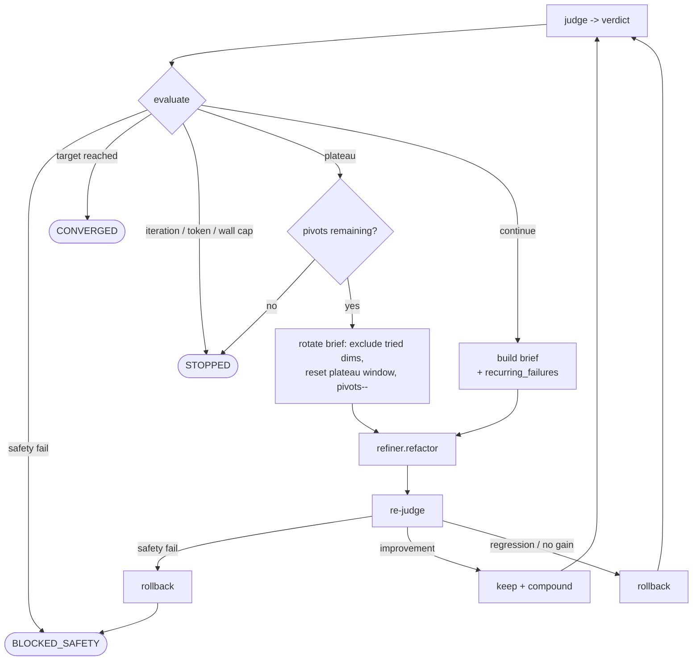

# feat: Bridge the Loop-Engineering anatomy gaps in the controller

## Summary

Turn the seven ranked findings from the loop-engineering gap analysis into shipped controller behavior. **Phase 1** closes the four real gaps where the post's generic agent-loop anatomy is ahead of our specialized loop — cross-run memory feedback, plateau-driven strategy pivot, retry/regression separation, and an enforced cost budget — plus a legible human-confirm gate and a docs pass that names our deliberate non-gaps. **Phase 2** (deferred, lightly specced here) carries the two larger architectural bets: Connectors-as-refereed-actions and portfolio coordination.

Source: `docs/ideation/2026-06-16-loop-engineering-gap-analysis-ideation.html` (this session's ideation; bases verified against the code by a fresh-context skeptic).

---

## Problem Frame

The repo already *is* a Loop Engineering implementation — it meets or exceeds the post on guardrails, iteration limits, observability, termination, and three named failure modes (hallucinated observations, memory corruption, degradation). The gaps are narrow and specific: our loop under-covers the *generic* per-iteration anatomy in two phases (dynamic action selection, real reflection) and skips three production controls (retry, enforced cost budget, loop-context handling). Three of the four hardest gaps share one root cause — **the machinery is built and the wire is never connected**:

- `recurring_failures()` (`src/loopeng/memory/store.py:311`) is called only in tests; `build_refactor_brief` (`src/loopeng/loop/refactor_brief.py:12`) uses the current verdict alone.
- `parse_token_cost()` measures cost, but `controller.run` initializes `tokens_spent = 0` (`src/loopeng/loop/controller.py:84`) and never updates it, so the token gate in `convergence.evaluate` (`src/loopeng/loop/convergence.py:62`) always compares against `0`. `src/loopeng/adapters/compound_engineering.py:26-28` records this as a deliberately deferred step.
- The `Connector` protocol declares actions `LoopController` never calls (Phase 2).

Every change here touches the safety-sensitive controller/convergence core whose loop dynamics are proven against recorded verdicts. The bar: existing tests stay green, new behavior is covered, and none of the repo's hard invariants move.

---

## Requirements

### Loop intelligence (reflection & action repertoire)

- R1. The refactor brief incorporates cross-run recurring-failure history for the current target, so a run starts knowing which fixtures defeated prior runs (idea #1).
- R2. A plateau triggers one strategy pivot — rotate to the next-lowest dimension and reset the plateau window — before the loop terminates as `STOPPED` (idea #2, minimal rotate-dim variant).

### Production hardening

- R3. A transient tool/subprocess failure is retried with bounded backoff and is not counted as a quality regression; a safety-failing result is never retried (idea #3).
- R4. A configured token budget — and a wall-clock backstop — is enforced as a terminal convergence signal, computed from measured cost rather than a constant `0` (idea #4).

### Human-in-the-loop legibility

- R5. When the verification gate requires confirmation, the loop surfaces why it fired (the borderline dimension/score) and records the human's approve/reject verdict to the store (idea #7-K3, absorbing the cut audit-trail idea).

### Identity & documentation

- R6. The three deliberate non-gaps — outer-loop sovereignty, single referee of record, gated human confirm — are named in the product docs as design choices, not omissions (idea #7-K1/K2).

### Deferred to Phase 2 (specced lightly; see Scope Boundaries)

- R7. The loop can dispatch a refereed `Connector` action for a dimension a connector's capability claims, falling back to the refiner otherwise (idea #5).
- R8. A portfolio layer can read cross-target signals to avoid repeated landmines and triage compute by grade-slope (idea #6).

### Invariant constraints (carried from `AGENTS.md`; every unit must preserve)

- Wrap-don't-fork; the controller depends **only** on the protocols in `src/loopeng/adapters/base.py`.
- Quality comes only from CLI-Judge; safety is unbypassable (`BLOCKED_SAFETY` terminal).
- R10 (inherited from `AGENTS.md`, carried here so the KTD5 / Risks references resolve within this plan). Maker ≠ checker stays enforced; any new recording path is **observational only** and can never auto-ship a result.

---

## Key Technical Decisions

- KTD1. **Cross-run history plumbing keeps `build_refactor_brief` pure.** The controller (which already holds `self.store`) fetches recurring failures and passes them as a `list[str]` argument into `build_refactor_brief`; the builder stays a pure function of its inputs. `RefactorBrief` gains an optional `recurring_failures` field that `ClaudeCodeRefiner._build_prompt` surfaces. Rationale: preserves the controller's protocol-only testability and the builder's unit-testability.
- KTD2. **The pivot is controller state; `convergence.evaluate` stays a (still-pure) function.** `evaluate` gains a structured `reason_code` on `Decision` (`PLATEAU` / `ITERATION_CAP` / `TOKEN_CAP` / `WALL_CAP`) so the controller can tell a plateau-stop from a cap-stop without parsing the human-readable reason string. The controller enters the pivot branch only when `reason_code == PLATEAU` (the caps still have budget) and `pivots_used < budget.plateau_pivots`, rebuilds a rotated brief, and continues. `Budget` gains `plateau_pivots: int = 1`. The post-pivot plateau window is scoped via a new `since_iteration` argument on `store.is_plateaued`, not by mutating stored rows. Rationale: keeps the convergence policy a side-effect-free decision function and bounds thrashing to one pivot.
- KTD3. **Per-refactor cost flows through the `Refiner` protocol, not a concrete-class reach-in.** Add an optional `last_token_cost: int | None` to the `Refiner` protocol (default `None`); the controller reads it protocol-bound and threads it into `record_iteration` and `tokens_spent`. The token gate is enforced **only for refiners that report cost**: when `last_token_cost` is `None` (e.g. `FallbackLLMRefiner`), the controller logs a one-time startup warning if a `token_budget` is set, and `Budget.max_wall_seconds` is the universal backstop. The `token_budget` docstring states exactly this conditional enforcement rather than claiming it unconditionally. Rationale: the controller must not import or special-case `ClaudeCodeRefiner` (wrap-don't-fork / protocol-only), and a budget that silently no-ops is worse than an honest one.
- KTD4. **Three failure classes, three responses.** Infra failure (a pre-judge refiner `ProcResult`: timeout / empty stdout / non-zero exit) → bounded backoff retry of the refiner call; quality regression (a clean re-judge with no gain) → existing rollback, never retry semantic work; a post-judge `safety_ok == False` verdict → terminal `BLOCKED_SAFETY`, never in the retry path (the existing `controller.py:113` safety branch fires after the judge, strictly downstream of any retry). The infra class is returned by `ClaudeCodeRefiner.refactor` itself as a richer value, not by widening the `Refiner` protocol — the protocol gains a second consumer only in U7, so generalizing now is premature. Retries are bounded by `Budget.max_tool_retries` and counted against the cost/wall-clock budget so a flaky tool cannot evade the iteration cap. Rationale: today all three collapse into "no improvement," poisoning the plateau/regression signal.
- KTD5. **Gate recording is observational and write-only with respect to shippability.** The human verdict and the gate-firing reason are persisted for audit; shippability stays computed solely by `confirm_convergence` from a live, caller-supplied `confirmed` signal. No code path reads the persisted verdict back into the `confirmed` argument — the audit table is write-only as far as the gate is concerned. Rationale: R10 anti-cognitive-surrender — reading a stored approval back into the gate would re-create the auto-ship the gate exists to prevent.

---

## High-Level Technical Design

### Controller loop with the plateau pivot (U2)

The single new transition: when plateaued *and* pivots remain, rebuild a rotated brief and continue instead of stopping.



The `build brief + recurring_failures` node reflects the post-U1 state. Before U1 lands — and on a target's first one or two runs, where cross-run history is null — both the normal and pivot branches build the brief from the current verdict alone. The pivot's rotate-dim behavior does not depend on recurring-failure context.

### Failure-class routing (U3)

```mermaid
flowchart LR
    OUT[refactor outcome] --> Q{class?}
    Q -->|infra failure\n(timeout / empty / nonzero)| RT[bounded backoff retry\nof the refiner call]
    Q -->|quality regression| RB[rollback - existing path]
    Q -->|safety block| TERM[terminal - never retry]
    RT -->|still failing after N| RB
```

---

## Implementation Units

Phase 1 units (U1–U6) are the active scope. Phase 2 units (U7–U8) are deferred — included for traceability and shape, specced at a lighter grain.

### U1. Wire cross-run recurring-failure history into the refactor brief

- **Goal**: A run's briefs prioritize fixtures that have defeated prior runs of the same target (R1).
- **Requirements**: R1; preserves invariant constraints.
- **Dependencies**: none.
- **Files**: `src/loopeng/loop/refactor_brief.py`, `src/loopeng/loop/controller.py`, `src/loopeng/adapters/base.py` (extend `RefactorBrief`), `src/loopeng/adapters/compound_engineering.py` (`_build_prompt`), `src/loopeng/memory/store.py` (target-scoped query), `tests/test_refactor_brief.py` (new), `tests/test_memory_store.py`, `tests/test_loop_controller.py`.
- **Approach**: Add a target-scoped variant of `recurring_failures` (join `iterations.run_id → runs.target`) so cross-target fixtures don't leak into an unrelated target's brief (see Risks). The controller fetches the list for the run's target and passes it into `build_refactor_brief(verdict, goal, recurring_failures=...)`. The builder **intersects** those fixtures with the current verdict's failing set and re-prioritizes only the fixtures that are both historically recurring AND failing now — live signal is never demoted below stale history. Any non-failing recurring fixtures ride along as advisory context, not ahead of live failures. `RefactorBrief` carries the new optional field; `_build_prompt` adds a "fixtures that recur across prior runs" line.
- **Patterns to follow**: existing pure-function shape of `build_refactor_brief`; the existing `recurring_failures` query and its sort.
- **Test scenarios**:
  - Happy path: a fixture failing in 2 prior runs AND in the current verdict is re-prioritized in run 3's brief; a historically-recurring fixture that is passing now is NOT promoted ahead of a currently-failing one.
  - Edge: no prior runs → brief is byte-identical to today's output (pure additive behavior).
  - Edge: a fixture that recurs only for a *different* target is NOT injected (target scoping holds).
  - Integration: `controller.run` over recorded verdicts passes the fetched list through to the refiner prompt (assert via a fake refiner capturing the brief).
- **Verification**: new run's brief reflects cross-run history for its own target only; all existing brief/controller tests stay green.

### U2. Plateau triggers a rotate-dim pivot before STOPPED

- **Goal**: On plateau, the loop changes approach once (rotate to the next-lowest dimension, reset the plateau window) before terminating (R2).
- **Requirements**: R2; preserves safety/convergence invariants (KTD2).
- **Dependencies**: U1 (the rotated brief may reuse recurring-failure context; not hard-blocking).
- **Files**: `src/loopeng/loop/controller.py`, `src/loopeng/loop/convergence.py` (structured `reason_code` on `Decision`), `src/loopeng/loop/refactor_brief.py` (add `exclude_dims` parameter), `src/loopeng/memory/store.py` (`is_plateaued(since_iteration=...)`), `src/loopeng/config.py` (`Budget.plateau_pivots`), `tests/test_loop_controller.py`, `tests/test_convergence.py`, `tests/test_memory_store.py`, `tests/test_refactor_brief.py`.
- **Approach**: `convergence.evaluate` stays pure but gains a structured `reason_code` on `Decision` so the controller distinguishes a plateau-stop from an iteration/token/wall-cap stop without parsing the reason string. The controller tracks `pivots_used` and a `pivot_anchor` iteration. It enters the pivot branch only when `reason_code == PLATEAU` (the caps still have budget) and `pivots_used < budget.plateau_pivots`: it rebuilds the brief with `exclude_dims` = the dimensions targeted since the last pivot (rotating to the next-lowest), increments `pivots_used`, advances `pivot_anchor`, and continues. (A safety failure is terminal — the loop never continues past `BLOCKED_SAFETY` to pivot — so there is no "prior safety-blocked dim" to exclude within a run.) The post-pivot window is scoped by passing `since_iteration=pivot_anchor` to `store.is_plateaued`, so the freshly-pivoted strategy gets `plateau_patience` clean iterations before it can STOP. When `pivots_used == plateau_pivots`, plateau → `STOPPED` as today.
- **Execution note**: Characterization-first — add a test pinning today's plateau→STOPPED behavior before introducing the pivot branch, so the regression surface is explicit.
- **Technical design** (directional): the plateau-window reset is the one non-obvious mechanic and is pinned, not deferred — `store.is_plateaued` gains a `since_iteration: int = 0` argument and computes `best_before`/`recent_best` over `values[since_iteration:]` only. The pre-pivot best is intentionally dropped from the post-pivot window so the new strategy is judged on its own progress.
- **Patterns to follow**: the existing `is_plateaued` window math in `store.py`; the controller's existing decision/continue branch.
- **Test scenarios**:
  - Happy path: a run that plateaus on dim A continues with a brief excluding A (targeting the next-lowest) for `patience` more iterations before STOPPED.
  - Edge: `plateau_pivots=0` → behavior identical to today (immediate STOPPED on plateau).
  - Edge: a pivot that itself plateaus → STOPPED after the post-pivot window, not before.
  - Error/invariant: a safety failure during a post-pivot iteration still rolls back and halts in `BLOCKED_SAFETY` (pivot never bypasses safety).
  - Integration: pivot does not fire when the target grade/score is reached (convergence still wins over plateau).
  - Edge: pivot does not fire when the run is at the iteration/token/wall cap even if also plateaued (`reason_code` disambiguates; caps win).
  - Edge: `plateau_pivots=0` reproduces the original immediate-stop-on-plateau behavior (characterization).
- **Verification**: plateaued runs attempt exactly one rotated strategy before stopping; safety and convergence precedence unchanged; existing convergence tests green.

### U3. Separate infra failure from quality regression (bounded retry)

- **Goal**: Transient tool failures are retried and not mistaken for quality regressions; safety failures are never retried (R3).
- **Requirements**: R3; KTD4.
- **Dependencies**: none.
- **Files**: `src/loopeng/loop/controller.py`, `src/loopeng/adapters/compound_engineering.py` (`ClaudeCodeRefiner.refactor` returns a richer result carrying the infra-failure class), `src/loopeng/adapters/safety.py` (classification of `ProcResult`), `src/loopeng/config.py` (`Budget.max_tool_retries`, backoff), `tests/test_loop_controller.py`, `tests/test_compound_engineering.py`, `tests/test_safety.py` (new if absent).
- **Approach**: Classify a refiner invocation result as infra-failure (timeout, empty stdout, non-zero exit) vs. applied-change, returned by `ClaudeCodeRefiner.refactor` as a richer value — not by widening the `Refiner` protocol (see KTD4; the protocol gains a second consumer only in U7). The controller retries **only the pre-judge infra-failure class** with bounded exponential backoff (`max_tool_retries`, default 2); on exhaustion it falls through to the existing rollback path. Safety is detected *after* the judge runs (`controller.py:113`), strictly downstream of the retry, so a `safety_ok == False` verdict is terminal and can never enter the retry path. Retries are counted against the cost/wall-clock budget so repeated transient failures cannot run more total work than the iteration cap implies.
- **Execution note**: Characterization-first — pin current "infra failure burns an iteration / can trip plateau" behavior before adding retry.
- **Patterns to follow**: `run_tool`'s existing `ProcResult` normalization in `src/loopeng/adapters/safety.py`.
- **Test scenarios**:
  - Happy path: a refiner call that times out once then succeeds completes within the retry budget without consuming an extra iteration number.
  - Edge: retries exhaust → controller takes the existing rollback path, not a crash.
  - Error: a safety-failing re-judge is never retried (asserts no retry call on the safety branch).
  - Edge: a genuine quality non-improvement (clean run, lower grade) rolls back without any retry.
  - Integration: a transient failure no longer falsely advances the plateau counter.
  - Edge: repeated infra retries are bounded so total refiner invocations cannot exceed the wall/cost budget (no iteration-cap evasion).
- **Verification**: transient failures recover; quality regressions still roll back; safety failures terminal; existing controller tests green.

### U4. Make the cost budget enforceable (thread measured cost + wall-clock backstop)

- **Goal**: A configured token budget and wall-clock cap actually terminate the loop, computed from measured cost (R4).
- **Requirements**: R4; KTD3.
- **Dependencies**: none (independent of U1–U3).
- **Files**: `src/loopeng/adapters/base.py` (`Refiner.last_token_cost`), `src/loopeng/loop/controller.py` (accumulate into `tokens_spent`, pass elapsed), `src/loopeng/loop/convergence.py` (wall-clock predicate), `src/loopeng/config.py` (`Budget.max_wall_seconds`; update the `token_budget` docstring), `src/loopeng/adapters/compound_engineering.py` (already exposes `last_token_cost`), `tests/test_convergence.py`, `tests/test_loop_controller.py`.
- **Approach**: Add optional `last_token_cost: int | None` to the `Refiner` protocol (default `None`). After each `refiner.refactor`, the controller adds the reported cost to `tokens_spent` and threads it into `record_iteration(token_cost=...)`. The controller captures a monotonic start time at `run()` entry (it holds no clock today — timing lives in the runner) and passes elapsed seconds into `convergence.evaluate`, which gains a wall-clock terminal predicate parallel to the iteration cap; `evaluate` itself does no clock I/O, so it stays pure (KTD2). The `token_budget` docstring states it is enforced **only for refiners that report cost**; when `last_token_cost` is `None` the controller logs a one-time warning if a `token_budget` is set, and `max_wall_seconds` is the universal backstop. Refiners that report no cost leave `tokens_spent` unaffected.
- **Patterns to follow**: the existing `max_iterations` terminal check in `convergence.evaluate`; `parse_token_cost`/`last_token_cost` already in `compound_engineering.py`.
- **Test scenarios**:
  - Happy path: with `token_budget` set and a refiner reporting cost, the loop STOPs with reason "token budget … exhausted" once cumulative cost crosses it.
  - Edge: `token_budget=None` → no token-based stop (today's behavior preserved).
  - Edge: a refiner reporting `last_token_cost=None` never trips the token gate; `max_wall_seconds` still can.
  - Edge: `max_wall_seconds` set → loop STOPs on elapsed even when iterations remain.
  - Regression: the previously-latent `tokens_spent = 0` no longer makes the gate a no-op (assert it reflects reported cost).
  - Edge: `token_budget` set with a non-reporting refiner emits the one-time warning and the run still terminates via `max_wall_seconds`.
  - Purity: `evaluate` is called with a pre-computed `elapsed_seconds` float, not a clock reference.
- **Verification**: a budget-limited run terminates on cost/wall-clock; `record_iteration` carries real `token_cost`; existing convergence tests green.

### U5. Make the human-confirm gate legible and record its verdict

- **Goal**: When the gate fires, surface why and persist the human's approve/reject decision (R5).
- **Requirements**: R5; KTD5.
- **Dependencies**: none.
- **Files**: `src/loopeng/loop/integrity.py` (compose a firing reason), `src/loopeng/autonomous/runner.py` (return the firing reason on `RunResult`; a separate `record_confirmation` persists the human verdict), `src/loopeng/memory/store.py` (a `record_confirmation` write), `src/loopeng/memory/schema.sql` (a new `confirmations` table via `CREATE TABLE IF NOT EXISTS`), `tests/test_integrity.py` (new if absent), `tests/test_memory_store.py`, `tests/test_runner.py` (new if absent).
- **Approach**: When `gate_requires_confirmation` is true, compose a short reason from the converged verdict (the borderline dimension and score). `confirmed` stays a caller-supplied signal — there is no in-loop prompt; the runner returns the firing reason on `RunResult` for an out-of-band caller (CLI/TUI) to display and collect the human's approve/reject, then a separate `record_confirmation` persists the verdict + reason to a new `confirmations` table. The audit table is write-only with respect to shippability: no path reads it back into `confirmed`, so `confirm_convergence` remains the sole shippability authority (KTD5).
- **Patterns to follow**: `record_learning`/`record_iteration` write shape and the `_migrate` additive-column pattern in `store.py`.
- **Test scenarios**:
  - Happy path: a CONVERGED-but-gated run records a confirmation row with the firing reason on human approve.
  - Edge: gate-off / attended-CI bypass → no confirmation owed, `shippable=True`, optional no-op recording.
  - Error/invariant: a recorded "approve" never flips `shippable` without `confirm_convergence` returning true (recording is observational).
  - Edge: a rejected verdict is persisted and the run stays non-shippable.
  - Migration: a `confirmations` table is created via `CREATE TABLE IF NOT EXISTS` on an existing DB without data loss (a new table, not a `_migrate` column add).
- **Verification**: gate reasons are visible and verdicts are queryable; shippability logic unchanged; integrity tests green.

### U6. Name the three deliberate non-gaps in the product docs

- **Goal**: Document outer-loop sovereignty, single referee of record, and the gated human-confirm posture as intentional design choices (R6).
- **Requirements**: R6.
- **Dependencies**: U5 (the gate-legibility behavior is referenced by the "gated human confirm" entry).
- **Files**: `AGENTS.md` (Architecture boundaries), `README.md` (a short "Where we differ from a generic agent loop" note), `docs/solutions/` (a new decision record naming the three principles), `CHANGELOG.md`.
- **Approach**: Add a concise principles entry to `AGENTS.md` boundaries; a short README subsection contrasting our outer loop with the generic per-iteration loop; one `docs/solutions/` record capturing why these are choices, not omissions. For each non-gap, state the specific failure mode the post worries about and the concrete reason our design tolerates or mitigates it (e.g. single-referee → maker≠checker + held-out seeds bound referee gaming; calibration drift → tracked by the `judge-variance` probe) — a choice with a named cost is defensible; a bare label is not. Draft the gate-legibility entry after U5 lands, validating it against U5's actual behavior. No code.
- **Test scenarios**: Test expectation: none — documentation only.
- **Verification**: the three principles are stated where contributors and agents will read them; CHANGELOG updated.

### U7. (Phase 2) Wire Connectors as refereed actions

- **Goal**: The controller can dispatch a `Connector.act()` for a dimension whose capability a connector claims, else fall back to the refiner (R7).
- **Requirements**: R7; preserves maker≠checker (every connector action is graded by the same judge).
- **Dependencies**: U1 (brief plumbing), and the existing `src/loopeng/connectors/` protocol.
- **Files** (indicative): `src/loopeng/loop/controller.py`, `src/loopeng/connectors/base.py`, `tests/test_loop_controller.py`, a connector test.
- **Approach** (light): inject `connectors: list[Connector]` into `LoopController`; before `refiner.refactor`, match a brief target dimension against connector `capabilities`; dispatch `connector.act(payload)` and re-judge when matched, else refiner. Detailed payload contracts and capability↔dimension mapping to be specced when Phase 2 starts — including a **trust boundary on capability claims**: connectors self-declare `capabilities`, so Phase 2 must gate which dimensions a connector may claim against an allowlist validated at registration (a compromised pinned-SHA connector must not be able to claim a safety-critical dimension and intercept dispatch away from the refereed refiner).
- **Test scenarios** (to be expanded in Phase 2): matched dimension routes to connector; unmatched falls through to refiner; connector output is graded by the same judge; safety/rollback paths unchanged.
- **Verification**: deferred — Phase 2.

### U8. (Phase 2) Portfolio coordination over the shared store

- **Goal**: Read-only cross-target signals (failure surveillance) and grade-slope triage in the scheduler (R8).
- **Requirements**: R8; preserves per-loop isolation (coordinate allocation, not agents).
- **Dependencies**: U1's target-scoped query (reuse for cross-target reads).
- **Files** (indicative): `src/loopeng/scheduler/`, `src/loopeng/memory/store.py`, `src/loopeng/autonomous/parallel.py`, scheduler tests.
- **Approach** (light): add advisory cross-target reads over the shared SQLite (landmine surveillance) and a grade-slope ranking the scheduler consults at tick time; signals are advisory, never hard constraints. Detailed design when Phase 2 starts.
- **Test scenarios** (to be expanded in Phase 2): a landmine in one target surfaces as advisory context for siblings; slope ranking orders due targets; isolation/failure-isolation preserved.
- **Verification**: deferred — Phase 2.

---

## Scope Boundaries

### In scope (Phase 1)

U1–U6: the four anatomy/hardening bridges plus the legible gate and the docs naming pass.

### Deferred to Follow-Up Work (Phase 2, in this plan)

- U7 Connectors-as-refereed-actions (High complexity) — the structural bridge to dynamic action selection.
- U8 Portfolio coordination (Medium confidence) — the honest step up the multi-agent rung.

### Out of scope / non-goals

- N-variant "affinity-maturation" plateau search (spawn N briefs, keep best) — a deferred extension of U2; needs U4's budget gate first and was explicitly scoped out (rotate-dim only).
- Runtime refiner-switching on quota (subsumed by U2's pivot family; the fallback chain already exists internally).
- Loop-context compression of the refiner prompt (idea E) — not biting at the 10-iteration cap; revisit when runs deepen.
- Thompson-sampling action selection (idea J) — would add stochasticity to a deliberately deterministic convergence signal.
- Referee drift detection (idea L) — promote only if judge calibration over time becomes a concern; overlaps the existing `judge-variance` probe.
- Inspecting or instrumenting the inner refiner loop — out by design (outer-loop sovereignty, named in U6).

---

## Risks & Dependencies

- **Cross-target leakage (U1).** `recurring_failures()` is global across all runs/targets today. Injecting it unscoped would pollute an unrelated target's brief. Mitigation: U1 adds a target-scoped query (join through `runs.target`); the global query stays for the transcendent reporting use.
- **Pivot thrashing / masking convergence (U2).** A pivot that keeps the loop alive could waste budget or delay a legitimate stop. Mitigation: `plateau_pivots=1` default; convergence targets and the safety gate always take precedence over the pivot; the post-pivot window must elapse before a second stop.
- **Token cost only from cost-reporting refiners (U4).** `FallbackLLMRefiner` may not report tokens, so a `token_budget` set against it would silently no-op. Mitigation: the docstring states enforcement is conditional, the controller warns once at startup when `token_budget` is set but cost is unreported, and `max_wall_seconds` is the universal backstop.
- **Retry amplification (U3).** Bounded infra-retries that don't increment the iteration count could let a flaky tool run more total work than `max_iterations` implies. Mitigation: retries are bounded by `max_tool_retries` and counted against the cost/wall-clock budget.
- **Touching the proven controller/convergence core.** The loop dynamics are validated against recorded verdicts and a 74-test suite. Mitigation: characterization-first on U2/U3; every unit keeps existing tests green and adds new coverage; `convergence.evaluate` stays a pure function (KTD2).
- **Recording paths must not auto-ship (U5).** A new confirmation-recording write is observational only; `confirm_convergence` remains the sole shippability authority (KTD5/R10).
- **Cross-cutting docs-sync rule.** Per `AGENTS.md`, each behavior-altering unit (U1–U5) carries a `CHANGELOG.md` entry and syncs the docs it touches (README/AGENTS/plan tables); U6 is the dedicated docs unit.

---

## Sources / Research

- Ideation artifact: `docs/ideation/2026-06-16-loop-engineering-gap-analysis-ideation.html` — ranked ideas, bases, and the rejection table.
- Controller / convergence / brief: `src/loopeng/loop/controller.py:79-159`, `src/loopeng/loop/convergence.py:36-90`, `src/loopeng/loop/refactor_brief.py:12-23`.
- Memory & queries: `src/loopeng/memory/store.py:164-194` (`record_iteration`), `:286-326` (`is_plateaued`, `recurring_failures`).
- Cost & protocols: `src/loopeng/adapters/compound_engineering.py:31-83`, `src/loopeng/adapters/base.py:60-99`.
- Gate & integrity: `src/loopeng/loop/integrity.py:145-193`, `src/loopeng/autonomous/runner.py:36-52`.
- Config knobs: `src/loopeng/config.py:79-135`.
- Prior art carried from research: Reflexion (episodic lessons), ReAct/OODA (reflect-then-act), TCP backoff (transient vs systemic), Anthropic Evaluator-Optimizer / multi-agent system lessons.
- Relevant decision records: `docs/solutions/pluggable-refiner.md`, `docs/solutions/refine-only-baseline.md`, `docs/solutions/p0-feasibility-gates.md`.
