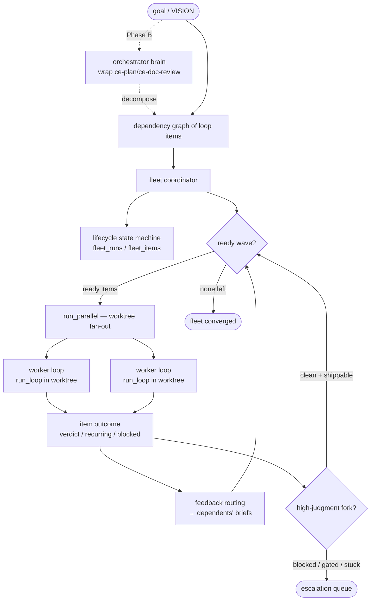
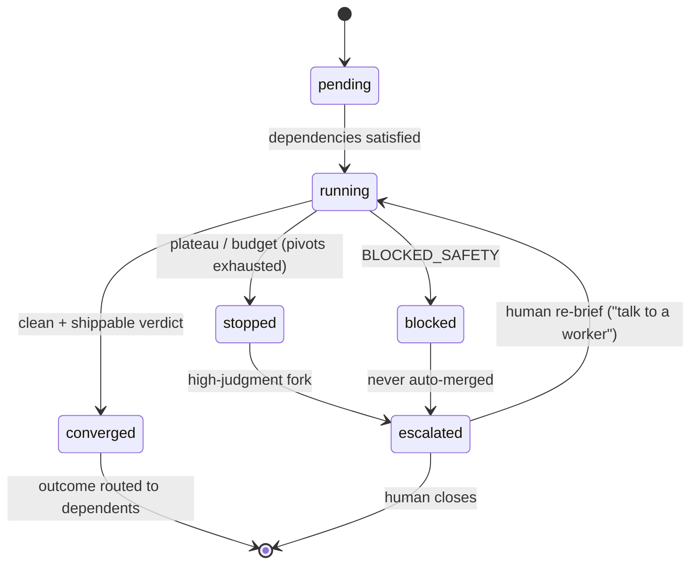

# feat: Fleet orchestration layer — coordinate self-improving loops

## Summary

Build the **orchestration layer above** our per-target loop: turn today's
embarrassingly-parallel, isolated runs into a **coordinated fleet** of
self-improving loops under one goal — dependency-ordered, lifecycle-tracked,
feedback-routed, and escalated to a human only for high-judgment forks. Phase A
(this plan's active scope) is the deterministic coordination *plumbing*; Phase B
(deferred, lightly specced) is the intelligent orchestrator *brain*, built by
wrapping the compound-engineering flow we already drive. We stay a loop
**engine** — coordinating our own target-loops — not an Agent IDE.

## Problem Frame

Prateek Karnal's *"What Are Agent Loops, Really?"* (the comparison target;
PDF read from the user's Downloads, repo `github.com/AgentWrapper/agent-orchestrator`)
makes the case that the gap between "we have loops" and "our loops work at scale"
is almost entirely the **orchestration layer**: a deterministic outer controller
plus an intelligent orchestrator that decomposes a vision into a dependency
graph, spawns and monitors a fleet of isolated workers, routes feedback back
automatically, tracks cross-agent lifecycle, and pulls the human in only when
judgment is needed ("optimize the human, don't remove them").

**Where we already meet or exceed the article** (do not rebuild): the
single-target *inner loop*. Our reality-grounded referee (the article
under-specifies judging), multi-signal convergence + degradation-proofing,
unbypassable safety, maker≠checker integrity, compounding-into-regression-tests,
worktree isolation, and SQLite memory (cross-run wiring shipped in
`docs/plans/2026-06-16-005-feat-loop-engineering-gap-bridges-plan.md`) already
realize the article's pillars #1 (feedback signals), #2 (isolation), #3 (memory),
and #5 (success criteria + escalation) **for one target**.

**Where the article is ahead — the 10X surface.** We have a deterministic outer
controller for *one* target's inner loop, but no layer that coordinates *many*
loops toward one goal. Concretely, today `autonomous/parallel.py:run_parallel`
is a flat fan-out (a list of independent targets, no dependency graph, no
cross-item lifecycle beyond `ParallelResult.ok`), and `scheduler/heartbeat.py`
fires due targets by cadence only. This plan adds the coordination layer on top —
exactly the work plan-005 deferred as U8 (portfolio coordination), now expanded
to the article's orchestration framing.

---

## Requirements

### Orchestration & coordination

- R1. A *fleet run* coordinates multiple loop work-items under one goal, with
  durable per-item lifecycle state (pending / running / converged / stopped /
  blocked / escalated).
- R2. Items run in **dependency order** (topological waves over the existing
  worktree fan-out), not as a flat fire-everything batch.
- R3. When an item completes, its outcome (verdict summary, recurring failures,
  blocked/stuck reason) is routed automatically into its dependents' briefs — no
  human forwarding.

### Human-efficiency

- R4. Only **high-judgment forks** escalate to the human — a worker blocked on
  safety, a converged-but-gated result, or a worker still stuck after its pivots
  are exhausted. Everything else proceeds. A human can re-brief a single worker
  directly ("talk to a worker") without going through the whole fleet.

### Surface

- R5. A CLI surface + research report expose a fleet run (start / status /
  report) and the escalation queue.

### Identity & documentation

- R6. The orchestration layer is documented as a loop-**engine** boundary — it
  coordinates our self-improving target-loops, not generic coding agents, and is
  explicitly **not** an issue→PR→CI Agent IDE — with the AO comparison recorded.

### Deferred to Phase B (specced lightly; see Scope Boundaries)

- R7. An orchestrator *brain* — wrapping compound-engineering (`ce-plan` →
  `ce-doc-review` → `ce-work`) behind an `Orchestrator` protocol — decomposes a
  VISION into a dependency graph of loop items + per-item briefs.
- R8. Fleet completion is judged against the original intent (wrapping a
  plan/critic review), distinct from each worker's referee.

### Invariant constraints (carried from `AGENTS.md` + `docs/solutions/outer-loop-non-gaps.md`)

- **Wrap-don't-fork at the fleet level too:** the coordinator depends only on
  existing primitives + a new protocol; the per-target `LoopController` is
  untouched.
- **Quality only from CLI-Judge, per worker:** the fleet never overrides a
  worker's referee verdict.
- **Safety unbypassable:** a `BLOCKED_SAFETY` worker is never auto-merged by the
  fleet — it escalates.
- **Maker ≠ checker holds at the fleet level:** the orchestrator brain (the
  decomposer / brief-writer) is never a worker's judge.
- **Human-confirm authority unchanged:** `confirm_convergence` stays the sole
  per-item shippability authority.

---

## Key Technical Decisions

- KTD1. **The fleet coordinator is a new layer ABOVE the controller**, depending
  only on existing primitives (`autonomous/parallel.py:run_parallel`,
  `MemoryStore`, `RunResult`) and a new `Orchestrator` protocol. The per-target
  `LoopController` and its convergence policy are not modified — wrap-don't-fork
  applies at the fleet level, mirroring how the controller wraps the four tools.
- KTD2. **Fleet state persists in new SQLite tables** (`fleet_runs`,
  `fleet_items`) created via `CREATE TABLE IF NOT EXISTS`, mirroring the
  `confirmations` (plan-005 U5) and `schedule_state` patterns. Existing tables
  are untouched; an existing DB gains the new tables on next open.
- KTD3. **Dependency ordering = topological waves dispatched through the existing
  `run_parallel`.** We sequence batches of fan-out (ready items → one
  `run_parallel` call → mark complete → unlock dependents), rather than replacing
  fan-out. A cycle in the dependency graph fails closed *before* any work starts,
  mirroring the `loop.integrity` fail-closed preconditions.
- KTD4. **Feedback routing is deterministic plumbing (code, not the LLM):** on
  item completion the coordinator appends a structured outcome summary to each
  dependent's brief context. The brief already carries cross-run
  `recurring_failures` (plan-005 U1); this extends the same channel with
  upstream-item outcomes.
- KTD5. **Escalation reuses `confirm_convergence` as the per-item shippability
  authority.** The fleet auto-proceeds only on a clean converged-and-shippable
  item; `BLOCKED_SAFETY`, converged-but-gated, and stuck items route to a human
  escalation queue. The Phase B orchestrator brain is a distinct role from each
  worker's judge, so maker≠checker holds at the fleet level.
- KTD6. **Identity boundary (named, not bridged):** fleet workers are *our*
  self-improving target-loops (`run_loop` / `run_refine_loop`), not generic
  coding agents. We coordinate loops; AO coordinates coding agents through an
  issue→PR→CI IDE. That is a deliberate non-gap (see
  `docs/solutions/outer-loop-non-gaps.md`).

---

## High-Level Technical Design

### Fleet topology (Phase A solid; Phase B dashed)

### Fleet-item lifecycle

---

## Implementation Units

Phase A (U1–U6) is the active scope. Phase B (U7–U8) is deferred — included for
traceability and shape, specced at a lighter grain.

### U1. Fleet lifecycle state machine + persistence

- **Goal**: A durable model of a fleet run and its items with explicit lifecycle
  status (R1).
- **Requirements**: R1; KTD2.
- **Dependencies**: none.
- **Files**: `src/loopeng/memory/schema.sql` (new `fleet_runs`, `fleet_items`
  tables), `src/loopeng/memory/store.py` (create/update/read methods), a new
  `src/loopeng/orchestration/fleet_state.py` (status enum + dataclasses),
  `tests/test_fleet_state.py` (new), `tests/test_memory_store.py`.
- **Approach**: `fleet_runs(id, goal, status, started, finished)` and
  `fleet_items(id, fleet_id, key, status, depends_on_json, run_id, outcome_json)`,
  created via `CREATE TABLE IF NOT EXISTS` (KTD2). A `FleetItemStatus` enum
  (pending / running / converged / stopped / blocked / escalated) with a small
  transition guard (only legal transitions, mirroring the controller's
  `LoopState`). Store methods: `create_fleet`, `add_fleet_item`,
  `set_item_status`, `record_item_outcome`, `fleet_items(fleet_id)`,
  `escalations(fleet_id)`.
- **Patterns to follow**: the `confirmations` table + `record_confirmation` /
  `confirmations` reader (plan-005 U5); `schedule_state` + `ScheduleEntry`;
  `LoopState` enum in `loop/controller.py`.
- **Test scenarios**:
  - Happy path: create a fleet with 3 items, transition one pending→running→converged, read back the ordered items with correct statuses.
  - Edge: an illegal transition (e.g. converged→running) is rejected by the guard.
  - Edge: a new `fleet_*` table is created via `CREATE TABLE IF NOT EXISTS` on a pre-existing DB without data loss.
  - Integration: `record_item_outcome` round-trips the outcome JSON (verdict summary, recurring failures, blocked reason) and `escalations(fleet_id)` returns only escalated items.
- **Verification**: a fleet and its items persist with correct lifecycle status and round-tripped outcomes; existing memory tests stay green.

### U2. Dependency-ordered fleet coordinator (topological waves)

- **Goal**: Run fleet items in dependency order over the existing worktree
  fan-out, wave by wave (R2).
- **Requirements**: R2; KTD1, KTD3.
- **Dependencies**: U1.
- **Files**: `src/loopeng/orchestration/coordinator.py` (new),
  `tests/test_fleet_coordinator.py` (new).
- **Approach**: The coordinator takes a fleet (items + `depends_on` edges) and a
  per-item runner callable. It computes ready items (all deps converged),
  dispatches that wave through `autonomous/parallel.py:run_parallel` (reusing the
  worktree isolation untouched), marks results via U1's status methods, then
  recomputes the next ready wave until none remain. A dependency cycle is
  detected and rejected **before any work starts** (fail-closed, KTD3). An item
  whose dependency ended non-converged (stopped/blocked) does not run — it is
  marked blocked-on-dependency and surfaced.
- **Execution note**: Characterization-first — pin today's flat `run_parallel`
  behavior (independent targets, no ordering) before layering wave sequencing, so
  the fan-out contract is demonstrably unchanged.
- **Technical design** (directional): waves = repeated `ready = [i for i in items
  if i.pending and all(dep.converged)]`; dispatch `run_parallel(ready)`; stop
  when no pending item is ready (either all done, or the rest are blocked on
  non-converged deps).
- **Patterns to follow**: `Heartbeat.tick_parallel` building `ParallelTarget`s and
  calling `run_parallel`; the integrity fail-closed precondition shape in
  `loop/integrity.py`.
- **Test scenarios**:
  - Happy path: a diamond DAG (A → B, A → C, B&C → D) runs A first, then B and C in one wave, then D.
  - Edge: a cycle (A→B→A) is rejected before any worker runs (no worktree created).
  - Error: when B ends `stopped`, D (depending on B) does not run and is marked blocked-on-dependency, while independent items still complete.
  - Integration: the wave actually dispatches through `run_parallel` with one worktree per ready item, bounded by `max_parallel`.
- **Verification**: items execute in topological waves; cycles fail closed; a non-converged dependency cleanly blocks its dependents without aborting siblings.

### U3. Automatic feedback routing between fleet items

- **Goal**: Route a completed item's outcome into its dependents' briefs
  automatically (R3).
- **Requirements**: R3; KTD4.
- **Dependencies**: U1, U2.
- **Files**: `src/loopeng/orchestration/routing.py` (new),
  `src/loopeng/orchestration/coordinator.py` (call the router between waves),
  `tests/test_fleet_routing.py` (new).
- **Approach**: On item completion, compose a structured `UpstreamOutcome`
  (grade/score summary, failing + recurring fixtures, blocked/stuck reason) and
  attach it to each dependent's brief context so the dependent's worker loop
  starts informed. This reuses the brief's existing advisory channel — plan-005
  U1 added `RefactorBrief.recurring_failures`; routing supplies upstream-item
  outcomes through the same per-worker brief seam, deterministically (no LLM).
- **Patterns to follow**: `loop/refactor_brief.py` (the brief is the per-worker
  context seam); plan-005 U1's advisory `recurring_failures` field.
- **Test scenarios**:
  - Happy path: item A converges; D's worker is invoked with A's outcome present in its brief context.
  - Edge: an item with no dependents routes nothing (no error).
  - Edge: a blocked upstream routes its blocked reason to dependents (so they can be held/escalated, not run blind).
  - Integration: routing is deterministic — the same upstream outcome yields the same dependent brief context, no model call.
- **Verification**: dependents start with upstream outcomes in context; routing is pure plumbing with no human forwarding.

### U4. Fleet-level human-efficiency escalation

- **Goal**: Escalate only high-judgment forks; auto-proceed on clean items; allow
  a direct re-brief of one worker (R4).
- **Requirements**: R4; KTD5.
- **Dependencies**: U1.
- **Files**: `src/loopeng/orchestration/escalation.py` (new),
  `src/loopeng/orchestration/coordinator.py` (consult escalation on each
  outcome), `tests/test_fleet_escalation.py` (new).
- **Approach**: A predicate classifies each item outcome: a clean
  converged-and-shippable item (`confirm_convergence` satisfied) proceeds
  silently; a `BLOCKED_SAFETY` item, a converged-but-gated item, or a worker still
  stopped after its pivots are exhausted is added to the escalation queue (U1
  status `escalated`) with a legible reason (reuse `describe_gate_reason` from
  plan-005 U5). A human action re-briefs one item (append a human note to its
  brief context and re-run that single worker) without re-running the fleet —
  the "talk to a worker" affordance. The fleet never auto-merges a blocked or
  unconfirmed item (KTD5).
- **Patterns to follow**: `loop/integrity.py:confirm_convergence` /
  `gate_requires_confirmation` / `describe_gate_reason`; `autonomous/runner.py`
  `_apply_gate` (plan-005 U5).
- **Test scenarios**:
  - Happy path: a clean converged-shippable item proceeds without escalation.
  - Error/invariant: a `BLOCKED_SAFETY` item is never auto-merged — it lands in the escalation queue.
  - Edge: a converged-but-gated item (confirmation owed, not confirmed) escalates with a legible reason; a confirmed one proceeds.
  - Edge: a stuck (stopped, pivots exhausted) item escalates rather than silently dropping.
  - Integration: a human re-brief re-runs exactly one worker with the human note in context, leaving sibling items untouched.
- **Verification**: only high-judgment forks reach the human; clean items flow; a single worker can be re-briefed without disturbing the fleet.

### U5. Fleet CLI surface + research report

- **Goal**: Expose fleet run / status / report and the escalation queue (R5).
- **Requirements**: R5.
- **Dependencies**: U1, U2, U3, U4.
- **Files**: `src/loopeng/cli.py` (new `fleet` command group),
  `src/loopeng/autonomous/report.py` (fleet research report), `tests/test_fleet_cli.py` (new).
- **Approach**: `loop-anything fleet run <spec> --goal ...` (spec = a list of
  items + dependencies; in Phase A supplied explicitly — Phase B generates it),
  `fleet status <fleet_id>`, `fleet report <fleet_id> [--json]`, and
  `fleet escalations <fleet_id>`. The report extends the existing per-run research
  report to the fleet: per-item grade trajectory + lifecycle + the escalation
  list. Reuse the existing CLI patterns (`run`, `status`, `report`, `schedule`).
- **Patterns to follow**: existing `loop-anything` Click command groups in
  `src/loopeng/cli.py` (`run`/`status`/`report`/`schedule`); `autonomous/report.py`.
- **Test scenarios**:
  - Happy path: `fleet run` with a 3-item spec records a fleet, runs the waves, and `fleet report` shows per-item status + grades.
  - Edge: `fleet status` on an unknown id returns a clean not-found message, not a stack trace.
  - Edge: `fleet escalations` lists only escalated items with reasons.
  - Integration: the spec parser rejects a malformed dependency reference (item depends on an unknown key) before running.
- **Verification**: a fleet is drivable and inspectable from the CLI; the report surfaces lifecycle, grades, and escalations.

### U6. Documentation — name the orchestration-layer boundary + AO comparison

- **Goal**: Record the loop-engine-not-Agent-IDE boundary and the AO comparison
  (R6).
- **Requirements**: R6.
- **Dependencies**: U1–U5 (describe what shipped).
- **Files**: `docs/solutions/fleet-orchestration-boundary.md` (new),
  `AGENTS.md` (orchestration layout + boundary entry), `README.md` (a fleet
  subsection), `CHANGELOG.md`.
- **Approach**: A decision record naming why the fleet coordinates *our
  self-improving loops* (not generic coding agents) and how that differs from
  AO's issue→PR→CI IDE — with the failure mode the boundary accepts and why,
  matching the `outer-loop-non-gaps.md` shape. Update the AGENTS.md layout table
  with `src/loopeng/orchestration/`. No code.
- **Test scenarios**: Test expectation: none — documentation only.
- **Verification**: the boundary + AO comparison are stated where contributors and
  agents read them; CHANGELOG updated.

### U7. (Phase B) Orchestrator brain — wrap compound-engineering for decomposition

- **Goal**: Decompose a VISION into a dependency graph of loop items + per-item
  briefs, behind an `Orchestrator` protocol (R7).
- **Requirements**: R7; preserves wrap-don't-fork + maker≠checker.
- **Dependencies**: U1, U2 (consumes the lifecycle + coordinator).
- **Files** (indicative): `src/loopeng/orchestration/brain.py`,
  `src/loopeng/orchestration/base.py` (the `Orchestrator` protocol), tests.
- **Approach** (light): an `Orchestrator` protocol (`decompose(vision) -> fleet
  spec`); a binding that wraps the compound-engineering flow (`ce-plan` →
  `ce-doc-review`) headlessly to produce the item graph + briefs, the way
  `adapters/compound_engineering.py` wraps `/ce-work`. The coordinator depends
  only on the protocol. Detailed prompt/headless-invocation contract specced when
  Phase B starts.
- **Test scenarios** (to be expanded in Phase B): protocol returns a valid DAG
  spec; a malformed/cyclic decomposition is rejected by U2's cycle guard; the
  coordinator depends only on the protocol (a fake orchestrator drives the fleet).
- **Verification**: deferred — Phase B.

### U8. (Phase B) Fleet completion judged against intent

- **Goal**: Judge whole-fleet completion against the original VISION, distinct
  from each worker's referee (R8).
- **Requirements**: R8; preserves maker≠checker at the fleet level.
- **Dependencies**: U7.
- **Files** (indicative): `src/loopeng/orchestration/brain.py`, tests.
- **Approach** (light): wrap a plan/critic review (`ce-doc-review`-style) to
  evaluate the merged fleet result against the VISION's success criteria — a
  fleet-level checker that is a distinct role from any worker's judge (maker≠checker
  holds at the fleet level). Detailed design when Phase B starts.
- **Test scenarios** (to be expanded in Phase B): fleet-completion verdict is
  produced by a role distinct from worker judges; an unmet success criterion
  surfaces as not-complete.
- **Verification**: deferred — Phase B.

---

## Scope Boundaries

### In scope (Phase A)

U1–U6: the deterministic coordination plumbing (lifecycle, dependency-ordered
waves, feedback routing, escalation, CLI/report) + the boundary docs.

### Deferred to Follow-Up Work (Phase B, in this plan)

- U7 orchestrator brain (decomposition via wrapped compound-engineering).
- U8 fleet-completion judged against intent.

### Out of scope / non-goals

- Becoming an **Agent IDE** — an issue→PR→CI coordinator of generic coding agents
  (AO's identity). We coordinate our own self-improving target-loops (KTD6,
  `docs/solutions/outer-loop-non-gaps.md`).
- Re-doing plan-005's U1–U6 (already shipped).
- Modifying the per-target `LoopController` or convergence policy — the fleet
  layer wraps, it does not fork (KTD1).
- A live GitHub-reaction system (AO's CI/review-comment injection) — our
  per-worker feedback is the referee verdict + routed upstream outcomes, not
  GitHub events. Revisit only if a GitHub-native target lane needs it.

---

## Risks & Dependencies

- **Worktree pressure at fleet scale.** Many concurrent items = many `git
  worktree add`/`remove` operations; CI already shows an intermittent
  concurrent-worktree race (`test_parallel_worktrees.py`). Mitigation: the
  coordinator reuses the bounded `run_parallel` (`max_parallel`) untouched and
  adds no new concurrency primitive; waves cap simultaneous worktrees.
- **Dependency-graph correctness.** A bad graph could deadlock or run work out of
  order. Mitigation: cycle detection fails closed before any work (KTD3); a
  non-converged dependency blocks dependents explicitly rather than running them
  blind.
- **Escalation must never become an auto-ship bypass.** Mitigation: escalation
  reuses `confirm_convergence` as the sole shippability authority (KTD5); a
  blocked/unconfirmed item is never auto-merged — same R10 guarantee as plan-005
  U5, lifted to the fleet.
- **Identity drift toward an Agent IDE.** Mitigation: KTD6 + U6 name the boundary;
  the non-goal is explicit.
- **Cross-cutting docs-sync.** Each behavior-altering unit (U1–U5) carries a
  `CHANGELOG.md` entry and syncs the docs it touches; U6 is the dedicated docs
  unit.

---

## Alternative Approaches Considered

- **Extend the `Heartbeat` scheduler into the coordinator** (vs. a new
  `orchestration/` layer). Rejected: the scheduler's job is cadence ("what's
  due"); coordination is a different concern ("what depends on what, what's the
  lifecycle"). Folding them couples two axes the article explicitly separates
  (plumbing vs. judgment) and would bloat a module whose single responsibility is
  due-calculation. A new layer that *calls* `run_parallel` keeps responsibilities
  clean and the scheduler untouched.
- **Build a bespoke orchestrator brain now** (vs. wrap compound-engineering in
  Phase B). Rejected for this plan per the confirmed scope: wrapping the flow we
  already drive honors wrap-don't-fork and reuses the research→plan→review
  machinery the article calls for, instead of reinventing it.
- **A live GitHub-reaction event system** (AO's model). Deferred as a non-goal:
  our feedback is the reality-grounded referee verdict + routed upstream
  outcomes, not GitHub CI/review events; adopting AO's reaction surface would
  pull us toward their IDE identity.

---

## Sources / Research

- Comparison target: *"What Are Agent Loops, Really?"* by Prateek Karnal
  (LinkedIn, 2026-06-16; repo `github.com/AgentWrapper/agent-orchestrator`) —
  read from the user's downloaded PDF. The 5 loop pillars + the
  deterministic-plumbing / intelligent-judgment split frame this plan.
- Prior art in-repo: `docs/plans/2026-06-16-005-feat-loop-engineering-gap-bridges-plan.md`
  (U7/U8 deferred — this plan expands U8 into the orchestration layer);
  `docs/solutions/outer-loop-non-gaps.md` (the identity boundary this plan honors).
- Fan-out + cadence surfaces this layer builds on: `src/loopeng/autonomous/parallel.py`
  (`run_parallel`, `ParallelTarget`/`ParallelResult`), `src/loopeng/scheduler/heartbeat.py`
  (`Heartbeat.tick_parallel`).
- Memory + gate patterns reused: `src/loopeng/memory/store.py` (`confirmations`,
  `schedule_state`, `record_*` idiom), `src/loopeng/loop/integrity.py`
  (`confirm_convergence`, `describe_gate_reason`), `src/loopeng/loop/controller.py`
  (`LoopState` enum as the transition-guard pattern).
