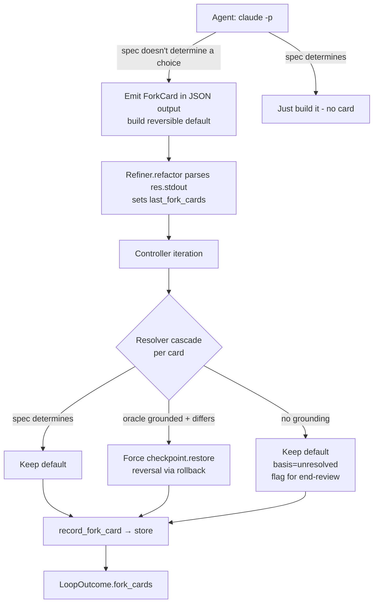

# feat: Fork-Card decision channel (headless v1)

## Summary

Make a build decision a first-class, gradable artifact. When the coding agent hits a choice the spec/northstar doesn't determine, it emits a typed **Fork-Card** in its `claude -p --output-format json` output and keeps building a reversible default. The refiner parses the cards; a resolver (spec → oracle → escalate) decides each one; when the resolver's choice differs from the agent's default, the supervisor reverses it through the loop's existing regression rollback. v1 is **headless-only** — the interactive `AskUserQuestion` path is deferred (Claude Code hooks can't inject a tool result; see origin KD2).

---

## Problem Frame

The autonomous refiner already drives the agent as `claude -p --permission-mode acceptEdits --output-format json` (`src/loopeng/adapters/compound_engineering.py:55,93`) — non-interactive, so the agent never pauses; it silently picks a default for every undetermined fork and moves on, with no record and no grounding. The supervised loop the user wants ("see the end result, give feedback, don't prompt along the way") needs those forks to become visible, typed, and routable. This is the keystone: every downstream piece (persona scoring, escalation triage, the decision ledger, spec-patching) consumes the Fork-Card. The JSON envelope the refiner already parses for token cost (`parse_token_cost`, lines 31–48) is the ready-made channel — Fork-Cards arrive on the same stdout.

---

## Requirements Traceability

Carried from origin (`docs/brainstorms/2026-06-17-fork-card-decision-channel-requirements.md`):

| Origin | Covered by |
|---|---|
| R1 (ForkCard type) | U1 |
| R2 (on-disk / append-only) | U1, U5 |
| R3 (headless prompt convention) | U4 |
| R4 (refiner parse) | U4 |
| R5 (unresolved → end-review flag) | U6 |
| R8 (resolver cascade) | U3 |
| R9 (reversal via rollback) | U6 |
| R10 (oracle≠checker) | U2 |
| R6, R7, F2, AE4, AE5 | Deferred (interactive — out of v1 scope) |

---

## Key Technical Decisions

**KTD1 — Parse Fork-Cards from the existing JSON envelope; one `json.loads`.** `_USAGE_ARGS = ("--output-format", "json")` is already in `extra_args` (`compound_engineering.py:28,55`), so cards arrive on the same `res.stdout` that `parse_token_cost` reads. Parse the stdout dict once and extract both token cost and a `fork_cards` field. No new subprocess flag. Malformed/absent cards degrade to an empty list, never an exception (mirror `parse_token_cost` returning `None`).

**KTD2 — Reversal reuses `checkpoint.snapshot()` / `restore(token)`.** The controller already snapshots before each refactor (`controller.py:154`) and restores on regression (`controller.py:213`) and on safety failure (`controller.py:188`). A Fork-Card reversal is the same `restore(token)` — forced when the resolver returns a confident, grounded choice that differs from the agent's `chosen_default`, even when the grade improved. No new rollback machinery.

**KTD3 — Oracle is a pluggable Protocol with a no-grounding default.** Define an `Oracle` Protocol in `adapters/base.py` (house style: `@runtime_checkable`, controller-read attributes declared on the protocol). Ship a `NoGroundingOracle` default that always returns "no grounding" — so in v1 every spec-silent fork keeps its reversible default and is flagged for end-review. The real twin-backed oracle is a separate brainstorm (origin idea #2). The resolver cascade is spec-determination → oracle → escalate; "escalate" routes into the existing `src/loopeng/orchestration/escalation.py` rather than a new subsystem.

**KTD4 — `oracle≠checker` mirrors `maker≠checker` exactly.** Add `assert_oracle_distinct_from_checker(oracle, judge)` in `integrity.py` modeled on `assert_maker_distinct_from_checker` (`integrity.py:43`): identity check (`is`), fail-closed, raise `IntegrityError` with a name not a repr. Wire it into `assert_loop_integrity` and both runner call sites (`runner.py:142–149`, `234–241`). Also assert `oracle≠maker` (the resolver/oracle must not be the refiner) — the existing function only guards the refiner/judge pair, so the third role needs its own guard.

**KTD5 — Persistence mirrors the append-only `confirmations`/`learnings` pattern; additive only.** Add a `fork_cards` table via `CREATE TABLE IF NOT EXISTS` in `schema.sql` (appears on next DB open, no `_migrate` step needed — schema.sql:66–68) with a `run_id` FK and an index like `idx_confirmations_run`. Add `record_fork_card(...)` / `fork_cards(run_id)` to `MemoryStore` mirroring `record_learning` / `record_confirmation`, all writes under `self._wlock`. `LoopOutcome` gains a defaulted `fork_cards: list = field(default_factory=list)` — honoring the recurring KTD1 constraint ("controller / LoopOutcome / NOT-NULL schema stay untouched"): additions are nullable/defaulted only.

**KTD6 — v1 spec source is the brief the agent already has.** The prompt convention asks the agent to emit a Fork-Card when a decision "is not determined by the spec/northstar." In v1 that "spec" is `brief.goal` plus the repo context the agent already reads — there is no separate spec document yet. Richer spec-determination and the spec-patch safety net are origin idea #6 (deferred). v1 accepts prompt-convention reliability for emission, backstopped by the end-review flag (R5).

---

## High-Level Technical Design

The headless Fork-Card lifecycle across one loop iteration:

Preflight (before any iteration): `assert_loop_integrity` now also runs `assert_oracle_distinct_from_checker` and `oracle≠maker`, fail-closed.

---

## Implementation Units

### U1. ForkCard type and on-disk format

**Goal:** A typed, serializable Fork-Card — the unit every other piece consumes.
**Requirements:** R1, R2.
**Dependencies:** none.
**Files:** `src/loopeng/loop/fork_card.py` (new), `tests/test_fork_card.py` (new), `src/loopeng/loop/__init__.py` (export).
**Approach:** A frozen dataclass with `id`, `options` (list of `{id, label, description}`), `spec_clause`, `chosen_default` (option id or `None`), `reversibility` (`reversible` | `hard_to_reverse` | `irreversible`), `blast_radius` (`local` | `module` | `cross_cutting`), `basis` (citation refs list, or the sentinel `unresolved`), `regime` (`headless` for v1), `created_at`. Provide `to_dict` / `from_dict`; enums validated on construction (reject unknown values). `from_dict` is defensive: a malformed dict raises a typed `ForkCardParseError` the caller catches and counts, never a bare exception.
**Patterns to follow:** the frozen-dataclass + row-mapper idiom in `src/loopeng/memory/store.py:51–88,468–528`; enum-as-literal-string validation used elsewhere in the loop layer.
**Test scenarios:**
- Round-trip `to_dict`/`from_dict` preserves all fields including `chosen_default=None` and `basis=unresolved`.
- Construction rejects an unknown `reversibility` / `blast_radius` value.
- `from_dict` on a malformed dict (missing required key, wrong type) raises `ForkCardParseError`, not `KeyError`/`TypeError`.
- `regime` defaults to `headless`.
**Verification:** the dataclass imports from `loopeng.loop`, round-trips, and rejects bad input.

### U2. Oracle protocol, no-grounding default, and oracle≠checker integrity

**Goal:** The pluggable oracle seam plus the integrity guard that keeps the answerer distinct from the referee.
**Requirements:** R10 (and the oracle half of R8).
**Dependencies:** U1.
**Files:** `src/loopeng/adapters/base.py` (add `Oracle` Protocol), `src/loopeng/adapters/oracle.py` (new — `NoGroundingOracle`), `src/loopeng/adapters/__init__.py` (register + `__all__`), `src/loopeng/loop/integrity.py` (add assertion + wire into `assert_loop_integrity`), `src/loopeng/loop/__init__.py` (export), `src/loopeng/autonomous/runner.py` (thread `oracle` through both call sites), `tests/test_oracle_resolver.py` (new), `tests/test_maker_checker.py` (extend).
**Approach:** `Oracle` Protocol: `def resolve(self, fork_card) -> OracleVerdict` where `OracleVerdict` carries `chosen_option_id | None` and `citations: list` (empty ⇒ no grounding). `NoGroundingOracle.resolve` always returns an empty-citation verdict (v1 default). `assert_oracle_distinct_from_checker(oracle, judge)` mirrors `assert_maker_distinct_from_checker` (`integrity.py:43`) — identity check, fail-closed, `IntegrityError` with a name. Add `assert_oracle_distinct_from_maker(oracle, refiner)` likewise. Call both unconditionally inside `assert_loop_integrity` (like the maker≠checker call), and add an `oracle` parameter to that function and to both `runner.py` invocations.
**Patterns to follow:** `assert_maker_distinct_from_checker` body (`integrity.py:43–56`) verbatim shape; the `@runtime_checkable` Protocol blocks in `adapters/base.py:78–124`; adapter registration in `adapters/__init__.py:3–33`.
**Test scenarios:**
- `assert_oracle_distinct_from_checker` raises `IntegrityError` when oracle `is` judge; passes for two distinct objects sharing a class.
- `assert_oracle_distinct_from_maker` raises when oracle `is` refiner.
- `assert_loop_integrity` raises when oracle equals judge (mirror `MakerCheckerSameObject` as `OracleCheckerSameObject`). Covers AE7.
- `NoGroundingOracle.resolve` returns an empty-citation verdict for any card.
- `NoGroundingOracle` satisfies `isinstance(x, Oracle)` (runtime_checkable).
**Verification:** a loop wired with oracle == judge fails preflight before any work; the default oracle is importable and protocol-conformant.

### U3. Resolver cascade (spec → oracle → escalate)

**Goal:** Decide one Fork-Card: keep the default, reverse to a grounded choice, or escalate.
**Requirements:** R8.
**Dependencies:** U1, U2.
**Files:** `src/loopeng/loop/resolver.py` (new), `src/loopeng/loop/__init__.py` (export), `tests/test_oracle_resolver.py` (extend).
**Approach:** `Resolver.resolve(fork_card) -> Resolution` where `Resolution` carries `decision` (`keep_default` | `reverse` | `escalate`), `chosen_option_id`, and `basis`. Cascade: (1) **spec determination** — if `chosen_default` is set and the card is not actually ambiguous per the available spec context, `keep_default`; (2) **oracle** — call `oracle.resolve`; a grounded verdict whose option differs from `chosen_default` ⇒ `reverse` (with citations as basis); grounded and same ⇒ `keep_default`; (3) **no grounding** ⇒ `escalate` (basis = `unresolved`), routing the escalation signal into `src/loopeng/orchestration/escalation.py`. In v1, with `NoGroundingOracle`, the cascade lands on `escalate`/keep-default-and-flag for every card (honest: the real oracle is deferred).
**Patterns to follow:** the wrapper/delegation idiom in `src/loopeng/proof.py:29–46` (`StoreBackedCompounder`); escalation entry points in `src/loopeng/orchestration/escalation.py`.
**Test scenarios:**
- Spec determines → `keep_default`, no oracle call.
- Oracle grounded, option differs from default → `reverse` with citations in basis.
- Oracle grounded, option equals default → `keep_default`.
- Oracle no grounding → `escalate`, basis `unresolved`.
- A `reverse` only fires on a confident grounded *different* choice — a no-grounding verdict never reverses.
**Verification:** the four cascade branches are covered; with `NoGroundingOracle` the resolver never reverses.

### U4. Refiner Fork-Card emission and parse

**Goal:** Headless emission contract + parse the cards off the existing JSON envelope.
**Requirements:** R3, R4.
**Dependencies:** U1.
**Files:** `src/loopeng/adapters/compound_engineering.py` (prompt convention + parse + `last_fork_cards`), `src/loopeng/adapters/base.py` (declare `last_fork_cards` on `Refiner`), `tests/test_compound_engineering.py` (extend).
**Approach:** Extend `_build_prompt` (lines 66–89) to append the convention: *"When a decision is not determined by the goal/spec, do NOT stop to ask — emit a Fork-Card in your final JSON result describing the options, the most reversible reasonable default you chose, its reversibility and blast radius, and keep building."* Add `parse_fork_cards(stdout) -> list[ForkCard]` symmetric to `parse_token_cost` — `json.loads` once, read a `fork_cards` array, map each via `ForkCard.from_dict`, skip malformed entries. In `refactor`, parse the stdout dict once for both cost and cards (KTD1), set `self.last_fork_cards` between lines 98–100 before the `if not res.ok` return. Declare `last_fork_cards: list` on the `Refiner` protocol (base.py:78–104) so the controller reads it protocol-bound, like `last_token_cost`.
**Patterns to follow:** `parse_token_cost` (`compound_engineering.py:31–48`) — None/empty on parse failure, never raise; the `getattr`-on-brief optional-field idiom in `_build_prompt`.
**Test scenarios:**
- `parse_fork_cards` returns `[]` for non-JSON stdout and for JSON with no `fork_cards` key (no raise).
- `parse_fork_cards` maps a well-formed `fork_cards` array to `ForkCard`s; skips a malformed entry while keeping valid siblings.
- `refactor` sets `last_fork_cards` from a fake `run_tool` returning a JSON envelope with cards (mirror the existing `monkeypatch.setattr(ce, "run_tool", fake_run)` branching on `claude` vs `git`).
- The built prompt contains the Fork-Card emission convention.
- Token cost and fork cards both come from a single parse (no double `json.loads`).
**Verification:** `refactor` populates `last_fork_cards`; malformed output never crashes the refiner.

### U5. Fork-Card persistence

**Goal:** Append-only per-run Fork-Card records and a typed read API.
**Requirements:** R2 (persistence), supports R5.
**Dependencies:** U1.
**Files:** `src/loopeng/memory/schema.sql` (add `fork_cards` table + index), `src/loopeng/memory/store.py` (dataclass + `record_fork_card` + `fork_cards(run_id)` + row mapper), `tests/test_memory_store.py` (extend).
**Approach:** `CREATE TABLE IF NOT EXISTS fork_cards (id INTEGER PK, run_id INTEGER NOT NULL REFERENCES runs(id), iteration_id INTEGER, card_id TEXT, options_json TEXT, spec_clause TEXT, chosen_default TEXT, reversibility TEXT, blast_radius TEXT, basis TEXT, decision TEXT, chosen_option TEXT, created_at TEXT)` plus `idx_fork_cards_run`. New table needs no `_migrate` entry (appears on next open — schema.sql:66–68). `record_fork_card(...)` and `fork_cards(run_id)` mirror `record_confirmation`/`confirmations` (`store.py:233–255`), all writes under `with self._wlock:` + commit. Add a `ForkCardRecord` dataclass + `_row_to_fork_card` mirroring the existing row mappers.
**Patterns to follow:** `confirmations` table + `record_confirmation`/`confirmations` (audit-only append precedent); `learnings` (`record_learning`); row-mapper statics (`store.py:468–528`).
**Test scenarios:**
- `record_fork_card` then `fork_cards(run_id)` round-trips all fields including `chosen_default=None`.
- `fork_cards(run_id)` returns only the cards for that run, ordered by insertion.
- A fresh DB opened against the new schema has the `fork_cards` table without an explicit migration call.
- Concurrent `record_fork_card` calls from two threads don't corrupt (mirror the existing concurrent-write store test).
**Verification:** cards persist and read back per run on a fresh and an existing DB.

### U6. Controller wiring — resolve, reverse, record, flag

**Goal:** Tie it together: per iteration, resolve emitted cards, reverse wrong defaults via rollback, persist all cards, flag unresolved ones for end-review, and surface them on `LoopOutcome`.
**Requirements:** R5, R9.
**Dependencies:** U1, U2, U3, U4, U5.
**Files:** `src/loopeng/loop/controller.py` (inject `resolver`/`oracle`; resolve + reverse + record), `src/loopeng/adapters/base.py` (`LoopOutcome.fork_cards` defaulted field), `src/loopeng/autonomous/runner.py` (construct + thread the oracle/resolver), `tests/test_loop_controller.py` (extend).
**Approach:** Inject `resolver` (and `oracle`) as optional keyword args on `LoopController.__init__` (mirror `compressor=None`, lines 71–96). After a refactor, read `refiner.last_fork_cards` (via `getattr`, like `last_token_cost` at line 170). For each card: run `resolver.resolve`; on `reverse`, force `self.checkpoint.restore(token)` for the iteration's snapshot **even when the grade improved** (KTD2); on `escalate`/no-grounding, keep the default and mark `basis=unresolved` for end-review (R5); call `store.record_fork_card` for every card. Add `LoopOutcome.fork_cards` (defaulted) and populate it in `_finish` (lines 253–263). Honor KTD1: no NOT-NULL columns, no non-defaulted dataclass fields, controller's existing accept/reject logic otherwise untouched.
**Execution note:** add a failing controller test for the forced-reversal path first — it's the one new control-flow branch and the highest-risk behavior.
**Patterns to follow:** the regression `else` branch + `checkpoint.restore(token)` (`controller.py:211–213`); `_record` iteration persistence (`controller.py:238–251`); the `getattr`-for-optional-signal idiom (line 170); injection pattern for `compressor`.
**Test scenarios:**
- Resolver says `reverse` on an iteration whose grade improved → `checkpoint.restores` increments (forced reversal); mirror `test_regression_rolls_back_and_does_not_compound_transient`.
- Resolver says `keep_default` → no extra restore beyond normal accept/reject.
- Every emitted card is passed to `store.record_fork_card` exactly once per iteration.
- An unresolved (no-grounding) card lands on `LoopOutcome.fork_cards` with `basis=unresolved`. Covers AE3.
- A reversal routes through `checkpoint.restore`, not a new mechanism. Covers AE6, R9.
- With `NoGroundingOracle` (the v1 default), no card is ever reversed; all spec-silent cards are flagged. Covers AE1/AE2 boundary via fake oracle for the grounded case.
- Controller with no resolver wired behaves exactly as today (backward-compatible default).
**Verification:** an end-to-end controller test with a `FakeRefiner` emitting cards and a fake grounded oracle reverses the right default, records all cards, flags unresolved ones, and leaves the existing accept/reject path unchanged.

---

## Scope Boundaries

### In scope (v1)

Headless Fork-Card emission + parse, the resolver cascade behind a pluggable oracle (no-grounding default), reversal via existing rollback, persistence, the oracle≠checker / oracle≠maker integrity guards, and surfacing cards on `LoopOutcome`.

### Deferred to Follow-Up Work

- **Interactive capture path** (origin R6/R7/F2) — intercept `AskUserQuestion` and auto-answer from the twin. Blocked on the bare CLI (hooks can't inject a tool result); needs the Agent SDK `canUseTool` callback. **Checkpoint with the user before starting** (per their instruction).
- **Real twin-backed oracle** (origin idea #2) — scoring + citations. v1 ships the seam and a no-grounding default only.
- **Living-spec patch** (origin idea #6) — turn a resolved card into a referee-gradable spec clause. This is KD6's load-bearing safety net; until it exists, a wrong default is invisible to the referee and relies on the end-review flag.
- **Escalation triage / budget / merge-readiness pack** (origin idea #4), **decision-ledger replay across runs** (origin idea #5), **fleet fork routing**.

---

## Risks & Mitigations

- **Prompt-convention reliability** — the agent may under-report forks or emit malformed cards. Mitigation: the parser is defensive (malformed → skipped + counted, never a crash, mirroring `parse_token_cost`); the end-review flag (R5) is the human backstop. Accepted v1 tradeoff (origin Dependencies).
- **Wrong reversal of a good default** — mitigation: `reverse` fires only on a confident, grounded, *different* oracle choice; the v1 default oracle never grounds, so v1 never auto-reverses in production (only under test with a fake oracle).
- **KTD1 invariant breakage** — additions to `LoopOutcome` and the schema must be defaulted/nullable; verified by the backward-compatible-controller test (U6).
- **Referee blind spot (KD6)** — a wrongly-defaulted spec-silent fork won't be caught by grading (the spec was silent there). Mitigation: end-review flag now; living-spec patch (#6) later. Documented, not closed in v1.

---

## Sources & Research

- Origin: `docs/brainstorms/2026-06-17-fork-card-decision-channel-requirements.md`.
- Integration map (this session's repo research): refiner seam `src/loopeng/adapters/compound_engineering.py:31–105`; controller rollback `src/loopeng/loop/controller.py:154,188,211–213,238–263`; integrity `src/loopeng/loop/integrity.py:43–56,113–142`; runner call sites `src/loopeng/autonomous/runner.py:142–149,234–241`; persistence `src/loopeng/memory/store.py:233–255,468–528` + `schema.sql:56–68,88–91`; protocols `src/loopeng/adapters/base.py:78–124`; adapter registration `src/loopeng/adapters/__init__.py:3–33`.
- Claude Code hook contract (validated 2026-06-17): `PreToolUse` fires on `AskUserQuestion` and sees the options but has no result-injection field — only the Agent SDK `canUseTool` callback can inject an answer. This is why the interactive path is deferred.
