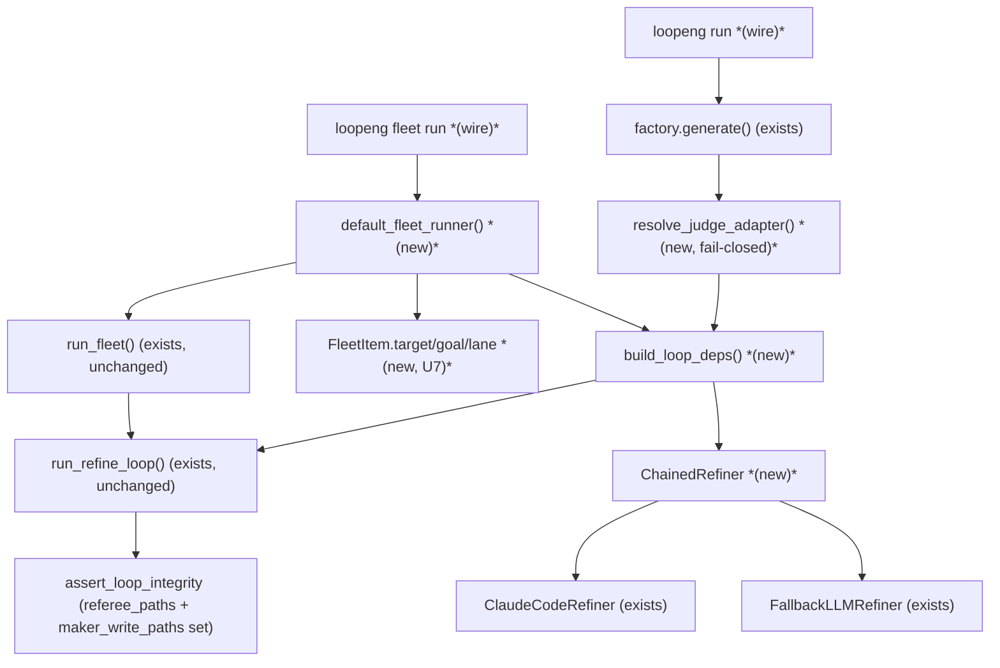
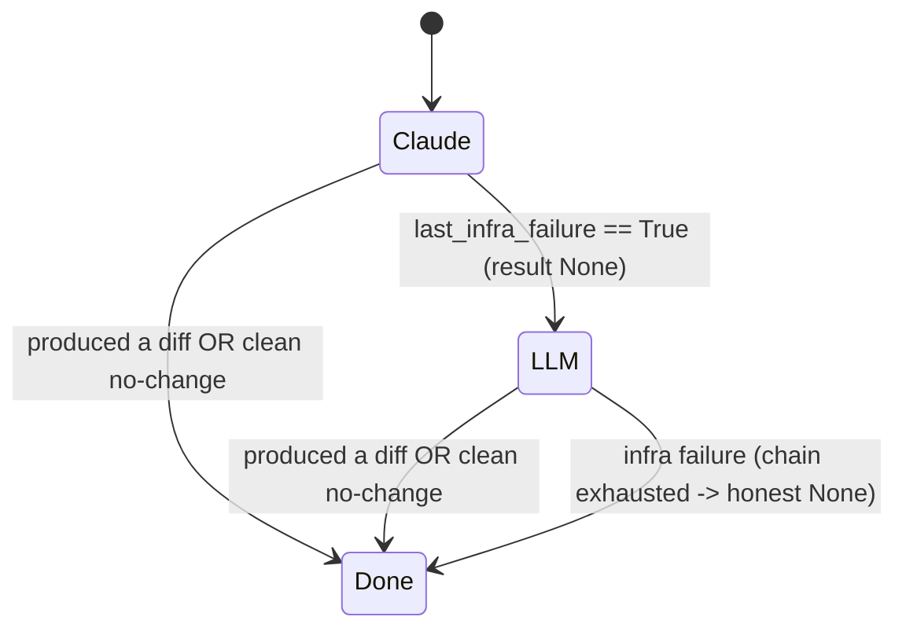

# feat: Wire U4/U5 loop adapters into the `run` + fleet CLI

## Summary

The loop *engine* is built and tested; it is simply **unplugged from the CLI**.
`run_loop` / `run_refine_loop` (`src/loopeng/autonomous/runner.py`) already
assemble the full chain — preflight → route → factory → controller → human-confirm
gate — against the `Factory`/`Judge`/`Refiner`/`Compounder` protocols, and the
proof pipeline (`_drive_proof_loop`, `src/loopeng/cli.py`) already drives a real
`run_refine_loop` with a real `CLIJudge` + real refiner. But `loopeng run` itself
still raises `"Factory adapters (U4/U5) are not yet wired to the real tools"`
(`src/loopeng/cli.py:75-92`), and `fleet run` only materializes a fleet row
without executing it.

This plan closes that last gap: build **default real bindings** (judge, refiner,
compounder) constructed from config + flags, and connect them to `run` and
`fleet run` so a target loops end-to-end. Three decisions are locked from
scoping: the CLI-Judge adapter is **auto-located** from the generated tool (with
an explicit override), the default refiner is **`claude` primary with the
free-tier LLM chain as fallback**, and **`fleet run` executes now**.

> **Deepened 2026-06-18 (doc-review).** Five-persona review surfaced three HIGH
> structural issues now resolved in this revision: (1) fleet items carry no
> per-item target/goal — added **U7** (fleet-item schema); (2) the
> referee-immutability claim was a no-op (adapter inside the maker's write jail,
> empty `maker_write_paths`) — KTD3 + U3 now enforce it for real; (3) the
> `judge_factory` seam was broken and scope creep — U4 is re-architected to
> resolve the adapter in the CLI and call the **existing** `run_refine_loop`,
> leaving `run_loop` untouched.

---

## Problem Frame

After plan-001 (engine), plan-005 (gap bridges), and plan-006 (fleet
orchestration), the orchestration layer is proven — the recent fleet dogfood
drove real git worktrees through topological waves, feedback routing, escalation,
and parking. But every one of those paths bottoms out at a worker that, through
the public CLI, cannot actually run: `run` raises by design, and `fleet run`
stops at row creation. The machinery to run a loop exists and is unit-tested
behind injectable protocols; what is missing is the **production wiring** that
constructs the real tool bindings and hands them to the already-built runner.
Without it, the entire stack is a tested skeleton with no live entrypoint — "the
missing floor under the proven orchestration layer."

---

## Requirements

| ID | Requirement |
|----|-------------|
| R1 | `loopeng run <target> --goal ...` drives a real end-to-end loop (generate → judge → refactor → re-judge → gate), replacing the hard `raise` at `src/loopeng/cli.py:75-92`. |
| R2 | The CLI-Judge adapter is **auto-located** for a target; an explicit `--judge-adapter PATH` overrides. Resolution **fails closed** on both *missing* and *out-of-workspace / inside-maker-write-tree* adapters, with an actionable error — never a silent or unsafe default. |
| R3 | The default refiner is a **chain**: `ClaudeCodeRefiner` first, falling through to `FallbackLLMRefiner` on an *infra* failure only. `--refiner {chain,claude,llm}` selects; `chain` is the default. |
| R4 | `fleet run` **executes** its items end-to-end through the existing `run_fleet` coordinator, each item driven inside its worktree with `upstream_context` routed (the plan-006 cross-item seam). A `--dry-run` flag preserves today's materialize-only behavior. |
| R5 | All existing gates remain intact and unbypassable from the CLI: preflight (`missing_for_lane`), credential gate, maker/checker integrity (`assert_loop_integrity`) **with the resolved referee actually protected**, and the human-confirm `VerificationGate` (no caller-settable bypass — including the `--scheduled --confirm` combination). |
| R6 | A failed or unavailable tool surfaces as a normalized, actionable CLI error — never a raw stack trace or a hang. |
| R7 | A fleet item carries the data needed to run: per-item `target`, `goal`, and optional `lane`. The spec parser, materialize path, store schema, and `FleetItem` are extended to persist them. |

---

## Key Technical Decisions

- **KTD1 — Construction, not new tools (wrap-don't-fork).** Every concrete
  binding already exists (`CLIJudge`, `ClaudeCodeRefiner`, `FallbackLLMRefiner`,
  `ClaudeCodeCompounder`, both factories). This plan adds a thin
  *bindings/wiring* layer plus one composite refiner — it does **not** modify the
  controller or `run_loop`/`run_refine_loop` bodies. _Rejected:_ re-implementing
  a unified refiner — the protocol already lets us compose.

- **KTD2 — `run` = generate → resolve adapter → `run_refine_loop` (no runner
  change).** Because the judge adapter is only knowable *after* generate, and
  `run_loop` performs generate internally and calls `assert_loop_integrity`
  *before* it, `run` instead does the generate step itself (via the routed
  factory), resolves the adapter against the produced tool, builds the judge +
  referee paths, then calls the **existing** `run_refine_loop(tool_path, ...)` —
  which already drives an already-present tool with the integrity check, gate, and
  store wiring intact. This sidesteps the broken "resolve a judge before generate"
  ordering and needs **zero** change to `run_loop`/`run_refine_loop`. _Rationale:_
  `_drive_proof_loop` already proves this exact generate-then-refine shape;
  `run`'s only delta is doing the generate itself instead of adopting from the
  catalog. _Rejected:_ adding a `judge_factory` callback seam to `run_loop` — it
  would force the integrity check to run with an empty/None referee (the seam
  resolves the adapter after `assert_loop_integrity` has already passed), and it
  changes the runner body the scope forbids.

- **KTD3 — The referee must be immutable to the maker, enforced for real.** The
  plan-001 R-1 claim ("pass the adapter as `referee_paths`") is a **no-op** as the
  code stands: `assert_referee_immutable_to_maker` only iterates
  `maker_write_paths`, and `run_refine_loop` defaults it to `()`, so nothing is
  checked — while the refiner's actual write jail is `tool_path`, which would
  *contain* an adapter auto-located under `tool_path`. This plan closes it two
  ways: (a) `resolve_judge_adapter` **rejects** any adapter path that resolves
  inside the maker's write tree (`within_workspace(adapter, tool_path)` ⇒
  `JudgeAdapterError`) — the trusted adapter must live in an operator-controlled
  location outside `tool_path` (e.g. the `demos/adapters/` registry, or a
  `--judge-adapter` path); and (b) `run` passes `referee_paths=[adapter]` **and**
  `maker_write_paths=[tool_path]` to `run_refine_loop` so
  `assert_referee_immutable_to_maker` actually fires. _Rejected:_ trusting an
  in-`tool_path` adapter — a maker-controlled generator could ship a fake adapter
  that self-reports grade A.

- **KTD4 — Chained refiner falls through on *infra* failure only.** The composite
  reads each inner refiner's `last_infra_failure`; a clean no-change result (a
  refiner that ran but did not improve) is **not** a fallback trigger — only a
  transient/infra failure (timeout, non-zero exit, throttled chain) advances to
  the next refiner. It initializes and, before each inner call, resets
  `last_token_cost` / `last_infra_failure` / `last_fork_cards`, then overwrites
  them from whichever inner refiner actually ran, so a stale Fork-Card list from a
  prior rung never leaks (the same leak `ClaudeCodeRefiner` already guards).
  _Rationale:_ matches the controller's existing infra-retry contract.

- **KTD5 — Chained-refiner provenance + fallback fidelity.** The fallback
  `FallbackLLMRefiner` is an arbitrary free-tier model explicitly prompted to
  "raise the CLI-Judge score" — a different maker than `claude`, unseen by the
  one-shot identity check in `assert_loop_integrity`. To keep an honest audit
  trail, the store records **which inner refiner produced each accepted diff**
  (claude vs a named provider). A run that converged *only* after a fallback-LLM
  diff is surfaced in the report (so a human can weigh fidelity); it does not
  silently read as a clean claude convergence. _Rationale:_ anti-quality-laundering
  (R6/R10 of plan-001); the gate already requires human confirm, this makes the
  confirm informed.

- **KTD6 — Fleet executes by default; `--dry-run` materializes only.** Today's
  `fleet run` behavior becomes `fleet run --dry-run`. The default drives
  `run_fleet`, behind the same preflight gate as single `run`. Because this flips
  an external CLI contract, `fleet run` (no flag) prints a one-line deprecation/
  behavior-change notice on first execute, and every in-repo caller (tests, the
  dogfood script, README/AGENTS examples) is updated in U5/U6. _Rejected:_
  materialize-default + `--execute` — the user explicitly chose execute-now; the
  notice + caller sweep covers the blast radius instead.

---

## High-Level Technical Design

New/changed pieces are starred; the runner and controller are unchanged.

Refiner fall-through (KTD4):

---

## Implementation Units

### U1. Default loop bindings builder

- **Goal:** One function that constructs the real `judge`, `refiner`, and
  `compounder` from config + flags, shared by `run` (cli.py) and the fleet runner
  (orchestration).
- **Requirements:** R3, R5.
- **Dependencies:** U2 (consumes `ChainedRefiner`).
- **Files:** `src/loopeng/bindings.py` (create), `tests/test_bindings.py` (create).
- **Approach:** `build_loop_deps(*, tool_path, judge_adapter, refiner_kind, compound=True) -> LoopDeps` returning a frozen `{judge, refiner, compounder}`. Refiner: `chain` → `ChainedRefiner([ClaudeCodeRefiner(), FallbackLLMRefiner()])`; `claude` → `ClaudeCodeRefiner()`; `llm` → `FallbackLLMRefiner()`. Compounder: `ClaudeCodeCompounder(tool_path)` for claude/chain, `None` for `llm` (store-only learnings, mirroring `_drive_proof_loop`). Judge: `CLIJudge(adapter_path=judge_adapter)`. **Credential preflight:** the builder reports which provider env vars the chosen `refiner_kind` needs (e.g. `chain`/`llm` → the active `LOOPENG_REFINER_CHAIN` providers' key names) so the caller can fold them into `Config.required_env` and the existing `_check_credentials` gate fires *before* work starts rather than silently degrading to Ollama.
- **Why a module, not an inline helper:** both consumers live in different layers — `run` in `src/loopeng/cli.py` and `default_fleet_runner` in `src/loopeng/orchestration/coordinator.py`. A shared leaf module avoids a `cli ↔ orchestration` import cycle. (The deferred `_drive_proof_loop` refactor becomes a third consumer.)
- **Patterns to follow:** `src/loopeng/cli.py` `_drive_proof_loop` (selection logic), `src/loopeng/adapters/llm_refiner.py` `_active_chain` (provider key names).
- **Test scenarios:**
  - `refiner_kind="chain"` → `ChainedRefiner` wrapping claude then llm; compounder is `ClaudeCodeCompounder` (happy path).
  - `refiner_kind="llm"` → `FallbackLLMRefiner`, compounder `None` (happy path).
  - `refiner_kind="claude"` → `ClaudeCodeRefiner`, compounder present.
  - Unknown `refiner_kind` → `ValueError` naming the allowed set (error path).
  - Returned `judge` is a `CLIJudge` whose `adapter_path` equals the passed value.
  - `chain`/`llm` report the expected provider key names for the credential gate; `claude` reports none (integration with `_check_credentials`).
- **Verification:** `build_loop_deps` returns protocol-satisfying objects for every kind; the bundle plugs into `run_refine_loop`'s keyword args without adaptation.

### U2. Chained refiner (claude → free-tier LLM)

- **Goal:** A `Refiner` that tries an ordered list of refiners, falling through to
  the next **only on an infra failure**, faithfully (re)exposing the
  controller-read attributes from whichever inner refiner last ran, with no stale
  leakage.
- **Requirements:** R3.
- **Dependencies:** none.
- **Files:** `src/loopeng/adapters/llm_refiner.py` (add `ChainedRefiner`), `tests/test_llm_refiner.py` (extend).
- **Approach:** `ChainedRefiner(inner: list[Refiner])` with `last_token_cost`/`last_infra_failure`/`last_fork_cards` initialized as instance attributes (so `isinstance(x, Refiner)` holds). `refactor(tool_path, brief)`: for each inner, **reset** the three attributes, call `inner.refactor`, then **overwrite** them from that inner (via `getattr` with safe defaults — `FallbackLLMRefiner` has no `last_fork_cards`). If the inner reported `last_infra_failure` and returned `None`, continue; otherwise return its result (real diff_ref, or clean `None`). On exhaustion, return the last inner's result with `last_infra_failure` reflecting the final attempt — never raise on a single inner's infra failure. **Provenance (KTD5):** record the producing refiner's name on the returned diff (a `last_refiner` attribute the proof/store layer reads in U5/U6). **Token budget across handoff:** when the active inner sets `last_token_cost=None` (FallbackLLMRefiner), the chain propagates `None` and the controller's existing wall-clock fallback applies — this is the correct interim behavior; cross-refiner cost aggregation is deferred, **not** a bug to fix inside U2.
- **Execution note:** Test-first — the infra-failure-only fall-through predicate and the reset-on-fall-through are the load-bearing, easy-to-break behaviors.
- **Patterns to follow:** `FallbackLLMRefiner._active_chain` (provider-chain fall-through), the `Refiner` protocol docstring in `src/loopeng/adapters/base.py`, `ClaudeCodeRefiner` line that resets `last_fork_cards=[]` on failure.
- **Test scenarios:**
  - Claude returns a diff_ref → chain returns it, LLM never invoked; `last_token_cost` reflects claude; `last_refiner == "claude"` (happy path).
  - Claude infra-fails (`last_infra_failure=True`, result `None`) → LLM runs and produces a diff_ref; chain returns it; `last_infra_failure` is `False` (LLM did not infra-fail); `last_refiner` is the LLM provider (fall-through).
  - Claude returns a **clean no-change** (`None`, `last_infra_failure=False`) → chain returns `None`, LLM **not** invoked (no-change is not a fallback trigger — the critical edge).
  - Both infra-fail → chain returns `None`, `last_infra_failure=True` (honest exhaustion).
  - Claude emitted fork-cards, then a fall-through to the (card-less) LLM → chain's `last_fork_cards` reflects the LLM rung (empty), not the stale claude list (reset correctness).
  - Empty inner list → `ValueError` at construction (error path).
- **Verification:** a `ChainedRefiner` passes `isinstance(x, Refiner)`; the controller drives it identically to a single refiner; fall-through fires on infra failure only; no stale attribute leaks across rungs.

### U3. Judge-adapter auto-discovery (fail-closed, out-of-jail)

- **Goal:** Resolve the CLI-Judge adapter path for a target without a manual flag,
  with an explicit override and a fail-closed error on missing **and** unsafe
  (in-maker-write-tree / out-of-workspace) paths.
- **Requirements:** R2, R5, R6.
- **Dependencies:** none.
- **Files:** `src/loopeng/adapters/judge.py` (add `resolve_judge_adapter`, `JudgeAdapterError`), `tests/test_adapter_judge.py` (extend).
- **Approach:** `resolve_judge_adapter(gen: GenerateResult, *, override: str | None = None, registry_dir: str | None = None) -> str`. Precedence: (1) `override` if given — must exist, else `JudgeAdapterError` (a wrong explicit override fails loudly, never falls back); (2) an operator-controlled registry location (e.g. `demos/adapters/<id>.py`) when present; (3) a path named in `gen.manifest`, **only if** it exists. In all cases the resolved path is rejected with `JudgeAdapterError` when `within_workspace(adapter, gen.tool_path)` is true — the referee must not live in the maker's write jail (KTD3). When nothing resolves, raise `JudgeAdapterError` with the `--judge-adapter PATH` hint. Exact registry/manifest field names pinned at implementation against a real generated tool (see Deferred).
- **Patterns to follow:** the registry adapter lookup + actionable raise in `_drive_proof_loop` (`demos/adapters/{id}.py`); `within_workspace` in `src/loopeng/adapters/safety.py`.
- **Test scenarios:**
  - Override path that exists and is outside `tool_path` → returned verbatim (happy path).
  - No override, a registry adapter present outside `tool_path` → that path returned (happy path).
  - Override given but missing → `JudgeAdapterError` (no silent fallback to search) (error path).
  - Resolved adapter resolves **inside** `tool_path` → `JudgeAdapterError` (the central safety guard — KTD3/R-2).
  - Manifest names an out-of-workspace absolute path → `JudgeAdapterError` (path-escape guard).
  - Nothing found → `JudgeAdapterError` with the `--judge-adapter` hint (error path).
  - Two candidate adapters at known locations → resolution is deterministic and documented (not "first os.walk hit") (edge).
- **Verification:** discovery returns a usable, out-of-jail adapter for a tool that ships one; missing, bad-override, in-jail, and out-of-workspace all raise the typed, actionable error.

### U4. Wire `loopeng run` (generate → resolve → refine)

- **Goal:** Replace the placeholder `raise` with a real run: route, generate via
  the routed factory, resolve the adapter, build deps, drive the **existing**
  `run_refine_loop`, render the outcome + report. **`run_loop`/`run_refine_loop`
  bodies are not modified.**
- **Requirements:** R1, R2, R3, R5, R6.
- **Dependencies:** U1, U2, U3.
- **Files:** `src/loopeng/cli.py` (`run_cmd`, ~lines 66-92), `tests/test_run_cli.py` (create).
- **Approach:** Keep the route echo + `missing_for_lane` preflight. Then: pick the routed factory (`_default_factories()[decision.factory]`), run `factory.generate(decision.normalized_target, goal, workspace_root)`; on `not gen.ok` render a STOPPED outcome honestly (R6). Resolve the adapter via `resolve_judge_adapter(gen, override=judge_adapter)` (U3). Build deps via `build_loop_deps(tool_path=gen.tool_path, judge_adapter=resolved, refiner_kind=...)` (U1). Call `run_refine_loop(gen.tool_path, goal, judge=deps.judge, refiner=deps.refiner, compounder=deps.compounder, store=..., workspace_root=..., lane=decision.lane, referee_paths=[resolved], maker_write_paths=[gen.tool_path], scheduled=..., confirmed=...)`. The `referee_paths`+`maker_write_paths` pair makes `assert_loop_integrity` actually enforce referee-immutability (KTD3/R5). New flags: `--judge-adapter`, `--refiner {chain,claude,llm}` (default `chain`), `--workspace`, `--confirm/--no-confirm` (feeds `confirmed`), `--scheduled`, `--max-iterations`. **`--scheduled --confirm` is rejected** with a `ClickException` ("a scheduled run cannot be pre-confirmed from the CLI") so the unattended anti-surrender default can't be flag-bypassed (R5). Render lane, before→after grade/score, shippable + gate_reason, the producing refiner (KTD5), and a pointer to `loopeng report <run_id>`. Wrap `RuntimeError`/`JudgeAdapterError` → `ClickException` (R6).
- **Execution note:** Start with a failing `CliRunner` test asserting `run` calls `run_refine_loop` (monkeypatched) with the chained refiner, the resolved out-of-jail adapter, and `maker_write_paths=[tool_path]` — locks the wiring + integrity contract before argument plumbing.
- **Patterns to follow:** `_drive_proof_loop` + `_finish_proof` (cli.py:500-566) for the generate-then-refine shape and rendering; `tests/test_autonomous_runner.py` for injecting fakes into `run_refine_loop`.
- **Test scenarios:**
  - `run <local-dir> --goal X` with monkeypatched factory/judge/refiner → `run_refine_loop` invoked once with a `ChainedRefiner`, the resolved adapter, and `referee_paths`/`maker_write_paths` set; converged outcome rendered with the run id (happy path).
  - Missing required tool for the lane → `ClickException` naming the tool; nothing generated (preflight, R5).
  - `--judge-adapter` absent and auto-discovery fails (or resolves in-jail) → `ClickException` with the hint, no loop started (error path, R2/R6).
  - `--refiner llm` → deps built with `FallbackLLMRefiner`, no compounder (integration with U1).
  - `--scheduled --confirm` → `ClickException`; gate cannot be pre-confirmed (R5).
  - Converged but human-confirm gate owed → output marks `shippable=false` with the gate reason (integration with `VerificationGate`).
  - Factory generate fails → STOPPED rendered, no stack trace (error path, R6).
- **Verification:** `loopeng run` on a target with tools present drives a real loop and prints before→after grades + a run id with the referee protected; every gate/flag misuse yields an actionable message, not a traceback.

### U7. Per-item fleet targets (spec + schema)

- **Goal:** Persist the data a fleet item needs to actually run — `target`,
  `goal`, optional `lane` — through the spec parser, materialize path, store
  schema, and `FleetItem`. (Numbered U7 to preserve U-ID stability; sequences
  **before** U5.)
- **Requirements:** R7, R4.
- **Dependencies:** none.
- **Files:** `src/loopeng/orchestration/spec.py` (`parse_fleet_spec`, `materialize_fleet`), `src/loopeng/memory/fleet_state.py` (`FleetItem`), `src/loopeng/memory/schema.sql`, `src/loopeng/memory/store.py` (`add_fleet_item`, `fleet_items`), `tests/test_fleet_state.py` + `tests/test_fleet_coordinator.py` (extend).
- **Approach:** Extend a spec item to `{"key", "target", "goal"?, "depends_on"?, "lane"?}` — `target` required, `goal` defaulting to the fleet goal when omitted, `lane` optional override. `parse_fleet_spec` validates `target` is a non-empty string. Add `target`, `goal`, `lane` columns to `fleet_items` (schema.sql) and to the `FleetItem` dataclass; thread them through `add_fleet_item` / `materialize_fleet` / `fleet_items`. Keep the schema-enum agreement test style already in `tests/test_fleet_state.py`.
- **Patterns to follow:** existing `fleet_items` columns + `add_fleet_item` in `store.py`; the spec validation pattern in `parse_fleet_spec`.
- **Test scenarios:**
  - Spec item with `target` + `goal` → materialized `FleetItem` carries both (happy path).
  - Spec item missing `target` → `FleetSpecError` (error path).
  - `goal` omitted → item inherits the fleet's top-level goal (edge).
  - Round-trip: `add_fleet_item` then `fleet_items` returns the persisted target/goal/lane (integration with store).
  - Schema string matches the `FleetItem` field set (the existing agreement-test pattern).
- **Verification:** a parsed + materialized fleet item carries a runnable `target`/`goal`; the store persists and returns them; malformed specs fail closed.

### U5. Wire `fleet run` to execute

- **Goal:** Make `fleet run` drive items through `run_fleet` with a default
  per-item runner that loops each item in its worktree; `--dry-run` keeps
  materialize-only.
- **Requirements:** R4, R5, R6.
- **Dependencies:** U1, U3, U7.
- **Files:** `src/loopeng/cli.py` (`fleet_run_cmd`, ~lines 146-174), `src/loopeng/orchestration/coordinator.py` (add `default_fleet_runner`), `tests/test_fleet_cli.py` (extend), `tests/test_fleet_runner.py` (create).
- **Approach:** Add `default_fleet_runner(*, fleet_goal, judge_adapter_override, refiner_kind) -> Callable[[FleetItem, str, list[dict]], RunResult]` in `coordinator.py` (alongside `default_classify`). The returned runner, per item: generate via the routed factory **into the item's worktree** (pass `workspace_root=worktree` to the generate step — `run_refine_loop` takes `workspace_root` as a kwarg; this is a plain pass, *not* a rebase of an existing root, and is distinct from `Heartbeat.tick_parallel`, which rebases `ScheduledFire.workspace`), resolve the adapter (U3), build deps (U1), then call `run_refine_loop(tool_path, item.goal or fleet_goal, ..., lane=item.lane, referee_paths=[adapter], maker_write_paths=[tool_path], upstream_context=upstream)`. `fleet_run_cmd`: after materialize, if `--dry-run` echo today's message and stop; otherwise run preflight once, print the behavior-change notice (KTD6), then `run_fleet(store, fid, default_fleet_runner(...), repo_dir=..., worktrees_root=..., classify=classify_with_escalation)` and render `build_fleet_report` (terminal status + escalation list).
- **Patterns to follow:** the dogfood driver's per-item runner shape; `run_fleet`'s contract (`src/loopeng/orchestration/coordinator.py:122-141`); `classify_with_escalation` usage in `tests/test_fleet_escalation.py`; `_drive_proof_loop` for generate-then-refine.
- **Test scenarios:**
  - `fleet run spec.json` (execute) with monkeypatched generate/`run_refine_loop` → each item runs in dependency order; converged fleet renders the report (happy path, integration).
  - `fleet run spec.json --dry-run` → materializes only, `run_fleet` never called, today's message printed (preserves existing behavior).
  - An item whose loop returns blocked/stopped → escalation + `blocked_on_dep` propagation + fleet parks `awaiting_human` (matches dogfood).
  - Missing tool for an item's lane → preflight error before any worktree is created (R5).
  - `upstream_context` from a converged dependency reaches the dependent item's runner (plan-006 cross-item seam, R4).
  - Each item's loop runs with `referee_paths`/`maker_write_paths` set (referee protected per worktree — KTD3/R5).
- **Verification:** `fleet run` (no flag) executes the DAG end-to-end through real worktrees with per-worktree referee protection; `--dry-run` matches prior behavior; escalation/parking behave as the dogfood proved.

### U6. End-to-end smoke + integrity tests + docs/changelog sync

- **Goal:** Prove the wired CLI path runs a loop with stubbed externals, **exercise
  the load-bearing safety properties** (not just happy plumbing), and sync the
  required docs.
- **Requirements:** R1, R4, R5, R6.
- **Dependencies:** U4, U5.
- **Files:** `tests/e2e/test_run_cli_e2e.py` (create), `CHANGELOG.md`, `README.md`, `AGENTS.md`.
- **Approach:** An e2e test invoking `loopeng run` via `CliRunner` against a tiny local fixture, monkeypatching the factory (returns a `GenerateResult` whose `tool_path` is a fixture tool and whose adapter lives in an out-of-jail registry dir), the judge (scripted `Verdict` ladder F→A), and a fake refiner — asserting the real CLI → generate → resolve → `run_refine_loop` path produces a converged run + readable report. Mirror for `fleet run` with a 2-item spec (with targets, per U7). **Plus three integrity-focused tests** (the doc-review gap): (1) a refiner that attempts to write the resolved adapter path → the loop rejects it (referee-immutability fires — KTD3); (2) a two-adapter fixture → resolution precedence is deterministic; (3) a chain where claude infra-fails and the LLM produces the converging diff → the run is attributed (`last_refiner`) and the report surfaces converged-via-fallback (KTD5). Then doc sync: `## [Unreleased]` CHANGELOG entry; `README.md` usage (the `run`/`fleet run` examples no longer say "not yet wired"); `AGENTS.md` CLI-surface + `run`/`fleet` entries (new flags, execute-default).
- **Patterns to follow:** `tests/e2e/test_reference_loop.py`, `tests/e2e/test_proof_loop.py`.
- **Test scenarios:**
  - `run` e2e: real CLI → converged run recorded; `loopeng report <id>` renders before→after grades (integration). `Covers R1.`
  - `fleet run` e2e: 2-item spec executes both; report shows both converged (integration). `Covers R4.`
  - Refiner writes the referee path → loop rejects, run does not converge on a mutated rubric (R5).
  - Converged-via-fallback → report attributes the producing refiner (KTD5).
  - Judge ladder never reaching A within `--max-iterations` → loop stops on budget, honest non-converged report (edge).
- **Verification:** the e2e suite drives the public CLI with no real external tools and proves both the wiring **and** the referee/attribution safety properties; CHANGELOG/README/AGENTS reflect the new live behavior.

---

## Scope Boundaries

**In scope:** default real bindings; the chained refiner; fail-closed,
out-of-jail judge-adapter discovery; per-item fleet target/goal schema; wiring
`run` and `fleet run`; integrity + e2e tests; doc sync.

**Out of scope (non-goals):**
- Changing the loop controller, convergence policy, or `run_loop`/`run_refine_loop`
  bodies — this revision needs **none** (KTD2 reuses `run_refine_loop` as-is).
- Modifying the adapters' real invocation surfaces (the `_build_command` strings
  are pinned/verified separately at build time — flagged in plan-001 U4/U5).
- Building or replacing any of the four external tools.
- Cross-refiner token-cost aggregation (interim: wall-clock fallback — KTD4).

**Deferred to Follow-Up Work:**
- Refactor `_drive_proof_loop` to consume `build_loop_deps` (U1), so the proof
  path stops duplicating refiner selection. Safe, but a separate PR.
- Cryptographic/manifest signing of the trusted judge adapter (beyond the
  out-of-jail location guard) — a hardening follow-up if generated tools begin
  shipping their own adapters.

---

## Deferred to Implementation (Unknowns)

- **Exact judge-adapter registry/manifest location** emitted alongside a generated
  tool — pin `resolve_judge_adapter`'s precedence list against a real CLI-Anything
  / Printing-Press output during U3 (the manifest currently carries only
  `executable` + `timed_out`; decide whether to extend it with an adapter path,
  remembering the out-of-jail guard rejects any in-`tool_path` path).
- **Per-worktree generate path** in `default_fleet_runner` — confirm the factory
  writes into `workspace_root=worktree` cleanly under concurrent waves during U5.

---

## Risks & Dependencies

- **R-1 Referee mutable by the maker (HIGH, was a silent no-op).** If the adapter
  lives under `tool_path` or `maker_write_paths` is empty, the maker can rewrite
  the rubric it is graded against. Mitigation (KTD3): `resolve_judge_adapter`
  rejects in-jail adapters, and `run`/`fleet` pass
  `referee_paths=[adapter]`+`maker_write_paths=[tool_path]` so
  `assert_referee_immutable_to_maker` actually fires. U6 test (1) exercises a
  refiner trying to write the referee.
- **R-2 Silent wrong-adapter judging.** Auto-discovery picking the wrong file
  grades against the wrong contract. Mitigation: strict, documented precedence;
  no fuzzy match; fail-closed on missing/in-jail/out-of-workspace; U6 two-adapter
  determinism test.
- **R-3 Quality laundering via the fallback LLM.** A free-tier model prompted to
  "raise the score" is an unaudited maker. Mitigation (KTD5): record the producing
  refiner; surface converged-via-fallback in the report; the human-confirm gate
  makes the final call informed.
- **R-4 Prompt injection via `upstream_context`.** A compromised upstream item's
  goal/fixtures flow into the LLM refiner's prompt. Mitigation: brief fields
  sourced from `upstream_context` are length-capped and stripped of control
  characters before interpolation (applied in the refiner before
  `_build_messages`); edits remain jailed by `within_workspace`. (Bounded — full
  content policy is out of scope.)
- **R-5 Gate bypass via flags.** Mitigation: the gate has no off switch; `--confirm`
  only sets the human affirmative and is **rejected** alongside `--scheduled`
  (U4); `--scheduled` defaults to confirm-required regardless of CI.
- **Dependency:** live runs need the external tools (`cli-anything`/`printing-press`,
  `cli-judge`, the compound-engineering plugin or LLM provider keys). All tests
  stub them; live runs gate on preflight + the credential gate (U1).

---

## System-Wide Impact

- **CLI surface (external contract):** new flags on `run` (`--judge-adapter`,
  `--refiner`, `--workspace`, `--confirm/--no-confirm`, `--scheduled`,
  `--max-iterations`) and `fleet run` (`--dry-run`, refiner/adapter flags).
  `--scheduled --confirm` is rejected. Documented in `AGENTS.md` + `README.md`.
- **Data-model change (corrected):** `fleet_items` gains `target`, `goal`, `lane`
  columns and `FleetItem` gains the matching fields (U7). The single-run `runs`
  table is unchanged. The fleet **spec format** gains a required `target` per item.
- **Behavior change:** `fleet run` now executes by default (was materialize-only);
  `--dry-run` preserves the old behavior, a behavior-change notice prints on
  execute, and existing fleet tests + the dogfood script + README/AGENTS examples
  are updated (U5/U6).
