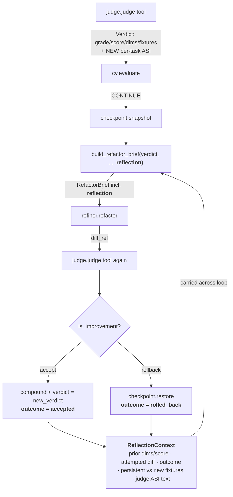

# feat: Reflective refine loop — GEPA-style trace-driven mutation (additive)

## Summary

Today the refine loop is a **blind** greedy hill-climb: each iteration builds the refactor brief from *only the latest single Verdict* (`build_refactor_brief` at `src/loopeng/loop/refactor_brief.py:12`), refactors, re-judges, and keeps-or-rolls-back. The refiner never learns *why* the last attempt scored what it did, whether its previous edit was accepted or thrown away, or which failures are stuck vs. transient. GEPA's central finding is that feeding **Actionable Side Information (ASI)** — the structured "why" behind a score — into the mutation step is "the text-optimization analogue of a gradient" and buys large sample-efficiency gains over blind mutation.

This plan adds that gradient **additively**, in the outer loop, refiner-agnostic. We carry a small `ReflectionContext` across iterations (prior grade/dims, the diff that was tried, whether it was accepted or rolled back, and persistent-vs-new failures), attach it as a new defaulted field on `RefactorBrief`, and render it into both refiner prompts via the same `getattr`-bound pattern already used for `recurring_failures` and `upstream_outcomes`. We enrich the judge's discarded per-task detail into that context (the "ASI" payload), and — as the operational-efficiency borrow from `everything-claude-code` — harden the already-JSON `ClaudeCodeRefiner` invocation with a hard `--max-budget-usd`/`--max-turns` cap and an explicit `--allowedTools` scope. The greedy hill-climb, regression rollback, maker≠checker integrity, and the human-confirm gate are all **unchanged**.

Explicitly **out of scope** (per the additive-architecture decision): the GEPA Pareto frontier / multi-candidate pool, RL fine-tuning, and any standalone business/strategy deliverable. Value framing rides inline on each decision.

**Calibrate the claim.** GEPA's headline numbers (35× sample-efficiency) come from reflective mutation **and** the Pareto frontier *together* — the frontier is what escapes the local optima a single-path greedy walk falls into. This slice tests only the **reflection/ASI lever within single-path greedy**; it does **not** reproduce GEPA's frontier-driven results. Frame the expected gain honestly as *fewer wasted/repeated rejected iterations* (faster, less-blind convergence), not GEPA-class sample-efficiency. A positive-but-modest first-light signal validates that the frontier follow-up is *warranted* — it does not retire it.

---

## Problem Frame

- **Blind mutation.** The brief is a pure projection of the latest `Verdict` (`controller.py:165`). On iteration *k+1* the refiner sees the same dims/fixtures shape it saw at *k* with no memory that its last edit was rolled back — so it can repeat a rejected approach. This is the "shallow refinement / no tool-specific context" risk flagged **OPEN P0** in `docs/solutions/p0-feasibility-gates.md`.
- **Discarded signal.** `parse_report` (`src/loopeng/adapters/judge.py:116`) reads rich per-task detail (`tasks[]` with `points`/`max_points`) but keeps only fixture *ids* on `Verdict`. GEPA shows that scalar-only ASI degrades reflection to "informed random mutation"; the textual "why" is the lever we are currently throwing away.
- **No persistence-vs-transience distinction.** `recurring_failures` already pulls *cross-run* history into the brief, but within a single run nothing tells the refiner "fixture X has resisted the last 3 edits" vs "fixture Y just appeared." HarnessX's Digester makes exactly this persistent/transient split the core of its reflection input.
- **Estimated, not measured, cost.** `ClaudeCodeRefiner` parses a best-effort token cost from the run envelope; there is no hard per-refactor spend ceiling. `everything-claude-code` documents `--output-format json` (real `total_cost_usd`) + `--max-budget-usd`/`--max-turns` as a zero-architecture upgrade.

**Goal:** make each mutation *reflective* — informed by the judge's structured feedback and the loop's own recent history — without changing the loop's control flow, safety invariants, or public contracts.

---

## Requirements

- **R1** — Reflection is computed in the **outer loop** from **judge output + loop history only**; the refiner never grades itself (preserve maker≠checker, `src/loopeng/loop/integrity.py`).
- **R2** — All additions are **backward-compatible**: new fields are defaulted on frozen dataclasses and read via `getattr`, so existing refiners, the fleet coordinator, and the SQLite schema are untouched (the codebase's KTD1 convention).
- **R3** — Both refiners (`ClaudeCodeRefiner`, `FallbackLLMRefiner`) benefit **identically**; reflection lives in shared brief construction, not in any adapter.
- **R4** — Reflective text interpolated into an LLM prompt is bounded against prompt injection (reuse `_clip` / `_MAX_BRIEF_FIELD`, `src/loopeng/adapters/llm_refiner.py:128`).
- **R5** — The accept/rollback rule and convergence semantics are **unchanged**: reflection changes the *proposal*, never the grade or the keep decision.
- **R6** — No new runtime dependencies (project is stdlib-disciplined: deps are only `click`, `pyyaml`, `jsonschema`). Borrow GEPA's *pattern*, not its package.
- **R7** — The gain is validated **honestly**: substantive-vs-cosmetic on held-out fixtures, recorded via the record-only `demo proof` path (`docs/solutions/provenance-honesty.md`), not hand-edited fixtures.

---

## High-Level Technical Design

The reflection seam sits between the re-judge result and the *next* brief. Everything in **bold** is new; the surrounding flow is unchanged.



**`ReflectionContext` (directional shape, not a spec):**

```text
ReflectionContext(                                       # every field defaulted -> ReflectionContext() is valid (U1)
    prior_grade: str = "", prior_score: float = 0.0,     # what last iteration scored
    prior_dims: dict = {},                               # field(default_factory=dict) in impl
    attempted: str | None = None,                        # diff summary of the edit just tried (None on first)
    outcome: str = "first",                              # "first" | "accepted" | "rolled_back" | "reversed"
    persistent_fixtures: list = [],                      # field(default_factory=list); failing now AND in a prior KEPT iteration
    new_fixtures: list = [],                             # field(default_factory=list); failing now, not seen before this run
    judge_feedback: str = "",                            # ASI text distilled from the judge's per-task detail (U4), sanitized at source
)
```

This is the GEPA `SideInfo`/ASI dict, narrowed to what our judge already produces and our loop already holds. The HarnessX Digester's persistent/transient split is `persistent_fixtures` vs `new_fixtures`. **Compute it over the loop-local kept-verdict lineage, not raw `store.iterations(run_id)` rows** — `_record` persists *every* iteration before the accept/rollback decision (`controller.py:194`), so the store also holds the failing fixtures of *rejected* attempts; intersecting against raw rows would label fixtures from discarded edits as "persistent." Track the failing-fixtures of accepted iterations in loop-local state (no schema change).

---

## Key Technical Decisions

- **KTD1 — Additive, defaulted, `getattr`-read.** `reflection` is a new defaulted field on `RefactorBrief`, appended **after** the last existing defaulted field `upstream_outcomes` (`src/loopeng/adapters/base.py:75`), exactly mirroring how `recurring_failures` and `upstream_outcomes` were introduced. Refiners read it via `getattr(brief, "reflection", None)`. No breaking change to `Verdict`, `RunResult`, the fleet consumer, or the schema. *(see origin: docs/solutions/refine-only-baseline.md — "wrap, don't fork; no dead-weight flags")*
- **KTD2 — Reflection lives in the outer loop, refiner-agnostic.** Built once in `build_refactor_brief` from data the controller already holds at `controller.py:192–234`; rendered by each refiner. This honors outer-loop sovereignty (`docs/solutions/outer-loop-non-gaps.md` #1) and gives both refiners the signal for free (R3).
- **KTD3 — Maker ≠ checker preserved, and the gradient is sanitized at source.** `judge_feedback` is distilled from the **judge's** `report.json`, never from the refiner's self-report. `integrity.py` fails closed on `refiner is judge` (R10) and stays as-is. The refiner consumes the gradient; it never produces it. Because `report.json` is free text the maker can *indirectly* shape (its edits change what the judge reports on — a Goodhart path, see Risks), `judge_feedback` is **sanitized once at the source** (U4: strip control chars + shell metacharacters, bound length) so *both* refiner paths — the `_clip`-guarded LLM path and the un-clipped-but-structured Claude path — are safe without a per-path asymmetry.
- **KTD4 — Copy GEPA's pattern, not its package.** We reuse the `optimize_anything` reflection-prompt *shape* (current artifact + ASI → propose improvement) as prose in our existing prompt builders. We do **not** `pip install gepa`. *(Rejected — see Alternatives.)*
- **KTD5 — No Pareto frontier in this plan.** Single-path greedy + rollback is retained (the additive-architecture choice). The frontier/candidate-pool is the obvious next step and is recorded under Deferred, not built here. *(Rejected for now — see Alternatives.)*
- **KTD6 — Harden the Claude Code invocation with a budget/turn cap and tool scoping.** `--output-format json` and JSON-envelope token-cost parsing **already exist** today (`compound_engineering.py:29,96,155-156` — cost is *measured* from `usage.input_tokens/output_tokens`, not estimated). The real delta U5 adds is a hard ceiling and tool scoping: `--max-turns`, `--max-budget-usd`, and an **explicit `--allowedTools`** list. `last_token_cost` stays an **integer token count** — do **not** overload it with the fractional `total_cost_usd` (it feeds an integer `tokens_spent >= token_budget` gate; a float truncates to 0 and the gate never fires). `--max-budget-usd` is enforced by the CLI itself; an overflow surfaces as `last_infra_failure` and is treated as a **non-retryable** stop (not a transient retry, which would re-exceed and burn the retry budget). Keep the current `--permission-mode acceptEdits` default — verify any flag-value change against the installed CLI before adopting it. All new flags degrade gracefully via the existing `_safe_loads`/shortstat fallback (R2).
- **KTD7 — Persistent/transient from existing storage.** The Digester-lite split reads the last K iterations via `store.iterations(run_id)`; no new table, no migration.

---

## Implementation Units

### U1. `ReflectionContext` model + additive `reflection` field on `RefactorBrief`

**Goal:** Introduce the carrier type and the backward-compatible brief field; nothing reads it yet.
**Requirements:** R1, R2, R6.
**Dependencies:** none.
**Files:**
- `src/loopeng/adapters/base.py` (add frozen `ReflectionContext` with **all fields defaulted** — `field(default_factory=...)` for the `dict`/`list` fields per frozen-dataclass style; add `reflection: "ReflectionContext | None" = None` to `RefactorBrief` **after** `upstream_outcomes` at `base.py:75`)
- `tests/test_refactor_brief.py` (extend) or `tests/test_reflection_context.py` (new)
**Approach:** Frozen dataclass with the fields in the HTD shape, all defaulted so `ReflectionContext()` is valid. The `RefactorBrief.reflection` field defaults to `None` so every existing `RefactorBrief(...)` call site and every fake refiner in the test suite stays valid. Do not touch `Verdict` here.
**Patterns to follow:** the defaulted-field additions at `base.py:70` (`recurring_failures`) and `base.py:75` (`upstream_outcomes`); frozen-dataclass style throughout `base.py`.
**Execution note:** Test-first — assert the dataclass defaults and that an existing `RefactorBrief` built without `reflection` still equals its prior shape.
**Test scenarios:**
- `ReflectionContext()` constructs with all fields defaulted; `outcome` defaults to `"first"`.
- `RefactorBrief(goal=..., target_dimensions=[], failing_fixtures=[])` still constructs and `.reflection is None` (backward-compat).
- A `RefactorBrief` carrying a populated `reflection` round-trips its fields.
- `isinstance` of an existing fake refiner against the `Refiner` protocol is unaffected (no new required attr).

### U2. Build the reflection context across iterations (controller + `build_refactor_brief`)

**Goal:** Populate `ReflectionContext` from the loop's own history and pass it into the brief on every iteration after the first.
**Requirements:** R1, R2, R5, R7.
**Dependencies:** U1, U4 (consumes `Verdict.feedback`; renderable with `judge_feedback=""` until U4 lands).
**Files:**
- `src/loopeng/loop/refactor_brief.py` (add `reflection: ReflectionContext | None = None` param to `build_refactor_brief`; thread it onto the returned `RefactorBrief`)
- `src/loopeng/loop/controller.py` (carry last-iteration reflective state across the `while True` loop; compute persistent-vs-new fixtures; pass into the `build_refactor_brief` call at line 165)
- `tests/test_loop_controller.py`, `tests/test_refactor_brief.py`
**Approach:** `build_refactor_brief` stays a **pure** function — it receives a ready `ReflectionContext` and only attaches it (no I/O). The controller owns the assembly. The loop body has **four terminal branches per iteration**, not two — the reflection `outcome` must cover all of them: safety-halt (`controller.py:203–210`, *returns* — no next brief, needs no reflection), fork-reversal rollback (`:212–216` → `outcome="reversed"`, grade may have improved but was overruled), accept + optional compression (`:217–231` → `outcome="accepted"`; a compression pass replaces `verdict` with no diff → carry forward as `attempted=None`), and regression rollback (`:232–234` → `outcome="rolled_back"`). It records the **kept** `verdict`'s grade/score/dims and the `diff_ref` attempted; on the next pass it computes `persistent_fixtures` over the **loop-local kept-verdict lineage** (NOT raw `store.iterations(run_id)`, which also holds rejected attempts — see HTD) vs `new_fixtures`, and hands the context to line 165. First iteration → `outcome="first"`, `attempted=None`. Keep `is_improvement` / rollback (`controller.py:217`, `:234`) byte-for-byte unchanged (R5).
**Patterns to follow:** how `recurring_fixtures` is computed once and threaded into the brief (`controller.py:121–126`, `:168`); the pure-function discipline of `build_refactor_brief`.
**Execution note:** Test-first for the pure path (brief attaches the context); then controller integration against fake judge/refiner returning scripted verdicts.
**Test scenarios:**
- First iteration: brief's `reflection.outcome == "first"`, `attempted is None`.
- After a rolled-back iteration: next brief's `reflection.outcome == "rolled_back"` and `prior_*` reflect the *kept* verdict (not the rejected one).
- After a fork-reversal: `outcome == "reversed"` even though the grade improved.
- After an accepted iteration: `outcome == "accepted"`, `prior_*` reflect the newly-kept verdict.
- After a compression pass (verdict replaced, no diff): next brief carries `attempted is None` and does not mislabel the compression as an `accepted` refactor.
- Persistent split is over kept lineage: a fixture failing in two *accepted/kept* iterations lands in `persistent_fixtures`; a fixture present only in a *rolled-back* attempt's stored row is NOT treated as persistent.
- `build_refactor_brief(verdict, reflection=None)` returns a brief identical in all prior fields (no regression to U1's contract).
- Integration: a 3-iteration run wires a non-None reflection into iterations 2 and 3 and the convergence/rollback outcome matches the pre-change baseline (reflection does not alter accept/reject).

### U3. Render reflection into both refiner prompts

**Goal:** Make the gradient visible to the model in `ClaudeCodeRefiner` and `FallbackLLMRefiner`.
**Requirements:** R3, R4.
**Dependencies:** U1, U2 (renders the context U2 populates; renderable independently against a hand-built `ReflectionContext`).
**Files:**
- `src/loopeng/adapters/compound_engineering.py` (`_build_prompt`, render `reflection` via `getattr`, after the `upstream_outcomes` block at line 125)
- `src/loopeng/adapters/llm_refiner.py` (`_build_messages`, render `reflection` through `_clip`, after fixtures at line 157)
- `tests/test_llm_refiner.py`, `tests/test_compound_engineering.py` (or the adapter's existing test file)
**Approach:** Both read `getattr(brief, "reflection", None)`; if present, append a concise "what the last attempt did and how it scored" section — prior grade→score, the outcome, the persistent fixtures, and `judge_feedback`. **The `rolled_back`/`reversed` cue must direct the model to try a *materially different* approach, not refine the rejected diff** — otherwise richer prior-attempt context risks anchoring the loop on a just-rejected neighborhood (the exploration-collapse failure mode that single-path greedy is prone to; see Risks). `judge_feedback` is already sanitized at the source (U4), so neither path needs to re-sanitize it; `llm_refiner` still routes *all* interpolated brief text through `_clip` as defense-in-depth (R4). Keep the message a compact directive, not a transcript dump (cap persistent-fixture count rendered).
**Patterns to follow:** the `recurring`/`upstream` rendering blocks at `compound_engineering.py:119–133`; `_clip` usage at `llm_refiner.py:144–145`.
**Test scenarios:**
- `ClaudeCodeRefiner._build_prompt` with a populated reflection includes the prior grade and a "try a different approach" directive on `rolled_back`/`reversed`; with `reflection=None` the prompt is byte-identical to today.
- `llm_refiner._build_messages` clips a reflection field containing CR/LF/NUL and a >2000-char `judge_feedback` (no control chars survive; truncated).
- **Both-path injection symmetry:** a `judge_feedback` carrying shell metacharacters (backtick, `$( )`, `;`) and a `/ce-work`-override attempt is neutralized on *both* the Claude `_build_prompt` argv path and the LLM `_build_messages` path — the raw metacharacters do not appear in either constructed prompt.
- A reflection with empty `persistent_fixtures` renders no empty "persistent:" line.

### U4. Capture judge ASI (the discarded per-task detail)

**Goal:** Stop throwing away the textual "why" — surface per-task detail as `judge_feedback` so reflection has gradient, not just a scalar.
**Requirements:** R1, R2, R3.
**Dependencies:** none (produces `Verdict.feedback`; U2 consumes it, U3 renders it).
**Files:**
- `src/loopeng/adapters/judge.py` (`parse_report` at line 116 / `derive_safety_ok`: distill a bounded textual summary from `tasks[]` — which tasks lost points and by how much — without changing `Verdict`'s required fields)
- `src/loopeng/adapters/base.py` (add `feedback: str = ""` defaulted field to `Verdict` **after** `failing_fixtures` at `base.py:32` — the KTD1-consistent defaulted-field route; **no** side channel)
- `tests/test_adapter_judge.py`
**Approach:** Extend `parse_report` to compose a short, deterministic feedback string from the per-task points it already parses. **Prefer dimension-level guidance over a literal per-fixture point map** (e.g. "correctness lost most points on pagination handling" rather than "lost 8/10 on pagination_drift") — naming the exact lossiest fixtures by score hands the model a precise gaming target and risks *amplifying* the OPEN-P0 cosmetic-edit risk rather than reducing it (see Risks + U6 falsification). **Sanitize at the source**: strip control chars and shell metacharacters and bound length before storing on `Verdict.feedback`, so both refiner paths (U3) are safe with no per-path asymmetry. Attach it as a defaulted `Verdict.feedback` so the fleet consumer and schema are unaffected (R2; `feedback` is not persisted to the NOT-NULL schema); the controller copies it into `ReflectionContext.judge_feedback` at end-of-iteration (the next brief is built at the *start* of the following iteration, `controller.py:165`). **This stays maker≠checker** (R1): the text is the *judge's* report, never the refiner's — though the maker can *indirectly* shape what the judge reports on (a Goodhart path acknowledged in Risks). If `tasks[]` is absent (older report shape), `feedback` is `""` and the system falls back to scalar reflection — graceful degradation per GEPA.
**Patterns to follow:** the defensive `parse_report` extraction and fail-closed behavior already covered by `tests/test_adapter_judge.py`; the discarded-detail note in the repo map.
**Execution note:** Characterization-first — pin current `parse_report` output on the existing fixtures before adding the feedback field, so the change is provably additive.
**Test scenarios:**
- A report with `tasks[]` carrying `points`/`max_points` produces a non-empty, deterministic, **dimension-level** `feedback` (not a literal per-fixture point map).
- `feedback` is sanitized at source: a report whose task text contains control chars / shell metacharacters yields a clean, length-bounded `feedback`.
- A report missing `tasks[]` yields `feedback == ""` and all existing `parse_report` assertions still pass (additive).
- Malformed/wrong-shape report still fails closed to `grade="F"`, `safety_ok=False` (existing `test_judge_fails_closed_on_wrong_shape_report` unchanged).
- `Verdict(grade=..., score=..., dims={}, safety_ok=True)` still constructs without `feedback` (default).

### U5. Harden the Claude Code invocation — budget/turn cap + tool scoping

> **Scope note:** This unit is operationally valuable but **independent** of the reflective core (U1–U4) — it survives even if the reflective premise fails, and could be extracted to its own plan. It is kept here as the `everything-claude-code` operational borrow; land it in a separate commit/PR so a flag-handling regression cannot block the reflective loop.

**Goal:** Add a hard per-refactor spend/turn ceiling and an explicit tool-scope to the `claude -p` invocation. **Not** "add measured cost" — `--output-format json` and JSON-envelope token-cost parsing already exist (`compound_engineering.py:29,96,155-156`; cost is already measured from `usage.*_tokens`). The delta is the cap and the scope.
**Requirements:** R2, R5.
**Dependencies:** none (independent; can land in parallel with or separately from U1–U4).
**Files:**
- `src/loopeng/adapters/compound_engineering.py` (`refactor` at line 148 / `extra_args` at line 96: add `--max-turns`, `--max-budget-usd`, and an **explicit `--allowedTools`** list to the argv)
- `src/loopeng/bindings.py` (thread optional budget/turn config into `ClaudeCodeRefiner` construction in `build_loop_deps`)
- `tests/test_compound_engineering.py`, `tests/test_bindings.py`
**Approach:** Append the new flags to `extra_args`; keep `_safe_loads` + the `git diff --shortstat` fallback (R2). **Do NOT overload `last_token_cost`** — it stays the integer token count from the existing `_token_cost_from` path (a fractional `total_cost_usd` would truncate to 0 and the integer `tokens_spent >= token_budget` gate would never fire). `--max-budget-usd` is enforced by the CLI; an overflow surfaces as `last_infra_failure` and must **short-circuit as a non-retryable stop** (retrying a genuine budget-exceeded condition just re-exceeds and burns the retry budget). Name the `--allowedTools` list explicitly and keep it **no broader than today's `acceptEdits` posture** — exclude an unscoped `Write` so the existing jailed-full-file-rewrite / `within_workspace` contract is not widened (see Risks/security). Keep `--permission-mode acceptEdits` unless a different value is verified against the installed CLI.
**Patterns to follow:** the existing envelope-parse-once pattern (`compound_engineering.py:154–157`); `is_infra_failure` handling; how `refiner_kind` selects refiners in `bindings.py:46`.
**Test scenarios:**
- The constructed argv contains `--max-turns`/`--max-budget-usd` and an `--allowedTools` list that does **not** include an unscoped `Write` entry.
- `last_token_cost` remains the integer token count (a USD float is never assigned to it).
- A non-JSON / legacy stdout still returns a diff_ref via the shortstat fallback (backward-compat).
- A budget-exceeded / max-turns exit sets `last_infra_failure=True` and **short-circuits** (no retry loop).
- `build_loop_deps` passes configured budget/turns through; default (unset) preserves today's behavior byte-for-byte.

### U6. Validate the gain honestly — reflective-vs-blind, adversarially held-out

**Goal:** Prove the **ASI gradient earns its keep** — that reflective mutation beats the blind baseline — and that it does **not** amplify fixture-gaming. This is the falsification bar for the whole plan's premise, not just a refine-quality smoke test.
**Requirements:** R5, R7.
**Dependencies:** U1–U4.
**Files:**
- `tests/e2e/test_reflective_refine_e2e.py` (new — non-gated e2e mirroring `tests/e2e/test_run_cli_e2e.py`; `monkeypatch.delenv("CI", raising=False)` per the CI-gate discipline)
- `demos/` proof recording for a real before/after run (record-only path; no fixture editing)
- `docs/solutions/` capture after first-light via `/ce-compound`
**Approach:** The acceptance bar is a **head-to-head: reflective vs blind on the same target**, measured on **iterations-to-target-grade** (the sample-efficiency claim GEPA actually makes) — a reflective run that merely *matches* blind efficiency is a **failure of the premise**, not a pass. The held-out set must be **adversarially isolated, not author-split**: a self-administered split is gameable the same way the refined set is (OPEN-P0 risk (b): "the same author picks the captured payloads"). Borrow the in-tree SimJudge secret-seed machinery (`derive_heldout_seeds` / `assert_heldout_disjoint`) so the refine loop and the brief never see the held-out fixture ids, or run against a third-party suite the plan author did not write — an author-administered split does **not** discharge OPEN-P0 risk (b). Record one real `F→A`-style run via the existing `demo proof` record-only path; a no-gain/`blocked_safety` run is recorded as-is (provenance honesty). **Every gate-touching assertion neutralizes `CI`** (auto-memory + `outer-loop-non-gaps.md` #3). `judge-variance -k 7` is run as **operational hygiene** (the judge is unchanged here), not as a hard gate on the reflective implementation.
**Execution note:** This is the acceptance bar for the whole plan; per `p0-feasibility-gates.md`, gate the U3/U5 polish and multi-target buildout on a **positive first-light reflective-vs-blind signal** (quota-open ~2026-07-01). Treat a held-out regression as a fail of the approach, not a test to relax.
**Test scenarios:**
- **Reflective beats blind:** reflective reaches the target grade in strictly fewer iterations than blind on the same target (the premise test); matching blind fails.
- **Adversarial held-out:** held-out fixtures (never seen by the loop/brief) improve alongside refined fixtures; a run that only moves the visible/targeted fixtures fails the bar.
- **Gaming-amplification falsification:** with richer `judge_feedback`, the held-out gain does not *decrease* relative to scalar reflection (richer signal must not sharpen gaming).
- **Exploration-collapse check:** a reflective run does not emit near-duplicate rolled-back diffs across consecutive iterations (the `try-a-different-approach` cue from U3 works).
- e2e is deterministic with `CI` set and unset (delenv discipline).
- Recorded proof flips to `live_verified` only through `demo proof`; a no-gain run records honestly.

### U7. Doc + changelog sync

**Goal:** Keep humans and agents in sync with the new behavior (global doc-sync policy).
**Requirements:** R2.
**Dependencies:** U1–U6.
**Files:** `CHANGELOG.md` (Unreleased entry), `README.md` (loop description + the three borrowed ideas), `AGENTS.md` (the `reflection`/ASI contract, maker≠checker reminder, the new Claude Code flags), `docs/solutions/` (new learning on reflective mutation).
**Approach:** One `## [Unreleased]` line per behavior change with the *why*; update the refine-loop narrative in README — **calibrated**: describe the gain as "reflective, less-blind convergence (fewer repeated rejected edits)", NOT GEPA-class sample-efficiency, since this slice keeps single-path greedy and defers the Pareto frontier. Document the `RefactorBrief.reflection` / `Verdict.feedback` contract and the U5 budget/turn/tool-scope flags in AGENTS.md (note U5 is independently shippable). Record under `### Investigated / Rejected` the GEPA-package and Pareto-frontier options with the decision that deferred them, and the dimension-level-vs-per-fixture-feedback choice (gaming-amplification) once the first-light signal is in.
**Test expectation:** none — docs only; verify the API-surface notes in AGENTS.md match the shipped field names.

---

## Alternatives Considered

- **`pip install gepa` and let GEPA drive the loop.** Rejected (KTD4/R6). GEPA's `optimize_anything` *owns* the optimization loop (it calls your evaluator), which inverts our controller — our `LoopController` would become GEPA's evaluator callback, displacing the convergence/rollback/fork-card/gate machinery that is the project's actual contribution. It also pulls `litellm` + `cloudpickle`, breaking the stdlib-only discipline (deps today: `click`, `pyyaml`, `jsonschema`). We copy the reflection-prompt *pattern* at near-zero integration cost — but note the prompt **content** is a first-class artifact, not boilerplate: GEPA's gains rest on the quality of the reflection phrasing, not its shape. Pin GEPA's actual `optimize_anything` prompt wording in U3 and treat U6's reflective-vs-blind bar as the acceptance test for prompt quality (a negative first-light signal must be attributed to prompt content vs. the reflective concept before the frontier is judged necessary).
- **Full GEPA Pareto frontier / multi-candidate pool now.** Deferred (KTD5). High payoff (escapes local optima a generalist masks) but large blast radius: it changes the controller from single-path to N-candidate, touches `RunResult`/fleet shippability semantics, and multiplies refiner cost per iteration. The user scoped this plan as *additive*; the frontier is the natural follow-up once reflective mutation is validated.
- **HarnessX 8-hook event stream + replay buffer.** Deferred. The richer trace infrastructure is valuable but is its own infra plan; we take only the Digester's persistent/transient split (U2), which we can compute from existing storage with no new abstractions.
- **Add a `--reflective` mode flag.** Rejected. The team has twice rejected dead-weight mode flags (`refine-only-baseline.md`); reflection enriches the existing brief path and is on by default (gracefully degrading to scalar when ASI is absent).

---

## Risks & Dependencies

| Risk | Likelihood | Mitigation |
|---|---|---|
| Richer ASI *amplifies* fixture-gaming (richer signal = sharper gaming target) | Medium | U4 emits **dimension-level** guidance, not per-fixture point maps; U6 gaming-amplification falsification on an adversarially-isolated held-out set |
| Reflection enables fixture-gaming / cosmetic edits (OPEN P0) | Medium | U6 **adversarially-isolated** held-out (SimJudge secret-seed, not author-split) + reflective-vs-blind bar; recorded proof, not hand-edited fixtures |
| Exploration collapse — prior-attempt context anchors the loop on a just-rejected neighborhood | Medium | U3 `rolled_back`/`reversed` cue directs a *different* approach; U6 near-duplicate-diff check. (Structural fix is the deferred Pareto frontier.) |
| Goodhart: maker indirectly shapes what the judge *reports on* (not injection, feedback-loop manipulation) | Low–Med | Inherent to any reflective architecture; bounded by the adversarial held-out (U6) — gain must show on fixtures the maker never sees |
| Prompt injection via `judge_feedback`/reflection text | Low | sanitized **at source** in U4 (control chars + shell metacharacters stripped, length-bounded) so *both* refiner paths are safe; `_clip` retained as LLM-path defense-in-depth (R4) |
| Maker≠checker erosion (feedback laundering into grade) | Low | KTD3 — feedback is judge-sourced only; `integrity.py` R10 unchanged; reflection never feeds `is_improvement` |
| `--permission-mode`/budget cap is the sole backstop in unattended runs | Low–Med | U5 keeps `acceptEdits` (not a broader mode) + explicit `--allowedTools` excluding unscoped `Write`; `within_workspace` jail unchanged |
| Token cost rises from richer prompts | Medium | U5 hard `--max-budget-usd` cap; cap rendered fixture count |
| Gate tests pass locally, fail in CI | Medium | `monkeypatch.delenv("CI")` in every gate/shippability/fleet test (auto-memory + non-gaps #3) |
| Fleet consumer breaks on `Verdict`/brief change | Low | KTD1/R2 — defaulted fields only; fleet reads `RunResult.shippable` unchanged |
| Older Claude CLI lacks new flags | Low | KTD6 graceful fallback to shortstat + `_safe_loads` |

**Prerequisites:** none beyond the current tree (the loop adapters were wired into the CLI in PR #28). No new packages.

---

## Scope Boundaries

**In scope:** reflective `ReflectionContext` across iterations; ASI capture from the judge's discarded per-task detail; rendering in both refiners; structured Claude Code invocation with a real cost ledger + budget cap; honest validation; doc sync.

### Deferred to Follow-Up Work
- GEPA Pareto frontier / multi-candidate pool (the architectural next step; see Alternatives).
- HarnessX full 8-hook trajectory stream + replay buffer + cross-harness GRPO.
- A standalone business/positioning deliverable (belongs in `/ce-strategy`; value rides inline here).
- Refactoring `_drive_proof_loop` onto `build_loop_deps` (carried from PR #28).

---

## Sources & Research

- **GEPA** (`github.com/gepa-ai/gepa`, MIT, Python/LiteLLM, ICLR 2026 oral): `optimize_anything` API, **ASI** = "text-optimization analogue of a gradient," reflection-prompt template, Pareto frontier types, 35× sample-efficiency vs GRPO. Load-bearing for the reflective-mutation core (U2–U4) and KTD4/KTD5.
- **HarnessX** (`github.com/Darwin-Agent/HarnessX`, MIT, arXiv 2606.14249): **Digester** persistent-vs-transient failure compression (→ U2 split) and the **seesaw constraint** (a regression gate we already implement via `is_improvement` + rollback — confirms our design rather than adding work).
- **everything-claude-code** (`github.com/worldflowai/everything-claude-code`, MIT): headless `claude -p --output-format json --max-budget-usd --max-turns --allowedTools --permission-mode` recipe (→ U5); verification-loop structured-output pattern (informs reflection rendering).
- **Internal:** `docs/solutions/outer-loop-non-gaps.md` (outer-loop sovereignty, maker≠checker, gate behavior), `docs/solutions/p0-feasibility-gates.md` (OPEN refine-quality risk → U6), `docs/solutions/pluggable-refiner.md` (refiner-agnostic placement), `docs/solutions/refine-only-baseline.md` (wrap-don't-fork), auto-memory `ci-gate-bypass-flake` (delenv CI discipline).
