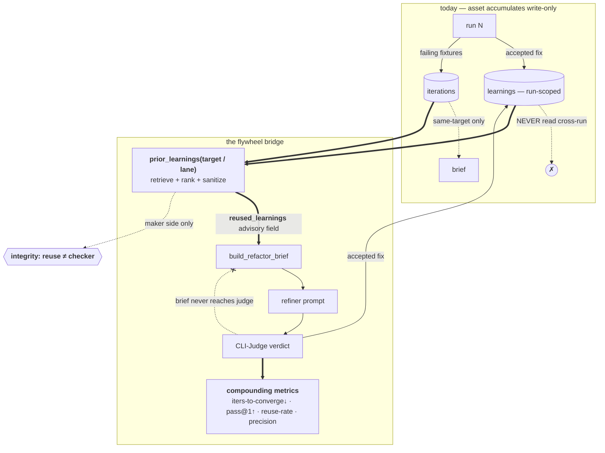
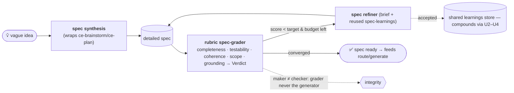

# feat: Learning-reuse flywheel — close the loop and prove compounding

## Summary

loop-anything **looks** like a flywheel but the return arc is disconnected. Every accepted fix writes a `learnings` row (`record_learning`, `memory/store.py`), but those learnings are read back **only within the same run** (`compression.py`, `proof.py`, `autonomous/report.py`) — they are **never injected into a future run**. The single cross-run feedback path, `recurring_failures(target=...)` (`store.py:536`), is scoped to the **same target**, so a lesson learned on target A never helps target B. And there is **zero instrumentation** of compounding — no metric answers "does a run converge faster because 50 runs came before it?" So today the system *accumulates* an asset (learnings) without *spending* it, and cannot prove it improves with usage.

This plan closes that arc: (1) **instrument** the flywheel so compounding is measurable; (2) **bridge the broken link** — retrieve prior learnings and inject them into future runs' briefs (cross-run, then cross-target by lane), mirroring the existing `recurring_failures` plumbing; (3) **prove** the gain causally and gaming-resistantly via interleaved ablation (reuse ON vs OFF on the *same* task, blind referee) on an adversarially-isolated held-out set, recorded through the existing record-only proof path; and (4) **extend the loop to the spec stage (req 3)** — a vague idea enters, is synthesized into a detailed spec, an independent **rubric spec-grader** scores it, and the spec is refined→re-graded→compounded by the *same* controller/convergence machinery, so spec quality compounds with usage exactly as tool quality does.

**Hard invariant throughout:** reused learnings feed the **refiner brief only** — never the judge, convergence, or acceptance. The moment a reused learning becomes a quality signal, maker≠checker breaks (`outer-loop-non-gaps.md` #2; `integrity.py`). This is enforced additively (defaulted, `getattr`-read fields — no mode flag, per the twice-rejected-flags precedent) and by a new fail-closed assertion + test.

**Calibrated claim:** the gain is "fewer wasted/repeated iterations — faster, less-blind convergence as usage accumulates," not GEPA-class sample-efficiency (single-path greedy is retained; the Pareto frontier stays deferred).

---

## Problem Frame

A flywheel needs four arcs to connect: **usage → asset → retrieval → improvement → (more usage)**. Mapping loop-anything against that:

| Arc | Status today | Evidence |
|---|---|---|
| usage → asset | **Connected** | `record_learning` on every accepted fix; `iterations`/`fork_cards`/`recurring_failures` accrue |
| asset → retrieval | **BROKEN** | `learnings(run_id)` is run-scoped; no `learnings(target=...)`; no cross-run read for injection |
| retrieval → improvement | **BROKEN** | nothing injects prior learnings into a brief; only same-target `recurring_failures` rides along |
| improvement → provable | **ABSENT** | no cross-run trend query (iterations-to-converge over time, first-attempt grade, reuse rate, recurrence-decay) |
| (low-friction entry + spec stage) | **MISSING** | route/generate exists, but no "vague idea → detailed spec" stage with its own grader+refine loop whose quality compounds (req 3) |

So the honest answer to part 1 ("is it a flywheel that grows with usage?") is: **not yet** — it has the memory substrate and a narrow same-target loop, but the asset is write-only across runs and the compounding is unmeasured. This plan connects the two broken arcs and instruments the result.

---

## Requirements

- **R1 — Close the loop.** Compounded learnings + recurring failures are retrieved and injected into future runs' briefs: cross-run (same target) first, then cross-target scoped by `runs.lane`. Injection feeds the refiner brief only.
- **R2 — Maker ≠ checker, enforced.** The reuse path never reaches `Judge`, `convergence`, or acceptance. Add a fail-closed assertion (mirroring `assert_maker_distinct_from_checker`) + a test that the retrieval result cannot reach the judge. (`outer-loop-non-gaps.md` #2, R10.)
- **R3 — Additive, defaulted, `getattr`-read; no mode flag.** New brief field + store queries are backward-compatible (KTD1 convention); reuse is on by default and degrades to today's behavior when history is absent. (Dead-weight flags twice-rejected — `refine-only-baseline.md`.)
- **R4 — Sanitize on the WRITE path, not just retrieval.** Learning summaries are stripped of control chars + shell metacharacters and length-bounded **in `record_learning` before they persist** (extract `judge._sanitize_feedback` to a shared module). Write-side sanitization means unsanitized text never enters the store, every reader (including the cross-target path and spec stage) is covered automatically, and no caller has to trust that retrieval sanitizes.
- **R5 — Measurable.** Instrument cross-run compounding metrics: iterations-to-converge vs cumulative usage, first-attempt grade (`pass@1-attempt`), reliability (`pass^k`), recurrence-decay, learning-reuse rate, and retrieval precision.
- **R6 — Provable + gaming-resistant.** Prove the gain causally via interleaved ablation (reuse ON vs OFF on the *same* task, referee blind to mode) on an **adversarially-isolated** held-out set (SimJudge secret-seed, not an author split), recorded through the record-only proof path. A reused-signal run whose held-out gain *decreases* is a gaming-amplification failure, not a pass.
- **R7 — Cross-target reuse is advisory and guards negative transfer.** Relaxing the `recurring_failures` same-target isolation (a deliberate boundary) must keep cross-target learnings as advisory brief context only — never a noise source or back-channel quality signal — gated by a retrieval-relevance threshold and watched by retrieval precision.
- **R8 — Spec-synthesis loop (req 3, full).** A vague idea enters, is synthesized into a detailed spec, scored by an **independent rubric spec-grader** (completeness, testability/acceptance-examples, coherence, scope-boundedness, grounding) producing a `Verdict`-shaped result, then refined→re-graded→compounded by the *same* `LoopController`/`convergence` machinery until the spec score converges. Spec-stage learnings accrue in the shared `learnings` store and compound via U2–U4.
- **R9 — Maker ≠ checker for specs (process *and* data-flow).** The spec-grader must never be the spec-generator/refiner (object identity, via `assert_maker_distinct_from_checker`), AND the grader must read only the spec artifact — no `RefactorBrief`/`reused_learnings` field reaches it (data-flow, via a canary test). Independence-of-*process* is achievable; independence-of-*criterion* is not fully (generator and rubric both descend from the in-house plan-quality conception — a shared blind spot, not a breach). The real maker-distinct signal of record is therefore the **downstream outcome oracle** in U9 (does a higher-rubric spec actually yield better tool-loop results?), which the refiner cannot directly optimize.

---

## High-Level Technical Design

The broken arc and the bridge (everything **bold** is new; the rest is today's loop):



**Proof design (R6) — interleaved ablation, the strongest causal structure without an RCT:**

```text
for every Kth run:  run the SAME target twice, same conditions, referee blind to mode
    A = loop with reused_learnings INJECTED
    B = loop with reuse SUPPRESSED (library cleared for this run)
  record  Δiters = iters(B) − iters(A),  Δfirst_attempt_grade = grade_A0 − grade_B0
  over N pairs → paired t-test;  held-out fixtures (never seen by loop/brief) gate substantive-vs-cosmetic
compounding curve:  cohort runs by len(library) at run-start {0–10, 11–25, 26–50, 51+}
                    plot pass@1-attempt and iters-to-converge per cohort;  AUC = single-number proof
```

**Spec-synthesis loop (req 3) — the same loop shape, one stage upstream:**



The spec loop is **not a new engine** — it instantiates the existing `LoopController`/`convergence`/`compound` machinery with a spec-grader in the `Judge` slot and a spec-refiner in the `Refiner` slot, so learning-reuse (U2–U4), metrics (U1/U5), and proof (U6) cover it for free.

---

## Key Technical Decisions

- **KTD1 — Mirror `recurring_failures`, not `reflection`.** Reused learnings are *compounder-sourced* and *static for the run*, so the clean template is `recurring_failures(target=...)` (computed once at run start, `controller.py:121-126`), not the per-iteration judge-sourced `ReflectionContext`. New `MemoryStore.prior_learnings(*, target, lane, limit)` JOINs `learnings`→`runs` on `runs.target` (then `runs.lane` for cross-target) — the FK chain already exists, so **scope** needs no schema change; **ranking** needs one nullable `grade_delta` column on `learnings` (the grade step isn't persisted today), added via the existing `_migrate` ALTER-ADD-COLUMN pattern and recorded in `record_learning`. New defaulted `RefactorBrief.reused_learnings` field; rendered in both refiners via `getattr` + the shared `reflection_render.py` pattern.
- **KTD2 — Maker≠checker by construction *and* assertion.** `Judge.judge(tool_path)` takes no brief, so injection cannot reach the judge structurally; add an explicit fail-closed check (the reuse retrieval is never passed to `judge`/`convergence`) so a future refactor can't silently breach it. The `confirmations` table's write-only-vs-gate discipline (`schema.sql:51-62`) is the precedent.
- **KTD3 — Copy the ExpeL/ERL *pattern*, not a vector stack.** Start with SQL/lane-scoped retrieval + simple relevance ranking (recency × accepted-grade-delta). Defer embedding/vector similarity — ERL shows *retrieval quality dominates quantity* and a noise floor at 40-60 stored items, so a curated, scoped retrieval beats a naive vector dump and adds no dependency (stdlib-only discipline holds). Vector retrieval is a documented follow-up once the metrics justify it.
- **KTD4 — Interleaved ablation + cohort curves as the proof spine.** Same-task reuse-ON-vs-OFF with a blind referee controls for task difficulty (the strongest causal design short of an RCT); cohort-by-library-size curves + learning-curve AUC give the headline "more usage → faster" number. Headline metrics: `pass@1-attempt`, `pass^k`, iters-to-converge. (sample-efficiency AUC, ExpeL/ERL ablation.)
- **KTD5 — Retrieval precision is the Goodhart guard.** `used / retrieved` per run, independent of the referee grade — it catches noise accumulation and negative transfer (a growing library with falling precision) that grade-based metrics can't, and it can't be gamed by pleasing the referee.
- **KTD6 — Calibrated claim.** Frame gains as faster/less-blind convergence over cumulative usage; do not import GEPA's 35× (no Pareto frontier here).
- **KTD7 — Spec stage = the same loop, a rubric spec-grader in the Judge slot (req 3).** Generation wraps the existing `ce-brainstorm`/`ce-plan`/`lavish` capability (don't rebuild it); the new build is an **independent, deterministic rubric spec-grader** that scores a spec on completeness / testability / consistency (cross-reference resolution + terminology recurrence — a deterministic proxy, *not* semantic contradiction detection) / scope-boundedness / grounding and emits a `Verdict`-shaped result — the spec analogue of CLI-Judge's `report.json`. It plugs into the existing `LoopController` via the `Judge` protocol, so convergence, rollback, compound, learning-reuse, metrics, and proof all apply unchanged. Determinism keeps single-run spec scores a safe control signal; the grader is distinct from the generator/refiner (KTD2/R9), with the downstream-outcome oracle (U9) as the criterion-independent check.
- **KTD8 — Spec runs use a distinct retrieval namespace.** Spec-synthesis runs persist to the same `learnings` store but must not cross-contaminate tool-stage retrieval — a spec lesson ("add acceptance examples") is noise in a tool-refine brief and vice-versa. Tag the run kind (e.g. a `kind` discriminator on `runs`, or a reserved `lane`) so `prior_learnings` retrieves spec-learnings for spec runs and tool-learnings for tool runs. Cross-*kind* reuse is out of scope.

---

## Implementation Units

> **Phase A (measure)** — U1. **Phase B (close the loop)** — U2→U3→U4. **Phase C (prove)** — U5, U6. **Phase D (spec-synthesis loop, req 3)** — U7→U8→U9. Build Phase A first so the bridge's effect is measurable from the first reuse; Phase D reuses A–C wholesale (it only adds a grader, a refiner, and a synthesis entry to the existing controller).
>
> **Delivery sequencing (not a scope cut — all 9 units are in):** ship **Phase A–C as PR-1**, with its acceptance condition being a **green U6 same-target ablation**. Ship **Phase D (U7–U9) as PR-2**, gated on PR-1's signal. Rationale: U7–U9 have zero upward dependency on U1–U6 *code* but their *proof* (U9) reuses U6's harness and only makes sense once same-target compounding is demonstrated; two PRs keep each reviewable and let a negative first-light result on PR-1 redirect before the spec-stage cost is spent. U4 (cross-target) lands within PR-1 only if its same-target gate passes (see U4 contingency).

### U1. Compounding instrumentation baseline

**Goal:** Make the flywheel measurable before bridging it, so the bridge's effect is provable against a baseline.
**Requirements:** R5.
**Dependencies:** none.
**Files:** `src/loopeng/memory/store.py` (new cross-run aggregates in the `transcendent queries` section), `src/loopeng/autonomous/report.py` (or a sibling `flywheel_report.py` — metadata-only renderer), `tests/test_memory_store.py`, `tests/test_flywheel_metrics.py` (new).
**Approach:** Add `MemoryStore` aggregates joining `runs`+`iterations` grouped by `target`/`lane` ordered by `started`: iterations-to-converge per converged run, first-attempt grade (`iterations[0].grade`), and a recurrence series from `recurring_failures` over time. Add a cohort view (bin runs by cumulative prior-run count). Render a metadata-only "compounding" report (grades/counts/trends — never diff/log content, per `report.py` discipline). All queries read-only; no new write path yet.
**Patterns to follow:** `recurring_failures` query shape (`store.py:536`), `score_trajectory`/`grade_trajectory`/`is_plateaued`, the `build_report`/`render_report` dict-builder + renderer split (`autonomous/report.py`).
**Execution note:** Test-first — assert each aggregate against a hand-seeded multi-run store.
**Test scenarios:**
- iters-to-converge aggregate returns one point per converged run for a target, ordered by `started`; excludes non-converged runs.
- first-attempt-grade series reads `iterations[0]` per run; legacy rows without grade are skipped, not errored.
- cohort binning places runs in the correct `len(prior runs)` bucket; empty history → single bin.
- report renderer emits only metadata (no diff_ref content); JSON and human forms agree.

### U2. Cross-run learning retrieval (`prior_learnings`)

**Goal:** The retrieval half of the broken arc: query accumulated learnings for the current target.
**Requirements:** R1, R4, R7.
**Dependencies:** none (parallel with U1).
**Files:** `src/loopeng/memory/store.py` (`prior_learnings(*, target, lane=None, limit)` + a nullable `grade_delta REAL` column on `learnings` via `_migrate`, populated in `record_learning` from the grade step the controller already computes), `src/loopeng/util/sanitize.py` (new — extract `_sanitize_feedback` here so `store.py` and `judge.py` share it without a cycle), `tests/test_memory_store.py`.
**Approach:** Mirror `recurring_failures` — the target/lane scope rides the existing `learnings.run_id→runs.id→runs.target` FK chain (no schema change for *scope*). **Ranking key correction:** today `learnings` has no grade/timestamp column, so "grade-delta" is not queryable; persist a nullable `grade_delta` (the controller knows `verdict.grade → new_verdict.grade` at compound time, `controller.py:219-224`) via the `_migrate` ALTER-ADD-COLUMN pattern, and use `learnings.id` (insertion order) for recency. Rank `recency × grade_delta`; cap at `limit` (≤ the ERL 40-60 noise floor). **Sanitization is now on the write path** (R4 / `record_learning`), so retrieval just reads. Same-target scope only here; `lane` param present but unused until U4. Return advisory strings/dicts, never grades.
**Patterns to follow:** `recurring_failures(min_runs, *, target)` scoping + return shape; `_migrate` ALTER-ADD-COLUMN idempotency (`store.py:132-143`).
**Execution note:** Test-first; include a scope-isolation test (target A's learnings never returned for target B) mirroring `test_recurring_failures_target_scoped_*`.
**Test scenarios:**
- learnings from other targets are excluded for a same-target query (scope isolation).
- ranking returns highest grade-delta / most-recent first; `limit` truncates.
- `record_learning` sanitizes at write time: a summary containing backticks/`$()`/`;`/control chars is stored already-scrubbed and length-bounded, so retrieval returns it clean (write-path test, R4).
- empty history → `[]` (no error); a target with one run → its own prior learnings only.

### U3. Inject reused learnings into the brief

**Goal:** The improvement half: feed retrieved learnings into the refiner prompt, on both refiner paths.
**Requirements:** R1, R2, R3, R4.
**Dependencies:** U2.
**Files:** `src/loopeng/adapters/base.py` (`RefactorBrief.reused_learnings: list = field(default_factory=list)`), `src/loopeng/loop/refactor_brief.py` (new defaulted kwarg threaded onto the brief), `src/loopeng/loop/controller.py` (compute once after `get_run`, alongside `recurring_fixtures`, pass to `build_refactor_brief`), `src/loopeng/adapters/reflection_render.py` (or a sibling renderer), `src/loopeng/adapters/compound_engineering.py` + `src/loopeng/adapters/llm_refiner.py` (render via `getattr`; LLM path through `_clip`), `src/loopeng/loop/integrity.py` (assertion for R2), `tests/test_refactor_brief.py`, `tests/test_loop_controller.py`, `tests/test_compound_engineering.py`, `tests/test_llm_refiner.py`, `tests/test_maker_checker.py`.
**Approach:** Exact mirror of how `recurring_failures`/`upstream_outcomes` were added — defaulted frozen-dataclass field, computed once at run start (`controller.py:121-126`), rendered `getattr`-guarded in both refiners. **R2 guard:** add a fail-closed assertion that the reuse retrieval is wired only to the brief, never to `self.judge`/`convergence`; a test constructs a controller and asserts the judge receives no learning-derived input. `build_refactor_brief(reused_learnings=[])` must equal today's brief byte-for-byte.
**Patterns to follow:** `upstream_outcomes` field + render blocks (`compound_engineering.py:126-134`, `llm_refiner.py`), `reflection_render.reflection_lines` getattr discipline, `assert_maker_distinct_from_checker` (`integrity.py:43`).
**Execution note:** Test-first for the pure brief path; then controller integration against scripted verdicts.
**Test scenarios:**
- brief with empty `reused_learnings` is identical to baseline; populated renders a bounded "what worked before" block in both refiners.
- LLM path clips a learning containing control chars / `$()` / a forged `"role":"system"`; Claude path is clean too (sanitized at source).
- maker≠checker: the judge stub records its inputs across a run and never receives any learning-derived data; the new integrity assertion fails closed if reuse is wired to the judge.
- a 2-run sequence on one target injects run-1's learnings into run-2's brief (end-to-end cross-run reuse).

### U4. Cross-target generalization (lane-scoped, advisory, transfer-guarded)

**Goal:** Let a lesson from one target help a *similar* target — the cross-target reach of the flywheel — without breaking the same-target isolation boundary.
**Requirements:** R1, R7.
**Dependencies:** U2, U3.
**Files:** `src/loopeng/memory/store.py` (`prior_learnings` lane-scoped branch + relevance threshold), `src/loopeng/loop/controller.py` (opt-in cross-target retrieval with same-target prioritized), `tests/test_memory_store.py`, `tests/test_loop_controller.py`.
**Approach:** Extend `prior_learnings` to optionally widen from `target` to same-`lane` runs, **same-target always ranked first**, cross-target entries demoted and gated by a relevance threshold (recency × grade_delta, capped count). Cross-target learnings ride the same *advisory* field — never promoted above live/same-target signal. **Data-minimization on the cross-boundary flow** (distinct from R4's metachar scrub): before injecting a learning from target A into target B's brief, redact target-specific tokens (file paths, URLs, identifiers) so A's specifics don't leak into B as noise or as accidental secrets. Document the deliberate relaxation of the `recurring_failures` U1 isolation boundary and why it stays advisory-only.
**Contingency:** if U6's same-target ablation shows **no** gain, this unit is **deferred entirely** — cross-target reuse multiplies noise before same-target value is proven.
**Patterns to follow:** `recurring_failures` advisory-vs-live prioritization; `runs.lane` as the only persisted cross-target axis (per repo map).
**Test scenarios:**
- two targets in the same lane: target B's brief receives target A's high-value learning, demoted below B's own.
- targets in different lanes do not cross-pollinate.
- a canary identifier in target A's learning summary does **not** appear in target B's brief (data-minimization redaction).
- relevance threshold filters low-value cross-target learnings; cap bounds the count; same-target learnings always precede cross-target ones.

### U5. Reuse-rate + retrieval-precision instrumentation

**Goal:** Measure that the loop is *actually using* the asset, and catch noise accumulation / **negative transfer** — the user-flagged "stale learning drags the run" failure (the Goodhart guard).
**Requirements:** R5, R7.
**Dependencies:** U3.
**Files:** `src/loopeng/memory/store.py` (a nullable `injected_learning_count INTEGER` column on `runs` via `_migrate` — **not** a new table; per-learning outcome attribution as a lightweight join), `src/loopeng/loop/controller.py` (record how many learnings were injected per run), `src/loopeng/autonomous/report.py` (surface the metrics), `tests/test_memory_store.py`, `tests/test_flywheel_metrics.py`.
**Approach:** Two grade-independent signals, both **observation-only — never an acceptance gate** (the deferred drift-detector from `outer-loop-non-gaps.md` #2 lives here): (1) **injection rate** = injected / retrieved-from-store (straightforward; the maker never self-reports). (2) **per-learning outcome attribution** — for a learning that *was* injected (matched against the diff deterministically, **never** asked of the refiner, which would be maker self-report and break the single-referee discipline), correlate runs that used it with their `Δiters` vs the no-reuse baseline; a learning consistently used yet correlated with equal/slower convergence is a **negative-transfer / stale candidate** for eviction. This localizes *which* learning drags — the aggregate U6 gaming-amplification check cannot. Library-size vs these signals flags rot.
**Patterns to follow:** the additive `_migrate` column pattern (`store.py:132-143`); metadata-only reporting (`report.py`); the "write-only w.r.t. the gate" discipline (`confirmations`).
**Test scenarios:**
- injected count recorded per run; injection rate computed; zero-injection run handled (no divide error).
- "used" is determined by deterministic diff match, never by querying the refiner (a test asserts no maker self-report path feeds the metric).
- the metrics are never read by convergence/acceptance (assertion/test).
- a learning consistently used but correlated with non-improving `Δiters` is flagged as a negative-transfer candidate; growing library with falling injection precision surfaces as a flagged trend.

### U6. Anti-gaming proof harness (interleaved ablation + held-out + record-only)

**Goal:** Prove the flywheel causally and gaming-resistantly — the acceptance bar for the whole plan.
**Requirements:** R6.
**Dependencies:** U1, U3 (U4 to prove cross-target).
**Files:** `tests/e2e/test_flywheel_proof_e2e.py` (new — non-gated; `monkeypatch.delenv("CI", raising=False)` per the CI-gate discipline), a `flywheel proof` recording path extending the existing `demo record`/`demo proof` (`src/loopeng/proof.py`, `demos/`), `docs/solutions/` capture after first-light.
**Approach:** Build a **reusable, parameterized** harness (takes any `Judge` + artifact type, so U9 instantiates it rather than duplicating it). Implement **interleaved ablation**: paired runs on the same target, reuse-ON vs reuse-OFF (library suppressed by forcing `reused_learnings=[]` in the brief — not by racing the store), referee blind to mode; record `Δiters` and `Δfirst-attempt-grade`. Held-out fixtures use the SimJudge **secret-seed** machinery (`derive_heldout_seeds`/`assert_heldout_disjoint`) — **not** an author split. A reused-signal run whose held-out gain *decreases* vs the no-reuse baseline is a **gaming-amplification failure**. **Proof integrity:** add a required `flywheel_proof` sub-object to the result schema (`ablation_mode` ∈ {reuse_on,reuse_off}, `paired_run_id`, `heldout_seed_hash`) and an assertion (mirroring `ProofPack.is_improvement`) that *both* legs of a pair are recorded with matching `heldout_seed_hash` before anything can be marked `live_verified` — so an ablation result can't be faked. Record real before/after through the record-only path; no-gain/`blocked_safety` records honestly.
**Patterns to follow:** the reflective-loop U6 reflective-vs-blind design (`docs/plans/2026-06-20-001-...`), `provenance-honesty.md` record-only path + `ProofPack.is_improvement`, `p0-feasibility-gates.md` first-light gating.
**Execution note:** This is the plan's acceptance bar; gate cross-target buildout (U4) on a positive same-target first-light signal (`claude -p` quota ~2026-07-01). Treat a held-out regression as failure of the approach, not a test to relax.
**Test scenarios:**
- ablation pairs run the same target in both modes with the referee blind to mode; `Δiters`/`Δgrade` recorded; reuse-OFF is enforced via empty `reused_learnings`, not a store race.
- reuse-ON reaches the target grade in strictly fewer iterations than reuse-OFF on the held-out set (the causal compounding test); matching reuse-OFF fails.
- gaming-amplification check: held-out gain does not decrease when reused signal is richer.
- **monotonicity is asserted only within the curated/capped regime (≤ the ERL noise floor), NOT across the `51+` bin** — above the cap, retrieval precision (U5) is the primary health signal and cohort shape is diagnostic, since the cited research predicts degradation past ~40-60 items. AUC(with) > AUC(without) within the capped regime.
- a `live_verified` flywheel result cannot be recorded unless both ablation legs + matching `heldout_seed_hash` are present (proof-integrity assertion).
- e2e deterministic with `CI` set and unset.

### U7. Rubric spec-grader (the `Judge` for specs)

**Goal:** An independent, deterministic grader that scores a spec's quality as a `Verdict` — the spec analogue of CLI-Judge.
**Requirements:** R8, R9, R6.
**Dependencies:** none — the `Judge` protocol and `LoopController` already exist in the tree; build U7 before U8's loop (it is independent of Phase A–C, not "parallel with A–B").
**Files:** `src/loopeng/adapters/spec_judge.py` (new — implements the `Judge` protocol over a spec artifact), `src/loopeng/spec/rubric.py` (new — the scored dimensions), `tests/test_spec_judge.py` (new).
**Approach:** A deterministic rubric scorer producing a `Verdict` (grade/score/dims/safety_ok/failing_fixtures/feedback) from a spec document. Dimensions, all **structurally decidable** (no semantic NLP): **completeness** (problem frame + requirements + units + per-unit test scenarios present), **testability** (acceptance examples present and measurable — count/shape check), **consistency** (cross-reference resolution: every `U#`/`R#` referenced is defined; every cited file path is well-formed; terminology used in Requirements recurs in the Units — a deterministic proxy for "terminology drift", **NOT** general contradiction detection, which is not deterministically tractable on prose and is explicitly out of v1), **scope-boundedness** (goals trace to requirements; no orphan units), **grounding** (file paths/decisions cited). `failing_fixtures` = the named gaps (e.g. "U3 has no test scenarios"); `feedback` = dimension-level "why" (the store-side sanitizer of R4 covers it). Must be deterministic (assert ~0 variance like CLI-Judge). **The grader reads ONLY the spec artifact — never any `RefactorBrief`/`reused_learnings` field** (R9 data-flow boundary; see U8 canary test). Implements the same `Judge` interface (`adapters/base.py:58`) so it drops into `LoopController` unchanged.
**Patterns to follow:** `adapters/judge.py` (`parse_report`/`derive_safety_ok`/`Verdict` shape, fail-closed on malformed input), `SimJudge` determinism, `ce-doc-review` dimension catalog (as rule inspiration, not a live agent).
**Execution note:** Test-first; pin determinism with a judge-variance-style repeat check.
**Test scenarios:**
- a complete, testable, consistent spec scores high; a spec missing test scenarios drops `completeness` and lists the gap in `failing_fixtures`.
- a spec referencing an undefined `U#`/`R#`, or a missing cited path, drops `consistency`; an orphan unit (no requirement trace) drops `scope-boundedness`.
- malformed/empty spec fails closed (low grade, `safety_ok` handled), never throws.
- repeated grading of the same spec returns identical scores (determinism).
- the grader, given a brief carrying a canary string, never reads it — only the spec artifact (maker≠checker data-flow).

### U8. Idea→spec synthesis + spec refine loop

**Goal:** Wire the vague-idea entry and the spec refine loop onto the existing controller, using U7 as the judge.
**Requirements:** R8, R9.
**Dependencies:** U7 (grader), U3 (brief/reuse machinery), U2 (retrieval).
**Files:** `src/loopeng/spec/synthesize.py` (new — vague idea → initial spec via the planning capability; the generate-analog), `src/loopeng/adapters/spec_refiner.py` (new — refines a spec against the grader's brief; implements `Refiner`), `src/loopeng/autonomous/runner.py` (a `run_spec_loop` entry mirroring `run_refine_loop`), CLI surface (a `spec` command), `tests/test_spec_loop.py` (new), `tests/test_maker_checker.py` (extend).
**Approach:** Synthesis wraps `ce-brainstorm`/`ce-plan`/`lavish` to produce the initial spec (don't rebuild generation). The spec refiner consumes a `RefactorBrief` (target_dimensions = the grader's lowest dims, failing_fixtures = named gaps, **reused_learnings** from U2/U3) and rewrites the spec. Drive it through the existing `LoopController` with `spec_judge` in the `Judge` slot — convergence, rollback, compound, gate, fork-cards all apply unchanged. `assert_maker_distinct_from_checker(spec_refiner, spec_judge)` at entry (R9). Spec artifacts persist as run artifacts so their learnings compound via the shared store.
**Patterns to follow:** `run_refine_loop` wiring (`autonomous/runner.py`), `bindings.build_loop_deps`, the `ChainedRefiner` claude→LLM pattern, integrity assertions at runner entry.
**Execution note:** Build against a scripted spec-grader first (like the loop-controller tests); gate live synthesis on the `claude -p` first-light window.
**Test scenarios:**
- a vague idea converges to a high-scoring spec across iterations against a scripted grader; rollback on a no-gain spec edit.
- the spec refiner receives reused spec-learnings in its brief (cross-run compounding on the spec stage).
- maker≠checker: `spec_refiner is spec_judge` fails closed at entry; the grader never receives the refiner's brief.
- a converged spec is emitted in a form that feeds route/generate (the stages connect).
- CI-gate discipline: any gate-touching assertion neutralizes `CI`.

### U9. Spec-stage compounding proof

**Goal:** Prove the spec stage compounds — and prove it with a quality signal **independent of the rubric grader**, so the result isn't circular ("the refiner learned to satisfy the grader faster" ≠ "specs got better").
**Requirements:** R6, R8, R9.
**Dependencies:** U1, U6, U8.
**Files:** instantiate U6's parameterized harness with `spec_judge` (no new harness; one new test config + recording), `tests/e2e/test_spec_flywheel_proof_e2e.py`, `docs/solutions/` capture.
**Approach:** Instantiate U6's harness with the spec-judge + spec artifact. **Two corrections specific to specs:** (1) **Held-out is a corpus split, not sim-seeds** — SimJudge's secret-seed machinery varies sim rollouts, which has no analogue for a single document; instead hold out a disjoint set of *idea-prompts* the reuse library was never trained against, with an explicit disjointness assertion (the spec analogue of `assert_heldout_disjoint`). (2) **Independent oracle to break circularity** — the headline metric is not only "iterations-to-converge on the rubric score" (which the refiner can game) but **whether higher-rubric specs produce better downstream tool-loop outcomes** (faster route/generate convergence / higher first-attempt *tool* grade) — an oracle the spec-refiner cannot directly optimize, and the true maker-distinct signal (R9). Record through the record-only path.
**Patterns to follow:** U6 harness (parameterized); `provenance-honesty.md`; `p0-feasibility-gates.md` first-light gating.
**Execution note:** Acceptance bar for the spec pillar. **Spec learnings are far more idea-specific than tool learnings** (the code substrate is shared across a target/lane; "what makes a good problem frame" is not), so the transfer ceiling may be much lower — a flat or negative downstream-oracle result is a real possible outcome, not a test to relax.
**Test scenarios:**
- reuse-ON converges the spec in fewer iterations than reuse-OFF on a **held-out idea-prompt corpus** (disjoint from the library); matching fails.
- downstream oracle: specs from the reuse-ON arm yield faster/higher-grade tool-loop runs than reuse-OFF specs (independent-of-rubric proof); a win on rubric score *without* a downstream win is flagged as rubric-gaming, not compounding.
- monotonicity asserted only within the curated regime (per U6); AUC(with) > AUC(without).
- recorded spec-proof flips to `live_verified` only via the record path with the `flywheel_proof` integrity object; no-gain records honestly.

---

## Alternatives Considered

- **Vector/embedding retrieval (ExpeL Faiss-style) now.** Deferred (KTD3). ERL shows retrieval *quality* dominates quantity with a 40-60 noise floor; a curated SQL/lane-scoped retrieval captures most of the value with zero new dependencies (stdlib discipline). Add vectors only when metrics show scoped retrieval saturating.
- **Engine self-tuning flywheel (aggregate outcomes auto-tune thresholds/refiner/judge).** Out of scope (user-chosen). Larger blast radius and touches safety-relevant policy; revisit after learning-reuse is proven.
- **Author-split held-out for the proof.** Rejected (R6). A split the author controls doesn't discharge the OPEN-P0 fixture-choice gaming risk; the SimJudge secret-seed isolation does.
- **A `--flywheel` / `--reuse` mode flag.** Rejected (R3). Dead-weight flags twice-rejected (`refine-only-baseline.md`); enrich the existing brief path, on by default, degrading gracefully.
- **Defer the spec-grading loop to a follow-up plan.** Rejected (user-confirmed). Building the spec loop here is justified because it is *not* a new engine — it reuses the existing `LoopController`/convergence/compound/learning-reuse/metrics/proof machinery, adding only a rubric `Judge` (U7), a `Refiner` (U8), and a synthesis entry. The marginal cost is one grader + one refiner, not a second loop framework.
- **Use a live LLM/agent panel (ce-doc-review) as the spec-grader.** Rejected for the grader itself. The grader must be deterministic and maker-distinct (single referee of record); a live agent panel is non-deterministic and harder to keep maker≠checker. The `ce-doc-review` dimension catalog *inspires* the rubric rules (U7), but the grader is deterministic code, like CLI-Judge.

---

## Risks & Dependencies

| Risk | Likelihood | Mitigation |
|---|---|---|
| Reused learnings become a back-channel quality signal (breaks maker≠checker) | Med | R2 — brief-only by construction + fail-closed assertion + test; never wired to judge/convergence |
| Richer reused signal *amplifies* fixture-gaming (OPEN P0) | Med | R6 interleaved ablation on adversarially-isolated held-out; gaming-amplification check; retrieval precision (U5) |
| Negative transfer / noise from cross-target reuse | Med | R7 advisory-only + relevance threshold + same-target-first; precision trend flags noise accumulation; ERL noise-floor cap |
| Prompt injection via persisted learning text | Low | R4 sanitize at source (control + shell metachars, length-bound) before any prompt |
| Metric gaming (optimize the metric, not the goal) | Med | KTD5 retrieval precision is grade-independent; cohort curves on held-out; referee blind to ablation mode |
| Cross-target relaxation leaks one target's history as noise | Low–Med | reconcile with `recurring_failures` U1 isolation boundary; lane-scoped + threshold + advisory demotion |
| Gate tests pass locally, fail in CI | Med | `monkeypatch.delenv("CI")` in every gate/proof test (auto-memory + non-gaps #3) |
| Spec-grader is gamed or non-deterministic (specs optimized to the rubric, not quality) | Med | U7 deterministic + maker-distinct (R9); U9 ablation + held-out + retrieval-precision; rubric rewards measurable acceptance-examples, not prose volume |
| Spec synthesis depends on live planning capability (`claude -p`) | Med | U8 builds against a scripted grader first; live synthesis gated on first-light; degrades to a recorded honest no-spec on failure |
| Append-only library crosses its own cited noise floor (corpus rot; a stale high-delta learning dominates the cap and biases every future run) | Med | U5 per-learning outcome attribution flags negative-transfer candidates; retrieval cap ≤ noise floor; **eviction/decay policy explicitly deferred** with this signal as its trigger (Deferred) |
| Spec learnings transfer poorly across *different* ideas (lower ceiling than tool learnings, which share a code substrate) | Med | U9 downstream-outcome oracle measures real transfer; a flat result is an accepted possible outcome, not relaxed; KTD8 keeps spec/tool retrieval separate |
| Correlated-criterion bias: spec generator and rubric grader both descend from the in-house plan-quality conception (shared blind spot) | Low–Med | R9 names it; the U9 downstream-outcome oracle is the criterion-independent check of record (the rubric alone cannot catch what the catalog itself omits) |
| `live_verified` flywheel result fabricated (fake ablation/metrics) | Low–Med | U6 `flywheel_proof` integrity object (`ablation_mode`/`paired_run_id`/`heldout_seed_hash`) + both-legs assertion before `live_verified`; record-only path |

**Prerequisites:** none beyond current tree. First-light `claude -p` quota (~2026-07-01) gates the U6 live proof and U4 cross-target buildout (build U1-U3 against scripted verdicts first).

---

## Scope Boundaries

**In scope:** flywheel instrumentation (U1), cross-run + cross-target learning retrieval and brief injection (U2-U4), reuse-rate/precision metrics (U5), the anti-gaming causal proof harness (U6), and the **full spec-synthesis loop** (req 3): a rubric spec-grader (U7), the idea→spec synthesis + spec refine loop (U8), and spec-stage compounding proof (U9).

### Deferred to Follow-Up Work
- **Engine self-tuning flywheel** — aggregate outcomes auto-tuning convergence thresholds / refiner selection / judge-adapter discovery / routing (user-deferred; safety-policy surface).
- **Vector/embedding retrieval** for learnings (KTD3) — add when scoped retrieval saturates.
- **Eviction / decay / consolidation policy** for the learnings corpus — the top-N cap bounds *retrieval* but not corpus growth; aging out learnings whose source assumptions no longer hold is deferred, triggered by U5's negative-transfer / falling-precision signal (the cap masks rot rather than preventing it).
- **Auto-handoff spec → route/generate as one unattended command** — U8 emits a converged spec in a route/generate-ready form, but chaining the spec loop directly into a tool run without a human checkpoint is deferred (keeps the human-confirm gate meaningful between stages).
- **Longitudinal drift detector as a gate** — the drift signal lands in U5 reporting; promoting it to an acceptance gate is out (must stay observation-only per `outer-loop-non-gaps.md` #2).
- **Catalog/community growth flywheel** (demos→recipes→adoption) — a different, non-engine flywheel.

---

## Sources & Research

- **ExpeL** (arXiv 2308.10144): insights + similar-trajectory retrieval; ablation (ReAct 40% → insights 50% → retrieval 55% → full 59% on ALFWorld) — the canonical reuse blueprint (U2/U3). Gap: no hit-rate/anti-gaming — supplied by U5/U6.
- **ERL** (arXiv 2603.24639): disjoint held-out universes as contamination guard; *retrieval quality > quantity*; non-monotonic degradation above 40-60 heuristics (noise floor) → KTD3 cap, U4 threshold.
- **CER** (ACL 2025): dynamic memory buffer that grows with usage (closest flywheel analogue); +51% relative on WebArena.
- **Learning-curve AUC** (arXiv 2102.04881): sample-efficiency = AUC of performance-vs-usage → KTD4 single-number compounding proof.
- **Goodhart/reward-hacking** (ICLR 2024) + **retro-holdouts**: motivate KTD5 retrieval precision (grade-independent) and R6 secret-seed held-out.
- **Internal:** `outer-loop-non-gaps.md` (single referee / maker≠checker — R2), `provenance-honesty.md` (record-only proof — R6), `p0-feasibility-gates.md` (OPEN refine-quality + first-light gating — U6), `docs/plans/2026-06-20-001-feat-reflective-refine-loop-plan.md` (the per-run precedent this generalizes cross-run), `memory/store.py:536` `recurring_failures` (the template — U2), `integrity.py:43` (assertion pattern — R2).
