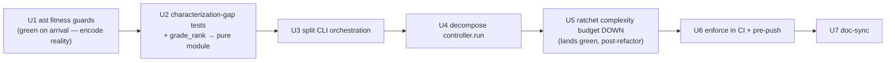

# refactor: Design-fitness pass — decompose god-methods + enforce architecture as fitness functions

## Summary

This is **not** an OOP rewrite. The codebase already makes the right bets — `typing.Protocol` for dependency inversion, ~35 frozen dataclasses as immutable value objects, ~160 module functions for a functional core, **zero concrete-inheritance hierarchies**. Forcing classical inheritance/stateful encapsulation would *regress* the fakes-against-protocols testability. The work is a **design-fitness pass** with two halves:

1. **Enforce the architecture as fitness functions** — a stdlib-`ast` pytest suite (no new deps) that mechanizes invariants already true today, plus a `ruff` complexity budget, run in CI and a pre-push hook (mirroring the doc-sync guard). The ast guards are **green on arrival** (they encode reality); the complexity budget is **ratcheted down at the end**, after the refactor, so it lands green — never a long red-CI window.
2. **Decompose the genuine god-methods** toward single-responsibility, **behavior-preserving and characterization-first**: `LoopController.run` (~175 lines / mccabe ~17, `loop/controller.py`) and `run_cmd`/`fleet_run_cmd` (`cli.py`), keeping the protocol/functional-core architecture and all seven loop invariants intact.

**Hard boundary:** no behavior change, no new product features, no classical inheritance, no second quality source. Guards assert *existing* invariants — they do not invent new constraints. The `MemoryStore` split, `import-linter`, and decomposing the heavy pure scorers (`score_spec`, `parse_fleet_spec`, `run_fleet`) are **explicitly deferred** (see Scope Boundaries) — they're lower-ROI and would balloon the blast radius.

---

## Problem Frame

The measured baseline is strong, with concentrated weak spots:

| Signal | Measured | Verdict |
|---|---|---|
| Concrete-inheritance hierarchies | 0 | Composition-over-inheritance — keep |
| `Protocol` files / frozen dataclasses / module functions | 4 / 35 / 160 | Protocol-oriented functional core — keep |
| `LoopController.run` | ~175 lines, ~11 inline phases, mccabe ~17 | **God-method** — decompose (U4) |
| `cli.run_cmd` / `fleet_run_cmd` | 109 / 70 lines, glue+orchestration+output mixed | **Fat handlers** — split (U3) |
| Architecture enforcement | **none** (CI runs only `pytest`; no lint/complexity tooling) | **Unguarded** — design can rot silently |

The design is good *by current discipline*, not by *enforcement* — nothing stops the next change from adding a 200-line method, a concrete inheritance tree, or an effect leaking into the pure core. This plan converts discipline into mechanism.

**Important calibration (from research):** a global low complexity ceiling does **not** isolate the three god-methods — `spec/rubric.py:score_spec` (mccabe ~33, 53 stmts), `orchestration/spec.py:parse_fleet_spec` (~24), `orchestration/coordinator.py:run_fleet` (~23), and `loop/refactor_brief.py:build_refactor_brief` (~18) are at or above `controller.run`. So the budget must be set from the **measured distribution** and target only what this pass refactors; the heavy pure scorers are deferred with their own tracked exemptions, not silently swept in.

**The seven invariants the refactor must not break** (verified; these become guard content): (1) controller owns the clock, `cv.evaluate` stays pure; (2) `assert_loop_integrity` runs fail-closed at *runner* entry (both call sites); (3) `confirm_convergence` is the sole shippability authority; (4) safety is terminal/unbypassable, compound fires only on a kept improvement; (5) maker≠checker is **object identity** (`refiner is judge`); (6) the controller depends only on `adapters.base` protocols and reads optional fields via `getattr` (KTD1 backward-compat); (7) the controller never calls the `Factory` / never introspects refiner internals.

---

## Requirements

- **R1 — Behavior-preserving.** No externally observable behavior change. Every existing test passes unchanged after each unit; existing suites are the characterization nets, **supplemented first** for the branches a refactor could silently drift (U2).
- **R2 — Architecture as fitness functions (stdlib `ast`).** CI-failing guards that assert: no concrete-class inheritance (outside an allow-list); **value-object** dataclasses are frozen (explicit allow-list, NOT "all `@dataclass`" — several are legitimately mutable); pure-core modules import no effects **(direct imports only — stated as the contract)**; the controller imports nothing from `adapters/` except `adapters.base`; the maker≠checker integrity assertions stay wired at runner entry.
- **R3 — Complexity budget, ratcheted.** A per-function complexity/length ceiling (`ruff` mccabe + statement budget) set from the **measured distribution** to flag the refactored god-methods, landed **after** the decomposition so CI stays green. Scoped to the budget rule-set only (not ruff's full default lint), with `ruff` version pinned.
- **R4 — Enforced, not advisory.** Guards run in **CI (the authoritative gate)** and a best-effort pre-push hook (mirror doc-sync's fail-closed + `SKIP_FITNESS=1` ergonomics).
- **R5 — Preserve the invariants.** All seven invariants intact and, where mechanizable, asserted by guards.
- **R6 — No regression of the idiom.** No classical inheritance, no stateful encapsulation that breaks fakes-against-protocols; the `getattr` protocol-bound read convention (KTD1) preserved (guards must not ban it).
- **R7 — Minimal dependency footprint.** stdlib-`ast` pytest guards (zero new deps) + one dev-dep (`ruff`). Defer `import-linter`/`radon`/`xenon`/`pytest-archon`.

---

## High-Level Technical Design

**Sequencing — green throughout (no deliberate red window):**



Why not "budget-first, red until refactored": research showed a low ceiling flags ~40 functions (most outside this pass) and a multi-unit red window on `main` conflates intended-red with real regressions and can block sibling PRs. Ratcheting the budget down *after* the decomposition lands it green and keeps pytest an honest signal throughout. All work happens on a feature branch.

**`controller.run` target shape** — extract the inline phases as **effectful bound-method helpers** (`(args) -> result`), generalizing the three already-extracted helpers (`_build_reflection`, `_refactor_with_retry`, `_process_fork_cards`). A frozen state carrier is *optional*, not mandated — it has a single consumer today, and the phases perform I/O (`store.record_*`, `checkpoint.snapshot/restore`, `compounder.compound`), so they are effectful, not pure. *(Directional, not a spec.)*

```text
run():
    ctx = self._init_run_context(run_id, tool_path, goal)   # preamble: judge, history, reuse fetch (effectful)
    # loop-local state stays as named locals threaded into helpers (the existing _refactor_with_retry idiom),
    # OR an optional private frozen carrier if it reduces arg lists — implementer's call, not mandated.
    while True:
        decision = self._decide(verdict, n, ...)            # plateau + cv.evaluate; CLOCK stays on controller
        if decision.terminal and not self._can_pivot(...): return self._finish(...)
        ... pivot/continue ...
        diff_ref = self._refactor_step(...)                 # snapshot, build_brief, retry, re-judge, record
        if not new_verdict.safety_ok: return self._finish(BLOCKED_SAFETY, ...)   # invariant 4, preserved
        verdict, n, ... = self._accept_or_rollback(...)     # accept/reverse/rollback + compound + compression
        reflection_ctx = self._build_reflection(...)        # already a pure staticmethod
```

The trickiest control-flow-preservation spot (flagged by research): the **compression branch rebinds `verdict` and increments `n` inside the accept branch** — its ordering relative to `accepted += 1` and the modulo check must be preserved exactly (U2 adds the interval>1 characterization test that pins it).

---

## Key Technical Decisions

- **KTD1 — Guards assert *existing* invariants, not new rules.** Each fitness test mechanizes something already true (the seven invariants + 0-inheritance/frozen-value/functional-core). Net-new constraints are out of scope.
- **KTD2 — stdlib-`ast` pytest is the centerpiece; `ruff` for the budget; nothing heavier.** `tests/test_architecture.py` rides existing CI with zero new deps and expresses rules tools can't. `ruff` (pinned dev-dep) adds the complexity budget via a **scoped select-set** — `C901` (mccabe) + `PLR0915` (statements) **only**, NOT ruff's default lint and **NOT `PLR0913` (max-args)**: the codebase deliberately uses wide keyword-only constructors (`run_refine_loop` 21 args, `LoopController.__init__` 12) for protocol injection — `PLR0913` would flag 17 functions the refactor never fixes. `import-linter`/`radon`/`xenon`/`pytest-archon` are **deferred** (premature/redundant for a small repo).
- **KTD3 — Behavior-preserving, characterization-first, with the net widened first.** The existing fakes cover converge/safety/plateau/pivot/rollback/compression/retry/reflection. Research found three uncovered branches the decomposition touches — interval>1 compression cadence, plateau-pivot × reflection interaction, `reuse_cross_target=True` — so **U2 adds those characterization tests before U4 cuts any seam**. A test that must change to pass = behavior drift (forbidden).
- **KTD4 — `controller.run` → effectful bound-method phases; frozen carrier optional.** Matches the three already-extracted helpers. Clock ownership, `sleeper` injection, single-referee, maker≠checker, safety-terminal, no-Factory all stay on the controller. The carrier is an internal `_`-prefixed detail introduced only if it shrinks arg lists — not a mandated new type (avoids a single-consumer abstraction).
- **KTD5 — Ratchet the complexity budget *down after* the refactor.** Land the decomposition first; then set `max-complexity`/`max-statements` to a value the refactored tree meets, which still flags any future regression. The heavy pure scorers outside this pass (`score_spec`, `parse_fleet_spec`, `run_fleet`, `build_refactor_brief`) get an explicit, tracked `# noqa: C901  # deferred: <follow-up>` so the budget is enforceable now without forcing their decomposition. This replaces the rejected "red-on-arrival" mechanic.
- **KTD6 — Move `grade_rank`/`GRADE_RANK` to a pure module (`loop/grades.py`).** Today `loop/convergence.py` and `flywheel/oracle.py` import `grade_rank` from `memory/store.py`, which imports `sqlite3` — so "pure core" is only *direct-import* true. Relocating `grade_rank` to an effect-free module makes the purity claim **structurally** true and lets the purity guard mean what it says. Small, behavior-preserving move (update importers).
- **KTD7 — Guards are honest-code drift-detectors, not adversary-proof.** AST string-matching can be evaded by aliased/dynamic/re-exported imports. The guards catch the realistic failure mode (a contributor honestly adding an `import os` to the core or a `class X(Concrete)`); they are **documented as such** in AGENTS.md. Alias-proof enforcement is the deferred `import-linter` case.
- **KTD8 — CI is the authoritative gate; the pre-push hook is best-effort.** R4 is satisfied by the CI step alone (it can't be skipped). The vendored `scripts/fitness-prepush.sh` + a documented per-clone install (`git config core.hooksPath` / symlink, matching doc-sync) is a convenience, not the enforcement floor.
- **KTD9 — HarnessX informs the *shape*, not the *framework*.** The phases-as-helpers target captures HarnessX's composability benefit; adopting its hook/processor machinery is rejected as a new abstraction violating the no-new-features boundary.
- **KTD10 — Frozen guard is allow-list-scoped, not "all `@dataclass`".** ~11 dataclasses are legitimately mutable (`RecordingCompounder` accumulates, `FallbackLLMRefiner` is a stateful adapter, `Run`/`Iteration`/`FleetItem` are row DTOs, `Config`, …). The guard asserts `frozen=True` for an **explicit value-object allow-list** (`adapters/base.py` contracts + named others), not every dataclass.

---

## Implementation Units

> **Phase A (guards, green on arrival)** — U1. **Phase B (prep + decompose, behavior-preserving)** — U2 → U3 → U4. **Phase C (lock in + enforce + sync)** — U5 → U6 → U7. CI stays green throughout; all work on a feature branch.

### U1. Architecture-fitness test suite (stdlib `ast`)

**Goal:** Mechanize the always-true architectural properties as CI-failing tests that pass on arrival.
**Requirements:** R2, R5, R6, R7.
**Dependencies:** none.
**Files:** `tests/test_architecture.py` (new).
**Approach:** A stdlib-`ast` suite over `src/loopeng/**`. Guards: (a) **no concrete inheritance** — every class base in an allow-list (`Protocol`, `Enum`/`IntEnum`, `Exception`/`*Error`, `ABC`, `object`); (b) **frozen value objects** — every dataclass in an explicit value-object allow-list (`adapters/base.py` contracts + named others) declares `frozen=True` (KTD10 — NOT all dataclasses); (c) **functional-core purity (direct imports only)** — pure-core modules (`loop/convergence.py`, `loop/refactor_brief.py`, `loop/grades.py`, `spec/rubric.py`, `flywheel/oracle.py`) have no *direct* import of `os`/`sys`/`sqlite3`/`subprocess`/`socket`/`click`/network; (d) **controller protocol-only deps** — `loop/controller.py` imports nothing from `adapters/` except `adapters.base`; (e) **maker≠checker wiring** — `autonomous/runner.py` calls `assert_loop_integrity` (both entrypoints) and `loop/integrity.py` retains the `refiner is judge` check. Each checker is unit-tested against inline AST samples. Must NOT forbid `getattr`. A module docstring states the honest-code-drift-detector scope (KTD7).
**Patterns to follow:** `loop/integrity.py` assertion style; `tests/test_domain_protocol.py` (single-protocol conformance); per-file fixtures (no `conftest.py`).
**Execution note:** These should pass immediately for (a)/(b)/(d)/(e); (c) passes after U2 moves `grade_rank` — so land (c) together with U2, or stub it to skip `convergence.py`/`oracle.py` until U2 lands. Prove each checker bites by unit-testing it against a violating inline sample.
**Test scenarios:**
- no-inheritance guard passes on the current tree; flags an inline `class X(SomeConcrete)` sample.
- frozen guard flags a non-frozen value-object sample; passes on `adapters/base.py`; does NOT flag the allow-listed mutable dataclasses (`RecordingCompounder`, `FallbackLLMRefiner`, `Run`, `Iteration`, `Config`, …).
- purity guard flags an inline `import os`; passes on the real pure-core modules (after `grade_rank` moves, U2/KTD6).
- controller-deps guard flags an inline `from ..adapters.judge import CLIJudge`; passes on the real `controller.py`.
- integrity-wiring guard fails if `assert_loop_integrity` is removed from a runner sample.

### U2. Characterization-gap tests + move `grade_rank` to a pure module

**Goal:** Close the test-coverage holes the decomposition could silently drift, and make the pure-core purity claim structurally true.
**Requirements:** R1, R6 (and enables R2.c).
**Dependencies:** U1.
**Files:** `tests/test_loop_controller.py` (add gap tests), `src/loopeng/loop/grades.py` (new — `grade_rank`/`GRADE_RANK`), `src/loopeng/memory/store.py` + `src/loopeng/loop/convergence.py` + `src/loopeng/flywheel/oracle.py` + `src/loopeng/loop/controller.py` (re-point `grade_rank` import; `store.py` may re-export for back-compat).
**Approach:** (1) Add three characterization tests against the existing fakes: **compression interval>1** (assert the exact iterations the compressor fires for a known accept sequence — pins the `accepted++`/modulo ordering); **plateau-pivot × reflection** (a plateau→pivot run asserting the post-pivot brief's reflection lineage + `active_exclude` rotation); **`reuse_cross_target=True`** (cross-target learnings appear in the brief). (2) Move `grade_rank`/`GRADE_RANK` from `memory/store.py` to a new effect-free `loop/grades.py`; re-point importers; keep a `store.grade_rank` re-export if any external caller relies on it (behavior-preserving).
**Execution note:** Characterization-first — these tests must pass on the *current* code (they characterize existing behavior) before U3/U4 touch anything.
**Test scenarios:**
- compression fires on exactly the expected iterations for `compression_interval=2` and `=3` (not just `=1`).
- a plateau→pivot run lands the reflection `outcome`/`persistent_fixtures` correctly on the post-pivot brief, and the lead dimension rotated.
- `reuse_cross_target=True` injects a same-lane other-target learning into the brief (redacted), demoted below same-target.
- `grade_rank` returns identical results from `loop.grades`; `convergence.py`/`oracle.py` no longer import `memory.store`; `import loopeng.loop.convergence` does not import `sqlite3`.

### U3. Split CLI orchestration from Click glue

**Goal:** Extract testable orchestration out of `run_cmd`/`fleet_run_cmd`, leaving thin command glue.
**Requirements:** R1.
**Dependencies:** U1, U2.
**Files:** `src/loopeng/cli.py` (extract `_execute_run(...)` / `_execute_fleet(...)` returning data / raising domain errors), `tests/test_run_cli.py` / `tests/test_fleet_cli.py` (characterization net + direct-call tests).
**Approach:** Move route→generate→resolve→`build_loop_deps`→`run_refine_loop` into `_execute_run`, raising `ValueError`/`JudgeAdapterError`/`RuntimeError`; the command maps errors→`ClickException` and formats output. Same split for `_execute_fleet` at the boundary after `parse_fleet_spec`.
**Execution note:** Characterization-first — `tests/test_run_cli.py`/`test_fleet_cli.py` stay green throughout.
**Test scenarios:**
- existing CLI tests pass unchanged.
- `_execute_run` is callable without `CliRunner` and raises a domain error (not `ClickException`) on missing-tool/bad-route; the command still surfaces the same message.
- `_execute_fleet` returns fleet outcome data; `--dry-run` still materializes-only.

### U4. Decompose `LoopController.run`

**Goal:** Reduce the god-method to a thin driver over effectful phase helpers, preserving all seven invariants and control flow.
**Requirements:** R1, R5, R6.
**Dependencies:** U1, U2 (the widened characterization net must exist first).
**Files:** `src/loopeng/loop/controller.py` (extract `_init_run_context`/`_decide`/`_refactor_step`/`_accept_or_rollback` bound-method helpers per HTD; optional private frozen carrier), `tests/test_loop_controller.py` (characterization net; add focused unit tests for new helpers).
**Approach:** Extract phases as bound-method helpers generalizing `_build_reflection`/`_refactor_with_retry`/`_process_fork_cards`. **Preserve exactly:** clock + `sleeper` seam (1), single-referee read (3/5), safety-terminal + compound-only-on-kept + the compression `verdict`/`n` rebind ordering (4), `getattr` optional reads (6), no Factory (7). No new collaborator may inject a second quality source into convergence. Carrier optional (KTD4).
**Execution note:** Characterization-first — full `tests/test_loop_controller.py` + `test_convergence.py` green before; re-run after each seam; a required test edit = drift → revert.
**Test scenarios:**
- all existing controller tests + the U2 gap tests pass unchanged (the full net).
- new helpers are unit-testable in isolation (e.g., `_decide` returns terminal on a met target; `_accept_or_rollback` keeps prior verdict on no-gain; compression cadence unchanged).
- maker≠checker canary: the judge still never receives brief/reused-learnings after decomposition.

### U5. Ratchet the complexity budget (lands green)

**Goal:** Lock in the decomposition with an enforceable per-function ceiling that flags future regressions, without forcing out-of-scope refactors.
**Requirements:** R3, R4, R7.
**Dependencies:** U3, U4 (budget is set to what the refactored tree meets).
**Files:** `pyproject.toml` (`[tool.ruff]` pinned; `[tool.ruff.lint] select = ["C90","PLR0915"]`; `[tool.ruff.lint.mccabe] max-complexity = <measured>`; `[tool.ruff.lint.pylint] max-statements = <measured>`), `.github/workflows/ci.yml` (a `ruff check` step), tracked `# noqa: C901  # deferred: <follow-up>` on the heavy pure scorers (`score_spec`, `parse_fleet_spec`, `run_fleet`, `build_refactor_brief`).
**Approach:** After U3/U4 land, measure the tree, set `max-complexity`/`max-statements` to the smallest value the refactored functions satisfy (which still catches a regression), and add explicit tracked `# noqa` to the out-of-scope heavy functions (with a follow-up reference) so the gate is enforceable now. Scope ruff to the budget select-set only (KTD2); pin the ruff version for matrix reproducibility (3.11/3.12/3.13).
**Execution note:** Lands green — run `ruff check` locally to confirm zero violations except the tracked deferred `# noqa`.
**Test scenarios:**
- `ruff check` is clean across the tree except the tracked-`noqa` deferred functions (enumerate them — count is ~4, not "3 god-methods").
- removing a tracked `# noqa` makes `ruff check` fail at that function (the budget bites).
- Test expectation: config + CI wiring; correctness verified by the `ruff check` outcomes above.

### U6. Enforce fitness in CI + pre-push

**Goal:** Make the guards permanent; CI authoritative, pre-push best-effort.
**Requirements:** R4.
**Dependencies:** U1, U5 (everything green).
**Files:** `.github/workflows/ci.yml` (run `pytest tests/test_architecture.py` + `ruff check` on the matrix), `scripts/fitness-prepush.sh` (new — mirrors `scripts/doc-sync-prepush.sh`), `AGENTS.md` (document the guard, budgets, `SKIP_FITNESS=1`, the honest-drift-detector scope, and the per-clone hook install step).
**Approach:** Add the architecture tests + `ruff` to CI as the **authoritative** gate (cannot be skipped). Vendor `scripts/fitness-prepush.sh` (fail-closed + `SKIP_FITNESS=1`, same ergonomics as doc-sync) and document the concrete per-clone install (`core.hooksPath` or symlink) — explicitly noting CI is the enforcement floor and the hook is convenience.
**Test scenarios:**
- CI fails on a throwaway branch that adds a concrete-inheritance class or an over-budget function.
- `scripts/fitness-prepush.sh` blocks a violating local push and passes with `SKIP_FITNESS=1`.
- Test expectation: CI/hook wiring; correctness verified by the failure/bypass behaviors above.

### U7. Doc sync

**Goal:** Keep humans + agents in sync (global policy; the guards themselves require it).
**Requirements:** R4.
**Dependencies:** U1–U6.
**Files:** `CHANGELOG.md` (Unreleased), `README.md` (a line on the enforced design-fitness guards), `AGENTS.md` (the fitness-guard contract, budgets, `SKIP_FITNESS=1`, drift-detector scope, `loop/grades.py` move).
**Approach:** One `## [Unreleased]` line per change with the why; document guards/budgets in AGENTS.md; record under `### Investigated / Rejected` the deferred tooling (`import-linter`/`radon`/`xenon`/`pytest-archon`), the MemoryStore mixin/sub-repo alternatives, `PLR0913`, and the red-on-arrival mechanic with the measurement that killed each. Note the missing `docs/solutions/` records (doc-sync guard pattern, KTD1, the fitness-guard pattern itself) as a `/ce-compound` follow-up.
**Test expectation:** none — docs only; verify AGENTS.md budgets/flags match what shipped.

---

## Alternatives Considered

- **Complexity-budget-first, CI red until refactored (original mechanic).** Rejected (KTD5). A ceiling low enough to flag `controller.run` flags ~40 functions, most outside this pass; a multi-unit red window on `main` conflates intended-red with real regressions and can block sibling PRs. Ratchet the budget down post-refactor instead.
- **`MemoryStore` → concern mixins (or sub-repositories).** Deferred (Scope). Mixins *are* multiple inheritance — they'd force the no-inheritance guard to allow-list internal names, coupling the guard to an implementation detail; sub-repos churn every call site and risk the single-connection+RLock model. It's the lowest-ROI unit (a thin, linearly-navigable god-object). If readability bites, prefer region comments or module-level free functions that pass `_conn`/`_wlock` — no inheritance — over either.
- **Mandate a frozen state carrier for `controller.run`.** Rejected (KTD4). The phases are effectful and there's one consumer; a mandated carrier adds `replace()` boilerplate and a single-use type. Allow bound-method extraction (the existing idiom); carrier optional.
- **`PLR0913` max-args budget.** Rejected (KTD2). Flags 17 wide keyword-only constructors that are the deliberate protocol-injection idiom; the decomposition fixes none of them.
- **`import-linter` / `radon` / `xenon` / `pytest-archon`.** Deferred/rejected — `import-linter` is the right alias-proof tool once layering grows (KTD7); the others are redundant with `ruff`/ast for a small stdlib-disciplined repo.
- **Classical-OOP rewrite.** Rejected at scope time — regresses DIP-via-structural-typing, reintroduces temporal coupling, breaks fakes-against-protocols.

---

## Risks & Dependencies

| Risk | Likelihood | Mitigation |
|---|---|---|
| Refactor silently changes behavior on an uncovered branch | Medium | U2 widens the net first (interval>1 compression, pivot×reflection, reuse_cross_target); characterization-first; revert on any required test edit |
| Decomposing `controller.run` breaks an invariant | Medium | Invariants 1–7 enumerated + U1 guard + canary; compression `verdict`/`n` rebind ordering called out as the trickiest spot |
| Complexity budget flags out-of-scope functions | High→Managed | KTD5 ratchet post-refactor + explicit tracked `# noqa` on the ~4 deferred heavy scorers; scoped select-set; no `PLR0913` |
| Frozen guard false-positives on mutable dataclasses | Medium | KTD10 explicit value-object allow-list, not all `@dataclass`; tested against the known-mutable set |
| Purity guard is only direct-import-true | Medium | KTD6 moves `grade_rank` to an effect-free module so the claim is structural; guard documented as direct-import-only |
| AST guards evaded by alias/dynamic/re-export imports | Medium | KTD7 — documented as honest-code drift-detectors; `import-linter` is the deferred alias-proof option |
| Long red-CI window blocks sibling PRs | Low (eliminated) | Reordered to land green throughout; feature branch; budget ratcheted last |
| ruff unpinned → non-reproducible budgets across matrix | Medium | KTD2 pins the ruff version |
| Gate/shippability tests pass locally, fail in CI | Medium | `monkeypatch.delenv("CI")` discipline preserved; refactor doesn't touch it |
| Doc-sync guard fires on the refactor | High (expected) | U7 lands CHANGELOG + README + AGENTS in the same change |

**Prerequisites:** none beyond the current tree. Adds one pinned dev dependency (`ruff`).

---

## Scope Boundaries

**In scope:** the ast fitness-guard suite (U1); characterization-gap tests + `grade_rank` purity move (U2); behavior-preserving decomposition of `controller.run` and the two CLI handlers (U3, U4); the ratcheted complexity budget (U5); CI + pre-push enforcement (U6); doc sync (U7).

### Deferred to Follow-Up Work
- **`MemoryStore` decomposition** — only if readability bites, and via region comments / module-level free functions (no inheritance), not mixins/sub-repos.
- **Decomposing the heavy pure scorers** (`score_spec`, `parse_fleet_spec`, `run_fleet`, `build_refactor_brief`) — carried as tracked `# noqa` debt by U5; their own future units.
- **`import-linter`** — adopt for alias-proof layered/forbidden contracts when the package graph grows ≥3 genuine layers.
- **`docs/solutions/` capture** (via `/ce-compound`) of the doc-sync guard pattern, the KTD1 additive-defaulted-field convention, and the fitness-guard pattern itself.
- **HarnessX processor/hook framework** — a separate, behavior-bearing redesign if ever warranted.

### Out of scope (non-goals)
- Any behavior change, new CLI surface, or new product feature.
- Classical inheritance hierarchies or stateful encapsulation that breaks fakes-against-protocols.
- Touching the loop invariants, the human-confirm gate, or the maker≠checker boundary except to *assert* them.

---

## Sources & Research

- **HarnessX** (`github.com/Darwin-Agent/HarnessX`): composable phase pipeline — informs the `controller.run` phases-as-helpers *shape* (KTD4/KTD9), not adopted as a framework.
- **`ruff`** `C901` (mccabe) + `PLR0915` (statements) (docs.astral.sh): the scoped complexity budget (U5); `PLR0913` deliberately excluded (KTD2).
- **stdlib `ast`** + pytest: the fitness-test centerpiece (U1) — no-inheritance, frozen-value-objects, direct-import purity, controller-deps — zero new deps (R7).
- **Building Evolutionary Architectures** (Ford/Parsons/Kua, ch.2): "fitness function = objective integrity assessment of an architectural characteristic" — framing for R2/R4.
- **import-linter / radon / pytest-archon**: evaluated and deferred/rejected (KTD2, Alternatives); `import-linter` is the alias-proof escalation (KTD7).
- **Internal:** `loop/integrity.py` (the seven invariants, fail-closed), `docs/solutions/outer-loop-non-gaps.md` (single-referee/maker≠checker/gate), `docs/solutions/pluggable-refiner.md` + `adapters/base.py` (controller-depends-on-protocols — the target state), `docs/solutions/refine-only-baseline.md` (controller-never-calls-Factory), `scripts/doc-sync-prepush.sh` (the enforced-guard template, U6), `AGENTS.md` (KTD1 convention the guards must not break). Measured baselines (mccabe/args/statements per function, the 11 mutable dataclasses, the `grade_rank` transitive-sqlite coupling) verified against the current tree during research.
